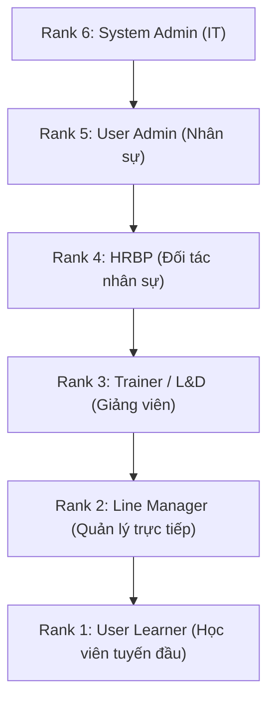
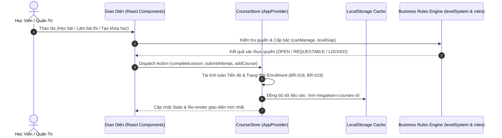

# MM MegaLearn — Tài Liệu Đặc Tả Yêu Cầu & Kiến Trúc Hệ Thống (SRS & Architecture Specification)

> **Dự án:** MM MegaLearn (Corporate Learning & Development Platform)  
> **Khách hàng / Doanh nghiệp:** MM Mega Market Vietnam (MMVN)  
> **Phiên bản tài liệu:** 2.0 (Cập nhật theo kiến trúc 6 Role & Thang 7 Cấp Bậc)  
> **Môi trường:** Web SPA (React 18 + Vite + React Router v6)

---

## MỤC LỤC

1. [Tổng Quan Dự Án & Tầm Nhìn Chiến Lược](#1-tổng-quan-dự-án--tầm-nhìn-chiến-lược)
2. [Mô Hình Tổ Chức & Cơ Chế Phân Quyền (Org & Role Architecture)](#2-mô-hình-tổ-chức--cơ-chế-phân-quyền)
   - 2.1. Cây tổ chức 2 nhánh (Dual-Branch Org Tree)
   - 2.2. Mô hình 6 Role phân cấp (Cascading Role Governance)
   - 2.3. Thang 7 Cấp bậc đảo ngược & Quy tắc học vượt cấp tuần tự (Sequential Level Gate)
3. [Đặc Tả Yêu Cầu Chức Năng (Functional Requirements - SRS)](#3-đặc-tả-yêu-cầu-chức-năng)
   - 3.1. Cấu trúc Khóa học: Course > Module > Lesson & Quy tắc hoàn thành
   - 3.2. Đa dạng hình thức đào tạo (Multi-Modal Learning: E-Learning, Virtual Class, In-Person ILT)
   - 3.3. Hệ thống Khảo thí & Ngân hàng câu hỏi (Assessment Engine)
   - 3.4. Hệ thống Chứng chỉ số & Lịch sử học tập (Digital Credentials & Transcripts)
   - 3.5. Giảng viên nội bộ, Phòng thực hành & Điểm danh Live QR Code (Trainer Hub)
   - 3.6. Đánh giá CSAT & Đo lường hiệu quả đào tạo Kirkpatrick 4 cấp độ
   - 3.7. HRBP: Ma trận Khoảng cách năng lực & Kế nhiệm 70-20-10 (Skill Gap & Succession)
   - 3.8. Quản trị Người dùng, Phân bổ khóa học & Nhóm tùy chỉnh (User Admin Portal)
   - 3.9. Quản trị Hạ tầng IT, Đồng bộ SAP HRIS & Bảo mật ISO 27001 (SysAdmin Portal)
   - 3.10. Trợ lý Tri thức & Tra cứu quy trình chuẩn AI SOP (AI Learning Hub)
4. [Giải Thích Cấu Trúc Mã Nguồn (Project Structure Breakdown)](#4-giải-thích-cấu-trúc-mã-nguồn)
5. [Luồng Dữ Liệu & Quản Lý Trạng Thái (State Management & Data Flow)](#5-luồng-dữ-liệu--quản-lý-trạng-thái)
6. [Yêu Cầu Phi Chức Năng & Bảo Mật (Non-Functional Requirements)](#6-yêu-cầu-phi-chức-năng--bảo-mật)
7. [Lộ Trình Tích Hợp Backend Thật (Production Integration Roadmap)](#7-lộ-trình-tích-hợp-backend-thật)

---

## 1. TỔNG QUAN DỰ ÁN & TẦM NHÌN CHIẾN LƯỢC

### 1.1. Bối cảnh
**MM MegaLearn** là nền tảng Quản trị Đào tạo & Phát triển Năng lực Doanh nghiệp (**Corporate L&D System**) được thiết kế theo tiêu chuẩn của chuỗi đại siêu thị bán lẻ **MM Mega Market Vietnam**.

Hệ thống phục vụ mục tiêu chuẩn hóa nghiệp vụ, tự động hóa lộ trình thăng tiến cho hơn 100+ vị trí công việc trải dài từ khối Văn phòng chính (**Head Office**) đến chuỗi hơn 30 trung tâm đại siêu thị trên cả nước (**Store Operations**).

### 1.2. Mục tiêu chiến lược
1. **Chuyển đổi số công tác L&D:** Thay thế quy trình đào tạo truyền thống bằng hình thức học kết hợp (**Blended Learning**).
2. **Kiểm soát tuân thủ 100%:** Giám sát các khóa học bắt buộc theo quy định pháp luật (An toàn VSTP, PCCC, An toàn lao động).
3. **Phát triển nhân tài nội bộ:** Xây dựng đường ống kế nhiệm theo mô hình **70-20-10** (Thánh Gióng Pipeline).
4. **Minh bạch hóa & Đo lường ROI:** Đánh giá công khai chất lượng giảng viên (**CSAT**) và đo lường tỷ lệ hoàn vốn đào tạo theo chuẩn **Kirkpatrick**.

---

## 2. MÔ HÌNH TỔ CHỨC & CƠ CHẾ PHÂN QUYỀN

### 2.1. Cây tổ chức 2 nhánh (Dual-Branch Org Tree)
Hệ thống phản ánh cơ cấu vận hành thực tế của MM Mega Market Vietnam:
- **Nhánh Văn phòng chính (Head Office - HO):**
  $$\text{Business Unit (MMVN)} \longrightarrow \text{16 Divisions (HRD, OMD, IT, Commercial...)} \longrightarrow \text{56 Departments (L\&OD, C\&B, Audit...)}$$
- **Nhánh Vận hành Siêu thị (Store Operations):**
  $$\text{3 Vùng (North/Central/South)} \longrightarrow \text{Cụm (Clusters)} \longrightarrow \text{30+ Siêu thị (An Phú, Bình Phú, Thăng Long...)} \longrightarrow \text{Ngành hàng (Dry Food, Fresh, Non-Food...)}$$

---

### 2.2. Mô hình 6 Role Phân Cấp (Cascading Role Governance)
> **Nguyên tắc cốt lõi:** *"Cả 6 role đều là Learner"* — Mọi nhân sự dù là Giám đốc hay IT Admin đều có Cổng học tập cá nhân. Role bậc trên quản lý được toàn bộ các role bậc dưới.



| Role ID | Tên Vai Trò | Rank | Cấp Bậc | Quyền Hạn Chính |
|---|---|:---:|:---:|---|
| `learner` | **Nhân viên / Học viên (User Learner)** | 1 | Level 7 | Tham gia học, làm bài thi, gửi đơn xin học vượt 1 cấp liền kề, xem CSAT giảng viên, nhận chứng chỉ số. |
| `manager` | **Quản lý Trực tiếp (Line Manager)** | 2 | Level 4 | **Giám sát đội ngũ (Monitoring-only):** Theo dõi tiến độ học của nhân viên phòng ban, cảnh báo quá hạn, xem Skill Gap của nhân viên. *(Không có quyền duyệt gán khóa học)*. |
| `trainer` | **Giảng viên / L&D (Trainer)** | 3 | Level 3 | Quản lý lớp học trực tiếp, tạo khóa Offline, kích hoạt **Live QR Code** điểm danh thời gian thực, quản lý phòng Lab, xem đánh giá CSAT từ học viên. |
| `hrbp` | **Đối tác Nhân sự (HRBP)** | 4 | Level 2 | Phân tích ma trận khoảng cách năng lực (**Skill Gap**), quy hoạch kế nhiệm 70-20-10, giám sát tuân thủ theo vùng, đề xuất nhân tài vào giáo trình. |
| `useradmin` | **Quản trị Nhân sự (User Admin)** | 5 | Level 2 | Quản trị hồ sơ 100+ nhân sự, phân bổ khóa học theo khối/phòng ban/nhóm tùy chỉnh, phân công giảng viên, **phê duyệt đơn học vượt cấp**, cấu hình lộ trình cấp bậc. |
| `sysadmin` | **Quản trị Hệ thống IT (SysAdmin)** | 6 | Level 1 | Toàn quyền kỹ thuật: Quản lý API Pipeline đồng bộ SAP HRIS, nhật ký kiểm toán ISO 27001 (Audit Logs), chính sách Watermark & Chống gian lận thi cử. |

---

### 2.3. Thang 7 Cấp Bậc Đảo Ngược & Quy Tắc Học Vượt Cấp Tuần Tự (Sequential Level Gate)
Thang cấp bậc được chuẩn hóa từ Level 7 (thấp nhất) đến Level 1 (cao nhất):
- **Level 1:** Board of Management (BOM) / Giám đốc điều hành
- **Level 2:** Store General Manager (SGM) / Trưởng Khối (Head of Division)
- **Level 3:** Section Manager / Trưởng Ngành Hàng (Master Trainer)
- **Level 4:** Department Manager / Trưởng Bộ Phận (Line Manager)
- **Level 5:** Shift Supervisor / Giám Sát Ca / Chuyên Viên Cao Cấp
- **Level 6:** Specialist / Chuyên Viên Vận Hành Chính Thức
- **Level 7:** Junior Associate / Nhân Viên Tuyến Đầu (Điểm xuất phát)

#### Ma trận kiểm soát truy cập (Access State Matrix):
$$\text{Level Gap} = \text{User Level} - \text{Course Level}$$
1. **$\text{Level Gap} \le 0$ (Cùng cấp hoặc thấp hơn):** Trạng thái `OPEN` — Học viên được học ngay.
2. **$\text{Level Gap} = 1$ (Vượt đúng 1 cấp liền kề):** Trạng thái `REQUESTABLE` ➔ Học viên gửi đơn giải trình ➔ User Admin/SysAdmin phê duyệt mới được mở khóa.
3. **$\text{Level Gap} \ge 2$ (Nhảy cóc):** Trạng thái `LOCKED_LEVEL_GAP` ➔ Bị chặn cứng và ẩn hoàn toàn khỏi Catalog học viên.

---

## 3. ĐẶC TẢ YÊU CẦU CHỨC NĂNG (SRS)

### 3.1. Cấu Trúc Khóa Học & Quy Tắc Hoàn Thành
- Cấu trúc 3 cấp: **Khóa học (Course) > Học phần (Module) > Bài học (Lesson)**.
- **Tiêu chuẩn hoàn thành từng loại Lesson:**
  - `VIDEO`: Đạt thời lượng xem $\ge 90\%$ (hoặc bấm xác nhận hoàn thành).
  - `DOCUMENT / PDF / SCRIPT`: Đọc và bấm xác nhận hoàn thành.
  - `TEXT`: Tự động nhận diện khi cuộn trang đạt $\ge 90\%$.
  - `IN-PERSON ILT`: Hoàn thành khi Giảng viên quét QR điểm danh hoặc chấm đạt thực hành.
- **Công thức tính tiến độ khóa học:**
  - Khóa **không** có bài thi: $\text{Progress} = \frac{\text{Số Lesson bắt buộc hoàn thành}}{\text{Tổng số Lesson bắt buộc}} \times 100\%$
  - Khóa **có** bài thi: Lesson chiếm **70%**, Bài thi cuối khóa đạt điểm chuẩn chiếm **30%**.

### 3.2. Đa Dạng Hình Thức Đào Tạo (Multi-Modal Learning)
1. **E-Learning:** Tự học qua video, tài liệu số, gói SCORM.
2. **Virtual Classroom:** Lớp học trực tuyến tích hợp phòng họp Zoom / Microsoft Teams.
3. **In-Person ILT (Workshop / Lab):** Lớp thực hành tại phòng đào tạo và xưởng bánh/thịt/quầy kệ siêu thị.

### 3.3. Hệ Thống Khảo Thí & Ngân Hàng Câu Hỏi (Assessment Engine)
- **Cấu hình bài thi:** Thời gian làm bài (Countdown Timer), Điểm chuẩn đạt ($\ge 80\%$), Số lượt làm bài tối đa (`maxAttempts`).
- **Ngân hàng câu hỏi:** Hỗ trợ câu hỏi đơn, nhiều lựa chọn, đúng/sai; hỗ trợ nhập thủ công hoặc **Import từ file CSV** với cơ chế validate chặt chẽ.
- **Rút đề ngẫu nhiên (Random Draw):** Trích xuất ngẫu nhiên tập con câu hỏi từ ngân hàng (ví dụ: rút 20 câu từ 50 câu) kèm xáo trộn vị trí câu hỏi và đáp án.
- **Idempotency & Auto-Submit:** Tự động nộp bài khi hết giờ, đảm bảo không nộp trùng bản ghi.
- **Lịch sử làm bài (Learning Transcript):** Lưu trữ dạng append-only, không bao giờ bị ghi đè.

### 3.4. Hệ Thống Chứng Chỉ Số (Digital Credentials)
- Chứng chỉ được sinh tự động (**Derived**) khi Enrollment đạt trạng thái `COMPLETED` và khóa học có bật tính năng cấp chứng chỉ.
- Thông tin chứng chỉ: Mã số định danh `CERT-{courseId}`, ngày hoàn thành, số điểm đạt được, mã QR tra cứu và thời hạn tái đào tạo.

### 3.5. Giảng Viên Nội Bộ & Điểm Danh Live QR (Trainer Hub)
- **Lịch mở lớp & Quản lý phòng thực hành:** Giảng viên lên lịch dạy, chọn phòng Lab / Workshop.
- **Dynamic Live QR Code:** Mã QR chiếu trên màn hình lớp học tự động xoay mã sau mỗi 15-30 giây nhằm chống chụp ảnh điểm danh hộ.
- **Chấm điểm & Đánh giá thực hành:** Giảng viên chấm điểm kỹ năng trực tiếp trên hệ thống cho từng học viên.

### 3.6. Đánh Giá CSAT & Báo Cáo Kirkpatrick 4 Cấp Độ
- **Khảo sát sau khóa học (CSAT):** Học viên đánh giá 5 sao về Giảng viên, Nội dung và Cơ sở vật chất.
- **Thư mục Đánh giá Giảng viên công khai:** Minh bạch hóa điểm CSAT trung bình của đội ngũ Trainer.
- **Báo cáo Kirkpatrick ROI:**
  - *Cấp 1 (Reaction):* Điểm hài lòng CSAT.
  - *Cấp 2 (Learning):* Điểm thi đánh giá năng lực.
  - *Cấp 3 (Behavior):* Tỷ lệ ứng dụng SOP vào vận hành.
  - *Cấp 4 (Results):* Tác động đến chi phí đào tạo và doanh thu siêu thị.

### 3.7. HRBP: Ma Trận Năng Lực & Lộ Trình Kế Nhiệm 70-20-10
- **Skill Gap Matrix:** So sánh năng lực thực tế của nhân sự với chuẩn định biên chức danh.
- **Lộ trình kế nhiệm 70-20-10:**
  - $70\%$: Trải nghiệm thực tế qua công việc (On-the-job projects).
  - $20\%$: Kèm cặp, học hỏi qua Mentoring & Coaching.
  - $10\%$: Khóa học chính quy trên hệ thống.
- **Đường ống nhân tài (Thánh Gióng Pipeline):** Quy hoạch nhân sự tiềm năng kế thừa các vị trí chủ chốt.

### 3.8. Quản Trị Nhân Sự & Phân Bổ Khóa Học (User Admin)
- **Employee Master:** Quản lý hồ sơ hơn 100+ nhân sự mẫu, tìm kiếm đa tiêu chí.
- **Phân bổ khóa học (Allocation):** Gán khóa học bắt buộc theo Khối, Phòng ban, Chi nhánh hoặc **Nhóm tùy chỉnh (Custom Groups)**.
- **Phê duyệt học vượt cấp:** Tiếp nhận và xử lý đơn xin học vượt 1 cấp từ học viên toàn hệ thống.

### 3.9. Quản Trị IT, Đồng Bộ SAP HRIS & Bảo Mật (SysAdmin)
- **SAP HRIS Pipeline:** Mô phỏng đồng bộ dữ liệu tổ chức và nhân sự theo thời gian thực.
- **Audit Logs:** Ghi nhật ký toàn bộ sự kiện hệ thống theo chuẩn an toàn thông tin ISO 27001.
- **Dynamic Watermark & Anti-Cheat:** Chống rò rỉ đề thi và tài liệu nội bộ bằng cách hiển thị mờ tên nhân sự, mã nhân viên và IP trên màn hình thi.

### 3.10. Trợ Lý Tri Thức AI (AI Learning Hub)
- Hỏi đáp và tra cứu nhanh các quy trình vận hành tiêu chuẩn (**SOP**), quy định an toàn vệ sinh thực phẩm và cẩm nang dịch vụ khách hàng thông qua mô hình trợ lý ảo AI.

---

## 4. GIẢI THÍCH CẤU TRÚC MÃ NGUỒN (PROJECT STRUCTURE)

```
mm-megalearn/
├── lms-app/                       # Ứng dụng Web chính (React 18 + Vite)
│   ├── index.html                 # Entry point HTML
│   ├── vite.config.js             # Cấu hình Vite bundler & dev server
│   ├── package.json               # Dependencies & Scripts
│   ├── SRS.md                     # Bản đặc tả yêu cầu gốc
│   │
│   └── src/
│       ├── main.jsx               # Điểm gắn kết React DOM (ReactDOM.createRoot)
│       ├── App.jsx                # Router trung tâm, phân quyền 6 Role, ErrorBoundary
│       │
│       ├── data/                  # DATA LAYER (Mock Data & Core Business Rules)
│       │   ├── roles.js           # Định nghĩa 6 Role, Rank, Quyền hạn (capabilities)
│       │   ├── levelSystem.js     # Thang 7 Level, Hàm tính Level Gap & Access Gate
│       │   ├── orgHierarchy.js    # Cây tổ chức 2 nhánh MMVN (HO & Store Operations)
│       │   ├── mockData.js        # Data Hub tập trung kết nối toàn bộ dữ liệu mẫu
│       │   ├── generated100Data.js# 100 Persona nhân sự & Ma trận khóa học
│       │   ├── assessmentData.js  # Ngân hàng câu hỏi kiểm tra mẫu
│       │   ├── customGroupsData.js# Dữ liệu các nhóm nhân sự tùy chỉnh
│       │   ├── assignmentTargets.js# Danh mục đối tượng gán khóa học
│       │   ├── levelRoadmapMatrix.js # Lộ trình học tập chuẩn theo từng cấp bậc
│       │   └── courseImages.js    # Quản lý hình ảnh và banner khóa học
│       │
│       ├── store/                 # STATE MANAGEMENT LAYER
│       │   ├── AppProvider.jsx    # React Context Provider bao bọc toàn ứng dụng
│       │   ├── CourseStore.jsx    # Store trung tâm quản lý Course, Enrollment, Attempts
│       │   └── sessionCache.js    # Mirror State vào localStorage (mm-megalearn-courses-v5)
│       │
│       ├── features/              # FEATURE MODULES (UI & Logic theo phân hệ nghiệp vụ)
│       │   ├── layout/            # Layout: AppHeader, AppFooterBar, Navigation
│       │   ├── assessment/        # Modal chỉnh sửa & quản lý bài thi, ngân hàng câu hỏi
│       │   ├── roadmaps/          # Timeline trực quan lộ trình học tập theo Level
│       │   ├── ratings/           # Đánh giá giảng viên & bảng xếp hạng CSAT
│       │   ├── calendar/          # Lịch học cá nhân & lịch đào tạo toàn công ty
│       │   ├── catalog/           # Cây danh mục giáo trình (Curriculum Tree)
│       │   ├── hrbp/              # Tab phân bổ giáo trình & đề xuất nhân tài
│       │   ├── useradmin/         # Quản lý nhóm nhân sự tùy chỉnh (Custom Groups)
│       │   ├── aiAssistant/       # Drawer trợ lý AI giải đáp quy trình SOP
│       │   └── common/            # UI components chung: Badge, Button, Modal, OrgBrowser
│       │
│       ├── pages/                 # PAGE CONTROLLERS (Màn hình chia theo từng Role)
│       │   ├── auth/              # Màn hình đăng nhập & chuyển đổi persona (LoginPage.jsx)
│       │   ├── shared/            # Màn hình dùng chung (MyLearning.jsx, MyCertificates.jsx)
│       │   ├── learner/           # Phân hệ Học viên (Dashboard, Courses, Classrooms, AI Hub)
│       │   ├── manager/           # Phân hệ Quản lý (Team Monitoring, Reports, Approvals)
│       │   ├── trainer/           # Phân hệ Giảng viên (TrainerHub, Live QR, Attendance, CSAT)
│       │   ├── hrbp/              # Phân hệ HRBP (Skill Gap Matrix, Succession, Compliance)
│       │   ├── useradmin/         # Phân hệ User Admin (Employee Master, Allocation, Org Tree)
│       │   ├── sysadmin/          # Phân hệ SysAdmin (SAP HRIS Sync, Audit Logs, Policies)
│       │   ├── admin/             # Phân hệ Quản trị khóa học (Course Builder, Reports)
│       │   └── player/            # Trình phát bài học (LessonPlayer) & Trình thi (AssessmentPlayer)
│       │
│       └── styles/                # STYLING LAYER
│           ├── tokens.css         # Design Tokens: Màu sắc Warm Paper (#FBF9F4), Brand Pine Green
│           └── app.css            # Stylesheet hoàn chỉnh của toàn bộ giao diện
│
└── mobile/                        # Ứng dụng Mobile hỗ trợ học tập (React Native / Expo)
```

---

## 5. LUỒNG DỮ LIỆU & QUẢN LÝ TRẠNG THÁI (DATA FLOW)



---

## 6. YÊU CẦU PHI CHỨC NĂNG & BẢO MẬT

1. **Thiết Kế Giao Diện (Visual Design System):**
   - Theme nền giấy ấm sang trọng (`--paper: #FBF9F4`).
   - Màu sắc mang ngữ nghĩa chuẩn hóa: **Pine Green** (Thương hiệu chính), **Amber** (Đang học / Chờ duyệt), **Sage Green** (Đạt / Hoàn thành), **Rust / Crimson** (Quá hạn / Chặn truy cập).
2. **Tính Toàn Vẹn Của Dữ Liệu Lịch Sử:**
   - Bản ghi bài thi (`ASSESSMENT_ATTEMPT`) là dữ liệu **Append-Only**, tuyệt đối không ghi đè hay xóa bỏ.
3. **Chống Gian Lận (Anti-Cheat):**
   - Cảnh báo chuyển tab khi đang làm bài thi.
   - Dynamic Watermark hiển thị thông tin học viên để bảo vệ đề thi.

---

## 7. LỘ TRÌNH TÍCH HỢP BACKEND THẬT (PRODUCTION ROADMAP)

Khi kết nối với hệ thống Backend thực tế:
1. **Xác thực người dùng (Authentication):**
   - Tích hợp **Single Sign-On (SSO)** qua SAML 2.0 / OAuth2 / Azure Active Directory của tập đoàn.
2. **Lưu trữ tệp tin (Object Storage):**
   - Kết nối **AWS S3 / Google Cloud Storage / MinIO** để lưu trữ video bài giảng, tệp PDF và gói SCORM.
3. **Cơ sở dữ liệu (Database Schema):**
   - Sử dụng **PostgreSQL / MySQL** cho quan hệ Cây tổ chức, Khóa học, Bài thi.
   - Áp dụng cơ chế **Partitioning** và **Append-Only** cho bảng `assessment_attempts` và `audit_logs`.
4. **Giao tiếp thời gian thực (Realtime WebSocket):**
   - Tích hợp **Socket.io / WebSockets** phục vụ tính năng xoay mã **Live QR Code** và nhận diện điểm danh tức thì.
