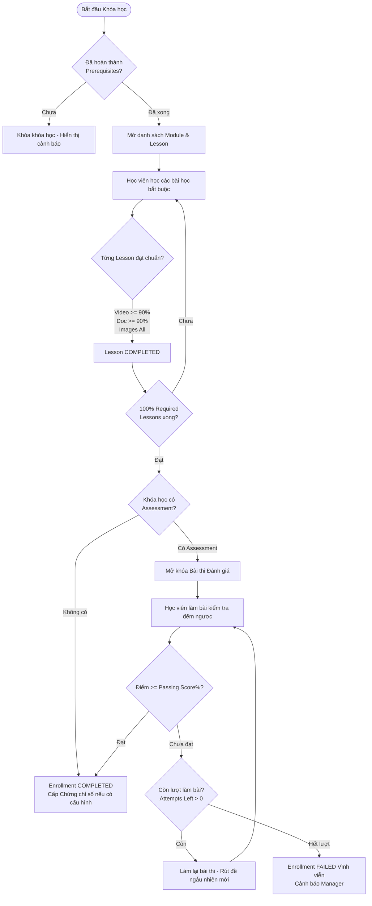
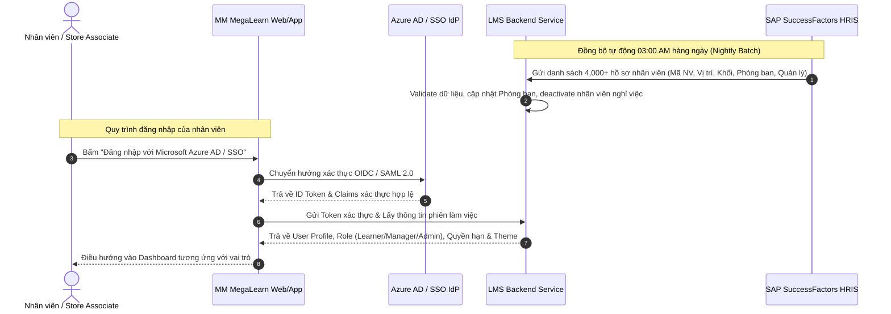
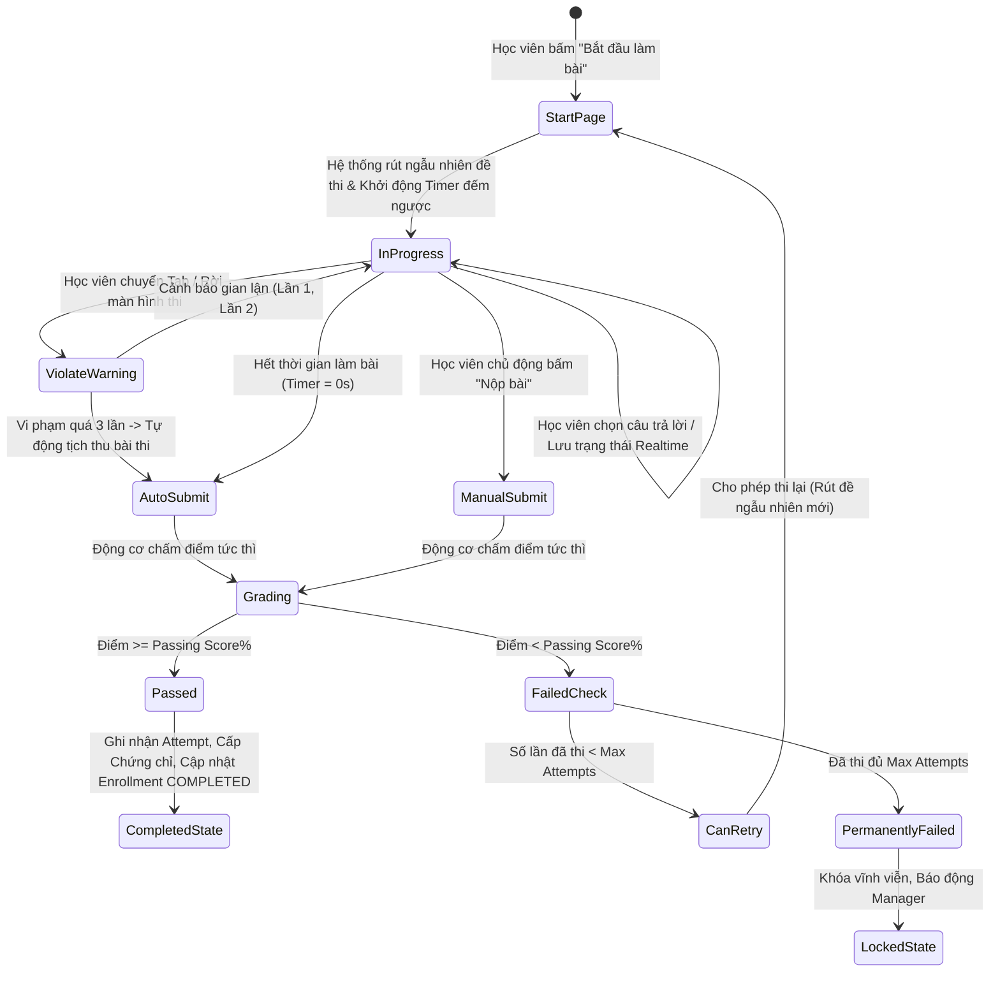
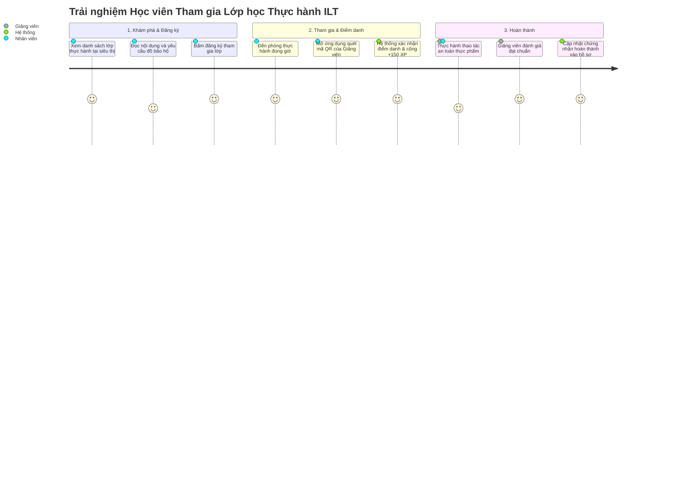
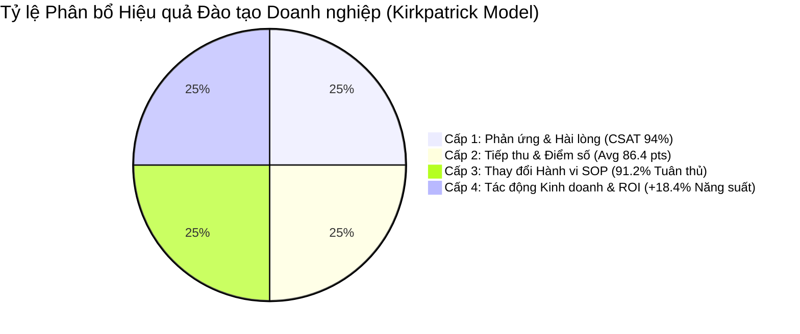
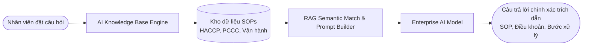
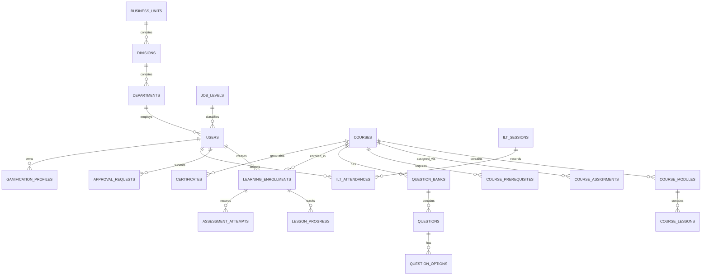
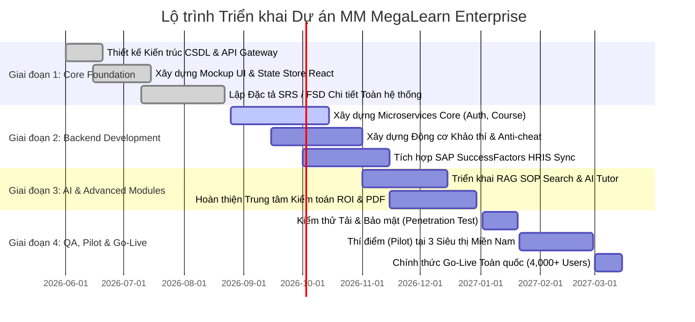

# TÀI LIỆU ĐẶC TẢ YÊU CẦU CHỨC NĂNG VÀ HỆ THỐNG
## MM MEGALEARN — ENTERPRISE LEARNING, DEVELOPMENT & COMPLIANCE PLATFORM
### (Hệ thống Quản lý Đào tạo Nội bộ, Phát triển Năng lực & Tuân thủ Doanh nghiệp)

---

| **Mã tài liệu** | **SRS-FSD-MEGALEARN-2026-V5** |
|:---|:---|
| **Dự án** | MM MegaLearn (MM Mega Market Vietnam Enterprise Edition) |
| **Loại tài liệu** | Software Requirements Specification & Functional Specification Document (SRS/FSD) |
| **Phiên bản** | 5.0 (Đầy đủ mọi phân hệ: Core LMS, Assessment Engine, Manager Supervision, AI Learning Hub, Gamification, ILT Classrooms, HRIS Sync, Kirkpatrick ROI & Audit Center) |
| **Ngày ban hành** | 22/08/2026 |
| **Trạng thái** | Approved / Ready for Full-Stack Implementation & Quality Assurance |
| **Đối tượng áp dụng** | Product Owners, Solution Architects, Business Analysts, Full-Stack Developers, QA Engineers, L&OD Executives |

---

## MỤC LỤC TỔNG QUAN

1. [TỔNG QUAN DỰ ÁN & BỐI CẢNH DOANH NGHIỆP](#1-tổng-quan-dự-án--bối-cảnh-doanh-nghiệp)
   - 1.1. Mục đích xây dựng hệ thống
   - 1.2. Bối cảnh & Khách hàng mục tiêu (MM Mega Market Vietnam)
   - 1.3. Phạm vi hệ thống (System Scope)
   - 1.4. Bảng thuật ngữ & Ký hiệu viết tắt (Glossary)
2. [CƠ CẤU TỔ CHỨC & MA TRẬN PHÂN QUYỀN RBAC](#2-cơ-cấu-tổ-chức--ma-trận-phân-quyền-rbac)
   - 2.1. Cây phân cấp tổ chức doanh nghiệp (Enterprise Organizational Matrix)
   - 2.2. Khung phân cấp chức danh (Job Levels & Roles)
   - 2.3. Ma trận phân quyền chi tiết (Granular Permission Matrix)
3. [DANH MỤC NGUYÊN TẮC NGHIỆP VỤ CỐT LÕI (BUSINESS RULES - BR)](#3-danh-mục-nguyên-tắc-nghiệp-vụ-cốt-lõi-business-rules---br)
   - 3.1. Nhóm quy tắc cấu trúc khóa học & Tiến độ (BR-001 -> BR-008)
   - 3.2. Nhóm quy tắc gán khóa học bắt buộc (BR-009 -> BR-012)
   - 3.3. Nhóm quy tắc điều kiện tiên quyết & Mở khóa (BR-013 -> BR-017)
   - 3.4. Nhóm quy tắc tính toán điểm số & Trạng thái Enrollment (BR-018 -> BR-021)
   - 3.5. Nhóm quy tắc thi & Khảo thí đánh giá (BR-022 -> BR-025)
   - 3.6. Nhóm quy tắc chứng chỉ số & Tái cấp chứng chỉ (BR-026 -> BR-030)
   - 3.7. Nhóm quy tắc Gamification, Chống gian lận & Bảo mật (BR-031 -> BR-035)
4. [ĐẶC TẢ CHI TIẾT CÁC PHÂN HỆ YÊU CẦU CHỨC NĂNG (FUNCTIONAL REQUIREMENTS - FR)](#4-đặc-tả-chi-tiết-các-phân-hệ-yêu-cầu-chức-năng-functional-requirements---fr)
   - 4.1. Phân hệ 1: Xác thực, Bảo mật & Tích hợp SAP HRIS (FR-AUTH & FR-HRIS)
   - 4.2. Phân hệ 2: Quản lý Khóa học & Soạn thảo Đa phương tiện (FR-CRS)
   - 4.3. Phân hệ 3: Động cơ Khảo thí & Đánh giá Cuối khóa (FR-ASSESS)
   - 4.4. Phân hệ 4: Cổng Trải nghiệm Học tập của Nhân viên (FR-LRN)
   - 4.5. Phân hệ 5: Giám sát, Quản trị & Phê duyệt của Line Manager (FR-MGR)
   - 4.6. Phân hệ 6: Quản trị Hệ thống, Vận hành & Báo cáo Kiểm toán ROI (FR-ADM)
   - 4.7. Phân hệ 7: Trung tâm Trợ lý Trí tuệ Nhân tạo AI Learning Hub (FR-AI)
5. [MÔ HÌNH DỮ LIỆU & THIẾT KẾ CƠ SỞ DỮ LIỆU CHI TIẾT (DATABASE SCHEMA)](#5-mô-hình-dữ-liệu--thiết-kế-cơ-sở-dữ-liệu-chi-tiết-database-schema)
   - 5.1. Sơ đồ thực thể liên kết (Entity Relationship Diagram - ERD)
   - 5.2. Đặc tả chi tiết các bảng dữ liệu (Data Dictionary)
6. [ĐẶC TẢ KIẾN TRÚC VÀ TÍCH HỢP HỆ THỐNG (API & INTEGRATIONS)](#6-đặc-tả-kiến-trúc-và-tích-hợp-hệ-thống-api--integrations)
   - 6.1. Danh mục RESTful API Endpoints
   - 6.2. Đặc tả giao thức đồng bộ SAP SuccessFactors HRIS
   - 6.3. Cổng thông báo đa kênh (SendGrid SMTP, Zalo ZNS, MS Teams Webhook)
7. [YÊU CẦU PHI CHỨC NĂNG (NON-FUNCTIONAL REQUIREMENTS - NFR)](#7-yêu-cầu-phi-chức-năng-non-functional-requirements---nfr)
   - 7.1. Hiệu năng & Khả năng chịu tải (Performance & Scalability)
   - 7.2. An toàn thông tin & Tuân thủ bảo mật (Security & Compliance)
   - 7.3. Tính sẵn sàng & Dự phòng thảm họa (Availability & Disaster Recovery)
   - 7.4. Chuẩn thiết kế giao diện & Khả năng tiếp cận (UI/UX & Accessibility)
8. [MA TRẬN TRUY XUẤT YÊU CẦU (RTM) & KẾ HOẠCH TRIỂN KHAI](#8-ma-trận-truy-xuất-yêu-cầu-rtm--kế-hoạch-triển-khai)

---

## 1. TỔNG QUAN DỰ ÁN & BỐI CẢNH DOANH NGHIỆP

### 1.1. Mục đích xây dựng hệ thống
**MM MegaLearn** là giải pháp phần mềm quản lý đào tạo, phát triển năng lực tổ chức (Learning & Organizational Development - L&OD) và kiểm soát tuân thủ chứng chỉ nghiệp vụ (Regulatory Compliance) cấp doanh nghiệp. Hệ thống được thiết kế nhằm chuẩn hóa toàn bộ vòng đời học tập của nhân viên từ giai đoạn hội nhập (Onboarding), đào tạo tiêu chuẩn vận hành (SOPs), an toàn vệ sinh thực phẩm (HACCP), phòng cháy chữa cháy (PCCC), an toàn thông tin (ISO 27001) cho tới các chương trình bồi dưỡng cán bộ quản lý (Leadership Development).

### 1.2. Bối cảnh & Khách hàng mục tiêu
Dự án được chuẩn hóa theo mô hình tổ chức của **MM Mega Market Vietnam (MMVN)** — chuỗi bán sỉ và bán lẻ đa ngành với hơn 4,000 cán bộ nhân viên trải dài khắp các trung tâm phân phối, siêu thị (Store Operations) và khối văn phòng trung tâm (Head Office).

**Các thách thức nghiệp vụ cốt lõi cần giải quyết:**
1. **Phân tán địa lý & Lực lượng lao động đa dạng**: Nhân viên vận hành tại kho, quầy bánh, quầy thịt tươi sống cần học trên điện thoại hoặc kiosk, không thể ngồi máy tính văn phòng cả ngày.
2. **Quy định tuân thủ nghiêm ngặt của Nhà nước & Quốc tế**: Các chứng nhận HACCP, PCCC, An toàn lao động có thời hạn bắt buộc và phải có khả năng xuất hồ sơ kiểm toán có chữ ký số ngay khi đoàn thanh tra liên ngành kiểm tra đột xuất.
3. **Cơ chế gán khóa học phức tạp**: Phải tự động gán chính xác khóa học theo đúng phòng ban, khối ngành, cấp bậc (Job Level) ngay khi nhân sự mới được thêm vào hệ thống HRIS.
4. **Trải nghiệm học tập thiếu động lực**: Chuyển đổi từ đào tạo thụ động sang tương tác chủ động thông qua Gamification (Điểm kinh nghiệm XP, Streak liên tục, Bảng xếp hạng) và Trợ lý AI giải đáp SOP 24/7.

### 1.3. Phạm vi hệ thống (System Scope)
- **Cổng Học viên (Learner Web Portal & Mobile Responsive)**: Trải nghiệm học tập đa phương tiện (Video, PDF, SCORM, Text), lộ trình nghề nghiệp (Learning Paths), đăng ký lớp học thực hành (ILT), điểm danh QR Code, làm bài thi khảo thí, tra cứu chứng chỉ và tích lũy XP.
- **Cổng Quản lý Trực tiếp (Manager Portal)**: Giám sát toàn diện 100% nhân viên báo cáo trực tiếp (Direct Reports), theo dõi cảnh báo quá hạn (Urgent Overdue), nhắc nhở 1-chạm (1-Click Nudge), phê duyệt đề xuất tham gia lớp đào tạo đặc thù.
- **Cổng Quản trị Doanh nghiệp (L&OD Admin Portal)**: Soạn thảo khóa học kéo thả (Course Builder), ngân hàng đề thi & Import CSV, cấu hình quy tắc gán tự động (Auto-assignment rules), tích hợp SAP SuccessFactors HRIS, giám sát chống gian lận (Anti-cheat & Watermark) và trung tâm phân tích hiệu quả đào tạo ROI theo Kirkpatrick.
- **Động cơ Trí tuệ Nhân tạo (Enterprise AI Engine)**: Tra cứu ngữ nghĩa chuẩn SOP bằng mô hình RAG (Retrieval-Augmented Generation), Gia sư ảo AI Tutor, Trợ lý tóm tắt tài liệu & tự động sinh câu hỏi trắc nghiệm.

### 1.4. Bảng thuật ngữ & Ký hiệu viết tắt (Glossary)

| Thuật ngữ / Mã | Tên tiếng Anh | Định nghĩa chi tiết |
|:---|:---|:---|
| **BU** | Business Unit | Đơn vị kinh doanh cao nhất trong mô hình tập đoàn (Ví dụ: `MMVN`). |
| **Division** | Division | Khối nghiệp vụ trực thuộc BU (Ví dụ: `OMD` - Merchandise, `OPT` - Operations, `FAD` - Finance). |
| **Department** | Department | Phòng ban/Bộ phận chức năng trực thuộc Division (Ví dụ: `PPF` - Processed Fresh Food). |
| **Job Level** | Job Level | Cấp bậc chuẩn hóa chức danh từ Level 1 (C-Level/Director) đến Level 7 (Associate), CL (Casual), IN (Intern). |
| **L&OD** | Learning & Organizational Development | Bộ phận Đào tạo và Phát triển Năng lực Tổ chức (Admin hệ thống). |
| **Mandatory Course** | Mandatory Compliance Course | Khóa học bắt buộc do doanh nghiệp/luật pháp quy định, có hạn chót hoàn thành (`dueDate`) và gán theo đối tượng tổ chức. |
| **Optional Course** | Optional Course | Khóa học tự chọn mở cho toàn thể nhân viên tự do đăng ký trên danh mục đào tạo (Catalog). |
| **Enrollment** | Learning Enrollment Record | Bản ghi quan hệ duy nhất giữa 1 Nhân viên và 1 Khóa học, lưu giữ tiến độ tổng thể, trạng thái và ngày hoàn thành. |
| **Attempt** | Assessment Attempt | Bản ghi bất biến ghi nhận 1 lần làm bài đánh giá cuối khóa của học viên (Điểm số, kết quả Pass/Fail, thời gian nộp). |
| **ILT** | Instructor-Led Training | Đào tạo tập trung có giảng viên hướng dẫn tại phòng thực hành (Store Lab) hoặc qua Webinar trực tuyến. |
| **SOP** | Standard Operating Procedure | Quy trình vận hành tiêu chuẩn áp dụng trong siêu thị và kho vận. |
| **RAG** | Retrieval-Augmented Generation | Kỹ thuật AI tìm kiếm trích xuất dữ liệu tài liệu nội bộ trước khi tạo phản hồi trả lời câu hỏi của người dùng. |
| **Kirkpatrick Model** | Kirkpatrick 4-Level Evaluation | Mô hình chuẩn quốc tế đo lường hiệu quả đào tạo: Cấp 1 (Phản ứng), Cấp 2 (Học tập), Cấp 3 (Hành vi), Cấp 4 (Kết quả kinh doanh). |

---

## 2. CƠ CẤU TỔ CHỨC & MA TRẬN PHÂN QUYỀN RBAC

### 2.1. Cây phân cấp tổ chức doanh nghiệp (Enterprise Organizational Matrix)
Hệ thống quản lý dữ liệu theo cấu trúc phân cấp chuẩn của MM Mega Market Vietnam:

```
BUSINESS_UNIT (MMVN - MM Mega Market Vietnam)
  │
  ├── 16 DIVISIONS (Khối nghiệp vụ)
  │     ├── OMD (Merchandise)
  │     ├── FAD (Finance & Accounting)
  │     ├── GM (General Management)
  │     ├── OPT (Operations & Store Network)
  │     ├── SCM (Supply Chain Management)
  │     ├── HRD (Human Resource)
  │     ├── MKT (Marketing)
  │     ├── LGD (Legal)
  │     ├── CDD (Corporate Development)
  │     ├── PRC (Pricing)
  │     ├── ECOM (E-Commerce)
  │     ├── LP (Loss Prevention & Quality Assurance)
  │     ├── IA (Internal Audit, SOP & Risk Management)
  │     ├── CAP (Cost Optimization & Procurement)
  │     ├── PROP (Property)
  │     └── TU (Trade Union)
  │
  └── 56 DEPARTMENTS (Phòng ban/Bộ phận)
        ├── OMD ── PPF (Processed Fresh Food), MIE, NF&PL, UF, DF, SRD, NFIF
        ├── SCM ── MDT, SC (Warehouse & Logistics), SIE, ANA
        ├── OPT ── OPX, GT (Gia Tot), NSO, SF, CONS, LEA
        └── HRD ── L&OD (Learning & Org Dev), HRBP, TA, C&B, ADMIN
```

### 2.2. Khung phân cấp chức danh (Job Levels & Roles)

| Mã Cấp bậc | Tên chuẩn chức danh | Vai trò trên LMS | Phạm vi & Trách nhiệm chính |
|:---|:---|:---|:---|
| **Level 1** | Managing Director / Board of Management (BOM) | `ADMIN` / Executive | Xem toàn bộ báo cáo ROI chiến lược, ký duyệt chính sách đào tạo toàn quốc. |
| **Level 2** | Head of Division / Director | `ADMIN` / Executive | Giám sát tuân thủ của toàn khối, phê duyệt ngân sách và phân bổ nguồn lực. |
| **Level 3** | Head of Department / Senior Manager | `ADMIN` / `MANAGER` | Quản lý lộ trình đào tạo chuyên môn của phòng ban, cấu hình khóa học chuyên ngành. |
| **Level 4** | Department Manager / Store General Manager | `MANAGER` | Quản lý trực tiếp (Line Manager) đội ngũ giám sát và nhân viên, theo dõi tiến độ, phê duyệt yêu cầu học. |
| **Level 5** | Section Manager / Store Supervisor / Shift Leader | `MANAGER` | Quản lý ca kíp vận hành trực tiếp, giám sát điểm danh lớp ILT, đôn đốc tuân thủ SOP. |
| **Level 6** | Senior Associate / Specialist / Technician | `USER_LEARN` | Học tập chuyên sâu, hoàn thành 100% khóa học tuân thủ bắt buộc, thi chứng chỉ tay nghề. |
| **Level 7** | Associate / Front-line Staff / Counter Associate | `USER_LEARN` | Học các khóa nhập môn, an toàn thực phẩm, vận hành thiết bị, an toàn lao động. |
| **CL** | Casual Labor / Seasonal Staff | `USER_LEARN` | Học các khóa an toàn PCCC, văn hóa doanh nghiệp và quy định kho vận cơ bản. |
| **IN** | Intern / Trainee | `USER_LEARN` | Học lộ trình đào tạo Onboarding thực tập sinh. |

### 2.3. Ma trận phân quyền chi tiết (Granular Permission Matrix)

| Chức năng hệ thống | `USER_LEARN` | `MANAGER` | `ADMIN` (L&OD) | Ghi chú nghiệp vụ |
|:---|:---:|:---:|:---:|:---|
| **Xem danh mục khóa học (Catalog) & Khóa tự chọn** | **R** | **R** | **CRUD** | Mọi nhân viên đều có quyền tự học khóa Optional. |
| **Học bài học & Làm bài kiểm tra cá nhân** | **CRUD** | **CRUD** | **CRUD** | Manager cũng là học viên với các khóa dành cho cấp quản lý. |
| **Nhận & Tải chứng chỉ cá nhân** | **R** | **R** | **CRUD** | Chứng chỉ được hệ thống tự động suy ra khi đạt điều kiện. |
| **Xem bảng xếp hạng Gamification & Tích lũy XP** | **R** | **R** | **CRUD** | Đua top theo phòng ban và toàn công ty. |
| **Sử dụng AI Learning Hub & Tra cứu SOP** | **R** | **R** | **CRUD** | Không giới hạn số lượt hỏi đáp với Trợ lý AI. |
| **Xem tiến độ của nhân viên trực thuộc (Direct Reports)** | ❌ | **R** (Trong bộ phận) | **R** (Toàn quốc) | **BR-024**: Manager chỉ thấy nhân viên cùng phòng ban mình quản lý. |
| **Gửi thông báo nhắc nhở nhân viên (Nudge)** | ❌ | **C** | **CRUD** | Gửi qua Zalo ZNS / Teams / Email khi nhân viên quá hạn. |
| **Phê duyệt yêu cầu đăng ký khóa học đặc thù** | ❌ | **CRUD** | **CRUD** | Manager phê duyệt đơn xin học của nhân viên thuộc line của mình. |
| **Tạo mới, Sửa, Xuất bản (Publish) Khóa học** | ❌ | ❌ | **CRUD** | Chỉ L&OD Admin được phép tạo và cấu hình khóa học. |
| **Xóa khóa học** | ❌ | ❌ | **D** (Có điều kiện) | **Chặn xóa** nếu khóa học đã có học viên phát sinh tiến độ. |
| **Cấu hình Ngân hàng câu hỏi & Đề thi** | ❌ | ❌ | **CRUD** | Hỗ trợ tạo tay và Import CSV có kiểm tra lỗi. |
| **Thiết lập Quy tắc Tự động Gán (Auto-assignment Rules)** | ❌ | ❌ | **CRUD** | Gán tự động theo BU, Division, Department, Job Level. |
| **Đồng bộ dữ liệu nhân sự SAP SuccessFactors HRIS** | ❌ | ❌ | **CRUD** | Quản lý Batch Sync định kỳ và xem nhật ký lỗi. |
| **Cấu hình Đóng dấu Bản quyền (Watermark) & Chống gian lận** | ❌ | ❌ | **CRUD** | Chống tua video, phát hiện rời tab thi cử, đóng dấu động IP. |
| **Xuất Hồ sơ Kiểm toán Đào tạo có Chữ ký số (Audit Dossier)** | ❌ | ❌ | **CRUD** | Dành cho thanh tra An toàn Vệ sinh Thực phẩm & PCCC. |

*(Ký hiệu: **C** = Create, **R** = Read, **U** = Update, **D** = Delete, ❌ = No Access)*

---

## 3. DANH MỤC NGUYÊN TẮC NGHIỆP VỤ CỐT LÕI (BUSINESS RULES - BR)



### 3.1. Nhóm quy tắc cấu trúc khóa học & Tiến độ (BR-001 -> BR-008)
- **BR-001 (Cấu trúc phân cấp 3 tầng)**: Chương trình học phải tuân thủ nghiêm ngặt mô hình `Course > Module > Lesson`. Một khóa học chứa từ 1 đến nhiều Module; mỗi Module chứa từ 1 đến nhiều Lesson.
- **BR-002 (Độc lập hoàn thành - No Manager Approval Gate)**: Mỗi Lesson tự động hoàn thành dựa trên quy tắc đo lường nội dung của chính nó. Tiến độ học tập không bị chặn bởi bất kỳ hành động phê duyệt thủ công nào từ Manager.
- **BR-003 (Phân loại bài học tính điểm)**: Mỗi bài học có thuộc tính `isRequired` (Bắt buộc) hoặc `isOptional` (Tùy chọn). Chỉ các bài học có `isRequired = true` mới được tính vào mẫu số phần trăm hoàn thành khóa học.
- **BR-004 (Quy tắc hoàn thành bài Video - §10)**: Bài học Video hoàn thành khi người học xem đạt tỷ lệ `requiredWatchPercent` (mặc định $\ge 90\%$ thời lượng video được tính theo `currentTime / duration`). Hệ thống chặn tua nhanh khi bật chế độ bảo mật Anti-cheat.
- **BR-005 (Quy tắc hoàn thành bài Tài liệu & Văn bản - §11-12)**: Bài học Document (PDF/DOC) và Text hoàn thành khi người học cuộn trang (scroll depth) đạt tỷ lệ `requiredReadPercent` (mặc định $\ge 90\%$) hoặc xác nhận "Mark as Read".
- **BR-006 (Quy tắc hoàn thành bài Bộ sưu tập Ảnh - §13)**: Bài học Image Gallery hoàn thành khi người học đã xem qua toàn bộ số lượng ảnh cấu hình (`viewedCount >= imageCount`).
- **BR-007 (Vị trí đặc biệt của Bài thi Assessment)**: Bài thi Assessment không được hiển thị như một bài học thông thường trong danh sách mà được định vị là cửa ải đánh giá cuối khóa (Gateway Assessment), chỉ mở khi người học đã hoàn thành 100% các bài học bắt buộc trước đó.
- **BR-008 (Quy định xóa khóa học)**: Khóa học chỉ được phép xóa khi chưa có bất kỳ nhân viên nào trong toàn hệ thống phát sinh bản ghi Enrollment (`courseHasParticipants = false`). Nếu đã có người học, khóa học chỉ có thể chuyển sang trạng thái `ARCHIVED` (Lưu trữ).

### 3.2. Nhóm quy tắc gán khóa học bắt buộc (BR-009 -> BR-012)
- **BR-009 (Phạm vi hiển thị khóa học)**:
  - Khóa học có `courseType = OPTIONAL`: Hiển thị công khai trên Catalog cho 100% nhân viên toàn công ty.
  - Khóa học có `courseType = MANDATORY`: Chỉ hiển thị và xuất hiện trong mục "My Courses" của nhân viên khi thông tin tổ chức của nhân viên thỏa mãn cấu hình gán (`CourseAssignment`).
- **BR-010 (Đa dạng hóa tiêu chí gán)**: Khóa học Mandatory có thể được gán theo một trong các cấp độ: `BUSINESS_UNIT`, `DIVISION`, `DEPARTMENT`, `JOB_LEVEL`, `ROLE` hoặc `USER` (Đích danh từng cá nhân).
- **BR-011 (Bắt buộc thời hạn hoàn thành Due Date)**: Khi lưu một khóa học Mandatory, hệ thống bắt buộc phải có giá trị `dueDate`. Nếu để trống, hệ thống sẽ chặn lưu với cảnh báo *"Mandatory courses require a valid due date for compliance tracking"*.
- **BR-012 (Chuyển đổi loại khóa học)**: Khi Admin chuyển đổi một khóa học từ `MANDATORY` sang `OPTIONAL`, bản ghi cấu hình gán `CourseAssignment` sẽ bị hủy (`null`) và khóa học sẽ tự động mở rộng cho toàn công ty.

### 3.3. Nhóm quy tắc điều kiện tiên quyết & Mở khóa (BR-013 -> BR-017)
- **BR-013 (Khóa khóa học do thiếu Prerequisite)**: Nếu một khóa học khai báo danh sách `prerequisites` (khóa học tiên quyết), người học bắt buộc phải có trạng thái Enrollment của tất cả các khóa tiên quyết là `COMPLETED`. Nếu còn bất kỳ khóa nào chưa đạt, toàn bộ nội dung bài học của khóa hiện tại sẽ bị khóa.
- **BR-014 (Chống phụ thuộc vòng tròn - Circular Dependency Prevention)**: Khi Admin cấu hình Prerequisite cho Khóa A chọn Khóa B, hệ thống sẽ kiểm tra đồ thị phụ thuộc và chặn không cho phép Khóa B chọn lại Khóa A làm điều kiện tiên quyết.

### 3.4. Nhóm quy tắc tính toán điểm số & Trạng thái Enrollment (BR-018 -> BR-021)
- **BR-018 (Nguyên tắc Single Source of Truth & Recompute)**: Trạng thái và tỷ lệ tiến độ của Enrollment không được lưu dưới dạng cờ độc lập tĩnh mà luôn được tính toán lại (Recompute) theo thời gian thực từ dữ liệu bài học và bài thi thật.
- **BR-019 (Công thức tính toán tiến độ tổng thể %)**:
  - Trường hợp khóa học **KHÔNG có Assessment**:
    $$\text{Progress \%} = \left( \frac{\text{Số bài học bắt buộc đã COMPLETED}}{\text{Tổng số bài học bắt buộc}} \right) \times 100\%$$
  - Trường hợp khóa học **CÓ Assessment**:
    $$\text{Progress \%} = \left( \frac{\text{Số bài học bắt buộc đã COMPLETED}}{\text{Tổng số bài học bắt buộc}} \times 70\% \right) + \left( \text{Assessment Passed ? } 30\% : 0\% \right)$$
    *(Khóa học không bao giờ đạt 100% nếu chưa vượt qua bài thi đánh giá cuối khóa).*
- **BR-020 (Vòng đời trạng thái Enrollment)**:
  $$\text{NOT\_STARTED} \longrightarrow \text{IN\_PROGRESS} \longrightarrow \begin{cases} \text{COMPLETED} & \text{(Đạt 100\% điều kiện)} \\ \text{FAILED} & \text{(Hết lượt thi mà không đạt điểm chuẩn)} \end{cases}$$
- **BR-021 (Đánh dấu Quá hạn - OVERDUE)**: Một Enrollment được xác định là `OVERDUE` khi thỏa mãn đồng thời hai điều kiện: $\text{Current Date} > \text{dueDate}$ và $\text{Status} \neq \text{COMPLETED}$.

### 3.5. Nhóm quy tắc thi & Khảo thí đánh giá (BR-022 -> BR-025)
- **BR-022 (Rút đề ngẫu nhiên - Dynamic Random Draw)**: Mỗi lượt thi mới, hệ thống tự động rút ngẫu nhiên tập con gồm `questionsPerAttempt` câu hỏi từ Ngân hàng câu hỏi của khóa học (Ví dụ: Rút ngẫu nhiên 20 câu trong tổng số 50 câu).
- **BR-023 (Giới hạn số lượt thi - Max Attempts)**: Số lượt thi của một nhân viên bị giới hạn cứng bởi `configuration.maxAttempts` (mặc định là 3 lượt). Nếu đã thi hết số lượt mà điểm số vẫn nhỏ hơn `passingScorePercent`, khóa học sẽ chuyển sang trạng thái `FAILED` vĩnh viễn và gửi thông báo khẩn cho Manager.
- **BR-024 (Tính bất biến của Lịch sử thi - Immutable Attempts)**: Mỗi lần nộp bài thi sẽ tạo ra một bản ghi `AssessmentAttempt` mới lưu giữ điểm số, thời gian làm bài, số câu đúng. Bản ghi này có tính chất Append-only, không bao giờ được phép sửa đổi hoặc xóa.
- **BR-025 (Chính sách hiển thị đáp án sau thi - Show Correct Answers)**:
  - `IMMEDIATELY`: Luôn hiển thị đáp án đúng và giải thích ngay sau khi nộp bài.
  - `AFTER_PASSING`: Chỉ hiển thị khi học viên đã đạt điểm chuẩn Pass.
  - `AFTER_FINAL_ATTEMPT`: Chỉ hiển thị khi học viên đã Pass hoặc khi đã dùng hết lượt thi cuối cùng.
  - `NEVER`: Tuyệt đối không bao giờ hiển thị đáp án (Dành cho các kỳ thi chứng chỉ bảo mật cấp độ cao).

### 3.6. Nhóm quy tắc chứng chỉ số & Tái cấp chứng chỉ (BR-026 -> BR-030)
- **BR-026 (Chứng chỉ tự động suy biến - Derived Certificate)**: Chứng chỉ số không được lưu trữ tách rời mà được hệ thống tự động xác nhận tồn tại khi và chỉ khi: $\text{Enrollment Status} = \text{COMPLETED}$ và $\text{configuration.certificateEnabled} = \text{true}$.
- **BR-027 (Mã định danh chứng chỉ chuẩn quốc tế)**: Mỗi chứng chỉ được cấp có một mã duy nhất định dạng `MMVN-CERT-{COURSE_CODE}-{USER_CODE}-{YEAR}` đi kèm mã QR xác thực công khai.
- **BR-028 (Thời hạn chứng chỉ & Cảnh báo tái đào tạo - Recertification Window)**: Chứng chỉ tuân thủ an toàn (HACCP, PCCC) có thời hạn hiệu lực `certValidityDays` (Ví dụ: 365 ngày). Trước khi hết hạn `recertWindowDays` (Ví dụ: 30 ngày), hệ thống tự động tạo Enrollment mới và gửi thông báo yêu cầu học viên thi lại để duy trì chứng chỉ.

### 3.7. Nhóm quy tắc Gamification, Chống gian lận & Bảo mật (BR-031 -> BR-035)
- **BR-031 (Cơ chế tính điểm kinh nghiệm XP & Chuỗi học tập Streak)**:
  - Hoàn thành 1 bài học: $+20\text{ XP}$.
  - Hoàn thành bài thi đạt điểm tối đa $100\%$: $+100\text{ XP}$.
  - Tham gia và điểm danh lớp thực hành ILT: $+150\text{ XP}$.
  - Học liên tục mỗi ngày: Tăng chuỗi Streak $+1\text{ ngày}$. Nếu ngắt quãng quá 24h, chuỗi Streak trở về 0.
- **BR-032 (Đóng dấu bản quyền động - Dynamic Anti-leak Watermarking)**: Khi học viên mở tài liệu bảo mật hoặc video, hệ thống tự động chèn lớp Watermark mờ lặp lại trên toàn màn hình chứa: `Mã NV + Họ tên + Địa chỉ IP + Timestamp`.
- **BR-033 (Kiểm soát gian lận khi thi - Window Blur & Tab Switching)**: Trong quá trình làm bài thi, nếu học viên chuyển tab hoặc thu nhỏ trình duyệt quá `maxQuizWindowBlurCount` (mặc định 3 lần), hệ thống sẽ lập biên bản vi phạm và tự động khóa bài thi.

---

## 4. ĐẶC TẢ CHI TIẾT CÁC PHÂN HỆ YÊU CẦU CHỨC NĂNG (FUNCTIONAL REQUIREMENTS - FR)

### 4.1. Phân hệ 1: Xác thực, Bảo mật & Tích hợp SAP HRIS (FR-AUTH & FR-HRIS)



#### FR-AUTH-001: Đăng nhập Tập trung Enterprise SSO & Xác thực Đa kênh
- **Mô tả**: Hỗ trợ đăng nhập một lần (Single Sign-On) tích hợp với Microsoft Azure Active Directory thông qua giao thức OIDC (OpenID Connect) và SAML 2.0.
- **Tiêu chí chấp nhận**:
  1. Tự động nhận diện tài khoản email doanh nghiệp `@mmvietnam.com`.
  2. Bắt buộc xác thực đa yếu tố (MFA) đối với các tài khoản cấp Quản lý (`MANAGER`) và Quản trị (`ADMIN`).
  3. Cung cấp cơ chế đăng nhập dự phòng (Mock Switcher / Local Auth) cho môi trường đào tạo nội bộ hoặc kiosk tại siêu thị.

#### FR-HRIS-001: Đồng bộ Tự động Cây Nhân sự từ SAP SuccessFactors
- **Mô tả**: Hệ thống cung cấp dịch vụ Background Job chạy tự động lúc 03:00 sáng hàng ngày để đồng bộ dữ liệu nhân sự từ SAP SuccessFactors API v2.
- **Tiêu chí chấp nhận**:
  1. Đồng bộ các trường thông tin: `EmployeeID`, `FullName`, `Email`, `Position`, `DeptCode`, `DivisionCode`, `ManagerID`, `JobLevel`, `Status`.
  2. Khi nhân viên được bổ nhiệm sang phòng ban mới, hệ thống tự động cập nhật cây quản lý và kích hoạt các quy tắc gán khóa học mới của phòng ban đó.
  3. Khi nhân viên nghỉ việc trên SAP, tài khoản trên LMS tự động chuyển sang trạng thái `DEACTIVATED`, khóa quyền đăng nhập nhưng giữ nguyên toàn bộ lịch sử học tập phục vụ lưu trữ kiểm toán.

---

### 4.2. Phân hệ 2: Quản lý Khóa học & Soạn thảo Đa phương tiện (FR-CRS)

#### FR-CRS-001: Trình Soạn thảo Khóa học Kéo thả (Course Builder)
- **Mô tả**: Cung cấp giao diện trực quan cho L&OD Admin xây dựng cấu trúc khóa học đa cấp độ.
- **Tiêu chí chấp nhận**:
  1. Thêm/Sửa/Xóa/Sắp xếp thứ tự các Module và Lesson bằng thao tác kéo thả.
  2. Hỗ trợ đầy đủ các định dạng bài học:
     - **Video**: Hỗ trợ nhúng URL (YouTube, Vimeo, MP4 CDN) hoặc Upload trực tiếp lên Cloud Storage.
     - **Tài liệu**: Hỗ trợ PDF, DOCX, Slide bài giảng trực quan.
     - **Văn bản Text**: Trình soạn thảo Rich-text HTML hỗ trợ định dạng bảng, ảnh minh họa, code snippet.
     - **Bộ ảnh Image Gallery**: Tải lên bộ sưu tập ảnh kèm chú thích cho từng thao tác kỹ thuật tại quầy.
  3. Cấu hình điều kiện tiên quyết (Prerequisites) từ danh sách khóa học hiện có.

#### FR-CRS-002: Thiết lập Quy tắc Tự động Gán Khóa học (Auto-Assignment Rules)
- **Mô tả**: Cho phép cấu hình các luật tự động ghi danh nhân viên mới vào khóa học dựa trên sự kiện và thuộc tính tổ chức.
- **Tiêu chí chấp nhận**:
  1. Chọn tiêu chí kích hoạt: `DEPARTMENT`, `DIVISION`, `JOB_LEVEL`, hoặc `ALL_ASSOCIATES`.
  2. Thiết lập thời hạn hoàn thành tương đối (Ví dụ: Hoàn thành trong vòng 14 ngày kể từ ngày tạo tài khoản).
  3. Khi luật được kích hoạt, hệ thống tự động tạo bản ghi `Enrollment` và gửi thông báo chào mừng qua Email/Zalo cho học viên.

---

### 4.3. Phân hệ 3: Động cơ Khảo thí & Đánh giá Cuối khóa (FR-ASSESS)



#### FR-ASSESS-001: Quản lý & Import Ngân hàng Câu hỏi qua CSV
- **Mô tả**: Quản trị viên có thể nhập danh sách hàng trăm câu hỏi trắc nghiệm thông qua file CSV chuẩn hóa.
- **Tiêu chí chấp nhận**:
  1. Hỗ trợ các định dạng câu hỏi: Chọn 1 đáp án (`SINGLE_CHOICE`), Chọn nhiều đáp án (`MULTIPLE_CHOICE`), Đúng/Sai (`TRUE_FALSE`).
  2. Kiểm duyệt nghiêm ngặt: Tự động phát hiện và bỏ qua các dòng lỗi (thiếu câu hỏi, thiếu đáp án đúng, ít hơn 2 lựa chọn), đếm chính xác số dòng lỗi và thông báo chi tiết cho Admin thay vì bỏ qua âm thầm.
  3. Cho phép tải về file CSV mẫu (`sample_question_bank.csv`) với đầy đủ hướng dẫn định dạng.

#### FR-ASSESS-002: Trình Làm bài Thi Trực tuyến & Cơ chế Chống Gian lận
- **Mô tả**: Giao diện thi chuyên dụng, tập trung và bảo mật cao.
- **Tiêu chí chấp nhận**:
  1. Đồng hồ đếm ngược chính xác từng giây, đổi màu cảnh báo đỏ khi thời gian còn dưới 60 giây.
  2. Tự động nộp bài khi hết giờ với cơ chế Idempotency Guard (chặn tạo 2 lần nộp trùng lặp).
  3. Ghi nhận nhật ký giám sát: Đếm số lần mất tiêu điểm cửa sổ (`Window Blur Counter`), chặn hành vi bôi đen sao chép câu hỏi hoặc mở menu chuột phải.

---

### 4.4. Phân hệ 4: Cổng Trải nghiệm Học tập của Nhân viên (FR-LRN)

#### FR-LRN-001: Bảng Điều khiển Cá nhân (Learner Dashboard)
- **Mô tả**: Trung tâm điều hướng học tập hằng ngày của nhân viên.
- **Tiêu chí chấp nhận**:
  1. Thẻ "Tiếp tục học" (Continue Learning): Tự động ghim khóa học `IN_PROGRESS` gần nhất kèm nút "Resume" mở thẳng vào bài học đang học dở.
  2. Bộ chỉ số KPI học tập: Hiển thị tổng số khóa bắt buộc, khóa tự chọn, số khóa đã hoàn thành, số chứng chỉ đạt được và số khóa bị quá hạn.
  3. Lưới danh sách khóa học phân loại rõ ràng theo từng Tab: `All`, `Mandatory`, `Optional`, `Completed`.

#### FR-LRN-002: Lớp học Thực hành ILT & Điểm danh Mã QR (Classrooms & QR Check-in)
- **Mô tả**: Quản lý các buổi đào tạo trực tiếp tại quầy hàng (Store Practical Lab) hoặc qua cầu truyền hình trực tuyến.
- **Tiêu chí chấp nhận**:
  1. Hiển thị danh sách các lớp học sắp diễn ra, giảng viên phụ trách, địa điểm phòng đào tạo và số lượng chỗ còn trống.
  2. Cho phép nhân viên đăng ký tham gia lớp học.
  3. Tính năng **Quick QR Check-in**: Nhân viên mở mã QR cá nhân trên điện thoại hoặc quét mã QR của giảng viên tại lớp để điểm danh tức thì, hệ thống tự động cộng ngay $+150\text{ XP}$ thưởng chuyên cần.



#### FR-LRN-003: Hệ thống Gamification & Bảng Xếp hạng Doanh nghiệp
- **Mô tả**: Tạo động lực thi đua học tập lành mạnh giữa các cá nhân và các chi nhánh siêu thị.
- **Tiêu chí chấp nhận**:
  1. Thống kê Cấp bậc năng lực (Level 1 đến Level 5) và thanh tiến trình XP cần tích lũy để thăng cấp tiếp theo.
  2. Bộ sưu tập Huy hiệu thành tích (Badges): *Fast Starter*, *HACCP Master*, *7-Day Streak*, *AI Explorer*, *Compliance Hero*.
  3. Bảng xếp hạng trực quan hỗ trợ 2 chế độ lọc: Theo phòng ban (`Department Rank`) và Theo toàn quốc (`Company Rank`).

---

### 4.5. Phân hệ 5: Giám sát, Quản trị & Phê duyệt của Line Manager (FR-MGR)

#### FR-MGR-001: Bảng Điều khiển Giám sát Đội ngũ (Team Health Dashboard)
- **Mô tả**: Dành riêng cho Quản lý cấp phòng ban/siêu thị theo dõi tình hình học tập của các nhân viên cấp dưới trực tiếp.
- **Tiêu chí chấp nhận**:
  1. Thống kê tổng số nhân viên, tỷ lệ hoàn thành trung bình, điểm thi trung bình của toàn đội.
  2. Bảng cảnh báo khẩn cấp "Needs Attention": Liệt kê danh sách các nhân viên đang bị quá hạn (`OVERDUE`), nhân viên không có hoạt động học tập quá 3 ngày (`INACTIVE`), hoặc nhân viên thi trượt hết lượt (`FAILED_EXAM`).
  3. Nút hành động nhanh **Send Reminder (Nudge)**: Gửi thông điệp nhắc nhở tự động qua Zalo ZNS / Teams đến nhân viên chỉ với 1 cú click.

#### FR-MGR-002: Quy trình Phê duyệt Đăng ký Khóa học (Course Approvals)
- **Mô tả**: Tiếp nhận và xét duyệt các đơn xin tham gia các chương trình đào tạo nâng cao hoặc đào tạo chứng chỉ ngoài siêu thị.
- **Tiêu chí chấp nhận**:
  1. Xem chi tiết đơn đăng ký: Họ tên nhân viên, vị trí, khóa học đề xuất, chi phí đào tạo, lý do xin học (Justification).
  2. Hai hành động xử lý: **Approve** (Phê duyệt - ghi danh ngay vào khóa) hoặc **Reject** (Từ chối kèm lý do).
  3. Lưu vết toàn bộ lịch sử phê duyệt phục vụ kiểm tra minh bạch.

---

### 4.6. Phân hệ 6: Quản trị Hệ thống, Vận hành & Báo cáo Kiểm toán ROI (FR-ADM)



#### FR-ADM-001: Trung tâm Phân tích Hiệu quả Đào tạo ROI theo Mô hình Kirkpatrick
- **Mô tả**: Cung cấp cho Ban Giám Đốc (BOM) góc nhìn tài chính và hiệu quả thực tế của ngân sách đào tạo.
- **Tiêu chí chấp nhận**:
  1. **Cấp 1 (Reaction)**: Đo lường chỉ số hài lòng học viên (CSAT), Net Promoter Score (NPS) của từng khóa học.
  2. **Cấp 2 (Learning)**: Tỷ lệ đạt chứng chỉ, điểm số trung bình trước và sau đào tạo.
  3. **Cấp 3 (Behavior)**: Tỷ lệ tuân thủ quy trình SOP thực tế tại quầy siêu thị sau đào tạo.
  4. **Cấp 4 (Results & Financial ROI)**: Tỷ lệ hoàn vốn đầu tư đào tạo (Ví dụ: Giảm thiểu $32\%$ tỷ lệ hỏng hủy thực phẩm tại quầy Bakery nhờ khóa học HACCP, tiết kiệm chi phí vận hành hàng tỷ đồng).

#### FR-ADM-002: Xuất Hồ sơ Kiểm toán Đào tạo 1-Click (Regulatory Audit Package)
- **Mô tả**: Đáp ứng yêu cầu xuất trình hồ sơ năng lực và chứng chỉ an toàn lao động cho các đoàn thanh tra liên ngành Nhà nước.
- **Tiêu chí chấp nhận**:
  1. Lựa chọn gói thanh tra: An toàn Thực phẩm (HACCP), Phòng cháy chữa cháy (PCCC), hoặc An toàn Vệ sinh Lao động.
  2. Xuất báo cáo tổng hợp dạng PDF chính thức có đính kèm mã QR tra cứu tính xác thực, chữ ký số của Giám đốc Nhân sự và danh sách 100% nhân viên đã đạt chứng chỉ còn hiệu lực.

---

### 4.7. Phân hệ 7: Trung tâm Trợ lý Trí tuệ Nhân tạo AI Learning Hub (FR-AI)



#### FR-AI-001: Tra cứu Ngữ nghĩa Quy trình SOP Doanh nghiệp (Semantic SOP Search)
- **Mô tả**: Nhân viên có thể tìm kiếm quy trình vận hành bằng ngôn ngữ tự nhiên thay vì phải nhớ mã tài liệu phức tạp.
- **Tiêu chí chấp nhận**:
  1. Tìm kiếm theo từ khóa và ngữ cảnh: Ví dụ nhập *"nhiệt độ tủ ủ bánh mì"* -> Trả về chính xác quy định từ tài liệu `SOP-OMD-04` (Nhiệt độ $28^\circ\text{C} - 32^\circ\text{C}$, độ ẩm $80-85\%$).
  2. Trích dẫn nguồn tài liệu chính thức, số biểu mẫu và hướng dẫn xử lý khi có sai lệch.

#### FR-AI-002: Trợ lý Gia sư AI (24/7 AI Learning Companion & Global Drawer)
- **Mô tả**: Chatbot thông minh hỗ trợ giải đáp thắc mắc học tập và ôn thi chứng chỉ, xuất hiện dưới dạng nút nổi (Floating Drawer) trên toàn bộ các trang của hệ thống.
- **Tiêu chí chấp nhận**:
  1. Đưa ra các gợi ý câu hỏi phổ biến theo ngữ cảnh công việc.
  2. Hỗ trợ giải thích lý do tại sao một phương án trắc nghiệm là đúng/sai giúp nhân viên nắm vững kiến thức.
  3. Giao diện mượt mà, phản hồi tức thì với hiệu ứng typing tự nhiên.

---

## 5. MÔ HÌNH DỮ LIỆU & THIẾT KẾ CƠ SỞ DỮ LIỆU CHI TIẾT (DATABASE SCHEMA)

### 5.1. Sơ đồ thực thể liên kết (Entity Relationship Diagram - ERD)



---

### 5.2. Đặc tả chi tiết các bảng dữ liệu (Data Dictionary)

#### 1. Bảng `users` (Danh sách Cán bộ Nhân viên)
| Tên cột | Kiểu dữ liệu | Ràng buộc | Mô tả |
|:---|:---|:---|:---|
| `id` | VARCHAR(64) | PK, NOT NULL | Khóa chính duy nhất (Ví dụ: `USR-1042`). |
| `employee_code` | VARCHAR(32) | UNIQUE, NOT NULL | Mã số nhân viên MMVN (Ví dụ: `MMVN-1042`). |
| `email` | VARCHAR(128) | UNIQUE, NOT NULL | Địa chỉ email doanh nghiệp. |
| `full_name` | VARCHAR(128) | NOT NULL | Họ và tên đầy đủ của nhân viên. |
| `role` | ENUM | NOT NULL | Vai trò: `learner`, `manager`, `admin`. |
| `job_level` | VARCHAR(8) | FK -> `job_levels.level` | Cấp bậc chức danh (`1` đến `7`, `CL`, `IN`). |
| `position_title` | VARCHAR(128) | NOT NULL | Tên chức danh công việc cụ thể. |
| `business_unit_id`| VARCHAR(32) | FK -> `business_units.id` | Mã BU trực thuộc (`bu-mmvn`). |
| `division_id` | VARCHAR(32) | FK -> `divisions.id` | Mã Khối nghiệp vụ (`div-omd`, `div-scm`, ...). |
| `department_id` | VARCHAR(32) | FK -> `departments.id` | Mã Phòng ban (`dept-ppf`, `dept-df`, ...). |
| `manager_id` | VARCHAR(64) | FK -> `users.id`, NULL | Khóa ngoại trỏ tới Quản lý trực tiếp. |
| `status` | ENUM | NOT NULL, DEFAULT 'ACTIVE'| `ACTIVE`, `INACTIVE`, `DEACTIVATED`. |
| `created_at` | TIMESTAMP | DEFAULT CURRENT_TIMESTAMP | Thời điểm tạo bản ghi. |

#### 2. Bảng `courses` (Danh mục Khóa học)
| Tên cột | Kiểu dữ liệu | Ràng buộc | Mô tả |
|:---|:---|:---|:---|
| `id` | VARCHAR(64) | PK, NOT NULL | Khóa chính khóa học (Ví dụ: `course-fsh-1`). |
| `code` | VARCHAR(32) | UNIQUE, NOT NULL | Mã khóa học chuẩn hóa (Ví dụ: `HACCP-101`). |
| `title` | VARCHAR(255) | NOT NULL | Tên tiêu đề khóa học. |
| `summary` | TEXT | NULL | Tóm tắt mục tiêu đào tạo. |
| `course_type` | ENUM | NOT NULL | `MANDATORY`, `OPTIONAL`, `ILT_CLASSROOM`. |
| `category` | VARCHAR(64) | NOT NULL | Phân loại nghiệp vụ (Fresh Food, Safety, Leadership). |
| `thumbnail_url` | VARCHAR(512) | NULL | Đường dẫn ảnh đại diện khóa học. |
| `status` | ENUM | NOT NULL, DEFAULT 'DRAFT'| `DRAFT`, `PUBLISHED`, `ARCHIVED`. |
| `version` | VARCHAR(16) | DEFAULT '1.0' | Phiên bản khóa học. |
| `created_by` | VARCHAR(64) | FK -> `users.id` | Quản trị viên L&OD tạo khóa học. |

#### 3. Bảng `course_configurations` (Cấu hình Thi & Hoàn thành)
| Tên cột | Kiểu dữ liệu | Ràng buộc | Mô tả |
|:---|:---|:---|:---|
| `course_id` | VARCHAR(64) | PK, FK -> `courses.id` | Khóa chính liên kết 1-1 với khóa học. |
| `assessment_enabled`| BOOLEAN | DEFAULT FALSE | Bật/Tắt bài thi đánh giá cuối khóa. |
| `questions_per_attempt`| INT | DEFAULT 20 | Số lượng câu hỏi rút ngẫu nhiên cho mỗi đề thi. |
| `passing_score_percent`| INT | DEFAULT 80 | Ngưỡng điểm đạt yêu cầu ($\%$). |
| `max_attempts` | INT | DEFAULT 3 | Số lượt thi tối đa cho phép. |
| `time_limit_minutes` | INT | DEFAULT 30 | Thời gian làm bài thi (phút). |
| `randomize_questions`| BOOLEAN | DEFAULT TRUE | Tự động xáo trộn thứ tự câu hỏi. |
| `randomize_answers` | BOOLEAN | DEFAULT TRUE | Tự động xáo trộn thứ tự các đáp án. |
| `show_correct_answers`| ENUM | NOT NULL | `IMMEDIATELY`, `AFTER_PASSING`, `AFTER_FINAL_ATTEMPT`, `NEVER`. |
| `certificate_enabled` | BOOLEAN | DEFAULT TRUE | Tự động cấp chứng chỉ số khi hoàn thành. |
| `validity_days` | INT | DEFAULT 365 | Thời hạn hiệu lực của chứng chỉ (ngày). |

#### 4. Bảng `course_modules` & `course_lessons` (Cấu trúc Bài học)
| Bảng | Cột | Kiểu | Mô tả |
|:---|:---|:---|:---|
| `course_modules` | `id`, `course_id`, `title`, `order_index` | VARCHAR, INT | Quản lý các Module trong khóa học theo thứ tự. |
| `course_lessons` | `id`, `module_id`, `title`, `lesson_type` | VARCHAR, ENUM | Loại bài: `VIDEO`, `DOCUMENT`, `TEXT`, `IMAGE`, `SCRIPT`, `ASSESSMENT`. |
| `course_lessons` | `is_required` | BOOLEAN | Bắt buộc hay tùy chọn. |
| `course_lessons` | `rule_criteria` | JSON | Cấu hình rule: `{"requiredWatchPercent": 90}` hoặc `{"requiredReadPercent": 90}`. |
| `course_lessons` | `content_payload` | JSON | Dữ liệu nội dung: URL video, văn bản HTML, mảng file đính kèm. |

#### 5. Bảng `learning_enrollments` (Tiến trình Học tập)
| Tên cột | Kiểu dữ liệu | Ràng buộc | Mô tả |
|:---|:---|:---|:---|
| `id` | VARCHAR(64) | PK, NOT NULL | Khóa chính Enrollment (Ví dụ: `enr-1042-fsh`). |
| `user_id` | VARCHAR(64) | FK -> `users.id`, NOT NULL | Khóa ngoại người học. |
| `course_id` | VARCHAR(64) | FK -> `courses.id`, NOT NULL | Khóa ngoại khóa học. |
| `status` | ENUM | NOT NULL | `NOT_STARTED`, `IN_PROGRESS`, `COMPLETED`, `FAILED`, `OVERDUE`. |
| `progress_percent` | INT | DEFAULT 0 | Tiến độ hoàn thành từ $0\%$ đến $100\%$. |
| `final_score` | INT | NULL | Điểm thi cao nhất đạt được. |
| `due_date` | DATE | NULL | Hạn chót hoàn thành khóa học. |
| `completed_at` | TIMESTAMP | NULL | Thời điểm hoàn thành toàn bộ khóa học. |
| `last_activity_at`| TIMESTAMP | DEFAULT CURRENT_TIMESTAMP | Thời điểm có tương tác học tập gần nhất. |

#### 6. Bảng `assessment_attempts` (Nhật ký Thi Bất biến)
| Tên cột | Kiểu dữ liệu | Ràng buộc | Mô tả |
|:---|:---|:---|:---|
| `id` | VARCHAR(64) | PK, NOT NULL | Khóa chính bản ghi thi (Ví dụ: `att-98124`). |
| `enrollment_id` | VARCHAR(64) | FK -> `learning_enrollments.id` | Liên kết với bản ghi Enrollment. |
| `attempt_number` | INT | NOT NULL | Số thứ tự lần thi (1, 2, 3...). |
| `score_percent` | INT | NOT NULL | Điểm số đạt được ($\%$). |
| `passed` | BOOLEAN | NOT NULL | Kết quả Đạt (`true`) hoặc Không đạt (`false`). |
| `duration_seconds`| INT | NOT NULL | Thời gian thực tế làm bài (giây). |
| `violation_count` | INT | DEFAULT 0 | Số lần vi phạm chuyển tab trình duyệt. |
| `submitted_at` | TIMESTAMP | DEFAULT CURRENT_TIMESTAMP | Thời điểm nộp bài (Không cho phép sửa/xóa). |

---

## 6. ĐẶC TẢ KIẾN TRÚC VÀ TÍCH HỢP HỆ THỐNG (API & INTEGRATIONS)

### 6.1. Danh mục RESTful API Endpoints

```
/api/v1
├── /auth
│   ├── POST   /login-sso                 # Xác thực SSO Token từ Azure AD
│   ├── POST   /logout                    # Hủy phiên làm việc
│   └── GET    /me                        # Lấy thông tin User Profile hiện tại
│
├── /learner
│   ├── GET    /dashboard                 # Lấy tổng quan chỉ số và khóa học gần nhất
│   ├── GET    /courses                   # Lấy danh sách khóa học của học viên (My Courses)
│   ├── GET    /courses/:id               # Chi tiết khóa học, module, lesson & trạng thái
│   ├── POST   /courses/:id/lessons/:lid/progress # Ghi nhận tiến độ bài học (Watch %, Read %)
│   ├── POST   /courses/:id/assessment/start      # Khởi tạo lượt thi mới, rút đề ngẫu nhiên
│   ├── POST   /courses/:id/assessment/submit     # Nộp bài thi, tự động chấm điểm
│   ├── GET    /classrooms                # Danh sách lớp học ILT & Đăng ký
│   ├── POST   /classrooms/:id/checkin    # Điểm danh lớp học qua mã QR Code
│   ├── GET    /certificates              # Danh sách chứng chỉ số đạt được
│   └── GET    /leaderboard               # Bảng xếp hạng XP & Huy hiệu Gamification
│
├── /manager
│   ├── GET    /team-dashboard            # Thống kê KPI tuân thủ toàn đội
│   ├── GET    /direct-reports            # Danh sách nhân viên cấp dưới & chi tiết tiến độ
│   ├── POST   /nudge-reminder            # Gửi thông báo nhắc nhở nhân viên quá hạn
│   ├── GET    /approvals                 # Danh sách yêu cầu xin học cần phê duyệt
│   └── POST   /approvals/:id/decide      # Xử lý Approve / Reject yêu cầu
│
├── /admin
│   ├── GET    /overview-stats            # Báo cáo Executive KPI toàn quốc
│   ├── CRUD   /courses                   # Quản lý khóa học & Trình soạn thảo Builder
│   ├── POST   /courses/:id/question-bank/import-csv # Import câu hỏi trắc nghiệm
│   ├── CRUD   /auto-assignment-rules     # Quản lý quy tắc tự động gán khóa học
│   ├── POST   /hris/sync-trigger         # Kích hoạt đồng bộ thủ công SAP SuccessFactors
│   ├── GET    /hris/logs                 # Xem nhật ký đồng bộ nhân sự
│   ├── GET    /reports/kirkpatrick-roi   # Báo cáo ROI đào tạo 4 cấp độ
│   └── GET    /reports/audit-dossier/pdf # Xuất file PDF Hồ sơ Kiểm toán có chữ ký số
│
└── /ai-hub
    ├── POST   /sop-search                # Tìm kiếm ngữ nghĩa tài liệu quy trình SOP
    ├── POST   /chat-assistant            # Chatbot Gia sư AI giải đáp thắc mắc
    └── POST   /generate-quiz             # AI tự động sinh câu hỏi ôn tập từ văn bản
```

---

## 7. YÊU CẦU PHI CHỨC NĂNG (NON-FUNCTIONAL REQUIREMENTS - NFR)

### 7.1. Hiệu năng & Khả năng chịu tải (Performance & Scalability)
- **NFR-PERF-001 (Thời gian phản hồi)**: $95\%$ các truy vấn API thông thường (lấy danh sách khóa học, xem tiến độ) phải có thời gian phản hồi dưới **$200\text{ms}$** trong điều kiện mạng tiêu chuẩn.
- **NFR-PERF-002 (Khả năng chịu tải đồng thời)**: Hệ thống phải đáp ứng tối thiểu **$2,000$ người dùng đồng thời (Concurrent Users)** trong các đợt thi sát hạch an toàn thực phẩm định kỳ toàn quốc mà không làm suy giảm hiệu năng.
- **NFR-PERF-003 (Tối ưu hóa băng thông Kiosk)**: Trình phát bài học (Player) hỗ trợ cơ chế bộ đệm cục bộ (Local Caching) và tự động thích ứng độ phân giải video (Adaptive Bitrate Streaming) để đảm bảo phát mượt mà tại các chi nhánh siêu thị có đường truyền hạn chế.

### 7.2. An toàn thông tin & Tuân thủ bảo mật (Security & Compliance)
- **NFR-SEC-001 (Mã hóa toàn diện)**: Áp dụng giao thức mã hóa TLS 1.3 (HTTPS) cho toàn bộ dữ liệu truyền tải trên mạng. Dữ liệu nhạy cảm (thông tin cá nhân nhân viên, mật khẩu, bảng điểm) phải được mã hóa lưu trữ bằng thuật toán AES-256.
- **NFR-SEC-002 (Phân quyền kiểm soát truy cập RBAC)**: Thực thi kiểm tra quyền nghiêm ngặt ở cả 2 tầng Frontend Router và Backend API Interceptor. Tuyệt đối không cho phép IDOR (Insecure Direct Object References) giữa các Manager khác phòng ban.
- **NFR-SEC-003 (Bảo vệ tính toàn vẹn hồ sơ kiểm toán)**: Nhật ký thi (`assessment_attempts`) và nhật ký đồng bộ hệ thống (`audit_logs`) phải được lưu trữ dạng bất biến (Write Once, Read Many - WORM) với thời gian lưu trữ tối thiểu **$5\text{ năm}$** phục vụ lưu trữ pháp lý theo quy định của Bộ Lao động - Thương binh & Xã hội.

### 7.3. Tính sẵn sàng & Dự phòng thảm họa (Availability & Disaster Recovery)
- **NFR-AVAIL-001 (Chỉ số sẵn sàng SLA)**: Hệ thống cam kết thời gian hoạt động liên tục đạt tối thiểu **$99.9\%$** (ngoại trừ các khoảng thời gian bảo trì định kỳ đã được thông báo trước).
- **NFR-AVAIL-002 (Sao lưu & Khôi phục)**: Cơ sở dữ liệu được tự động sao lưu gia tăng (Incremental Backup) mỗi 1 giờ và sao lưu toàn phần (Full Backup) mỗi 24 giờ. Chỉ số thời gian khôi phục tối đa $\text{RTO} \le 2\text{ giờ}$, chỉ số thất thoát dữ liệu tối đa $\text{RPO} \le 15\text{ phút}$.

### 7.4. Chuẩn thiết kế giao diện & Khả năng tiếp cận (UI/UX & Accessibility)
- **NFR-UI-001 (Ngôn ngữ thiết kế Warm Paper)**: Sử dụng hệ thống Design System chuẩn mực với gam màu chủ đạo Xanh thông (`--rail: #0F766E`), nền giấy ấm thanh lịch (`--paper: #FBF9F4`), kết hợp hệ màu ngữ nghĩa rõ ràng: Xanh lá (Hoàn thành), Hổ phách (Đang học/Chờ duyệt), Đỏ gỉ (Quá hạn/Thất bại).
- **NFR-UI-002 (Tương thích thiết bị di động)**: Giao diện tương thích hoàn hảo (Responsive Design) trên mọi kích thước màn hình từ Desktop (1920x1080), Tablet (iPad/Kiosk) đến Điện thoại thông minh (iOS/Android).

---

## 8. MA TRẬN TRUY XUẤT YÊU CẦU (RTM) & KẾ HOẠCH TRIỂN KHAI

### 8.1. Ma trận truy xuất (Requirement Traceability Matrix)

| Mã Yêu cầu (FR/BR) | Tên chức năng / Quy tắc | Module Code liên kết | Test Case ID | Trạng thái Mockup / Backend |
|:---|:---|:---|:---|:---:|
| **FR-AUTH-001** | Đăng nhập SSO & Switcher | `src/pages/auth/LoginPage.jsx` | `TC-AUTH-01` | ✅ Hoàn thiện Frontend |
| **BR-001 -> BR-008** | Cấu trúc Course > Module > Lesson | `src/components/ui.jsx` (ModuleList) | `TC-CRS-01` | ✅ Hoàn thiện Frontend |
| **FR-CRS-001** | Trình soạn thảo Course Builder | `src/pages/admin/AdminCourseBuilder.jsx`| `TC-CRS-02` | ✅ Hoàn thiện Frontend |
| **FR-ASSESS-001** | Import CSV Ngân hàng đề thi | `src/pages/admin/AdminCourseBuilder.jsx`| `TC-ASSESS-01` | ✅ Hoàn thiện Frontend |
| **FR-ASSESS-002** | Trình làm bài thi & Đếm giờ | `src/pages/player/AssessmentPlayer.jsx` | `TC-ASSESS-02` | ✅ Hoàn thiện Frontend |
| **BR-018 -> BR-021** | Recompute Tiến độ (70/30 Rule) | `src/data/mockData.js` | `TC-PROG-01` | ✅ Hoàn thiện Frontend |
| **FR-LRN-002** | Lớp học ILT & Điểm danh QR | `src/pages/learner/LearnerClassrooms.jsx`| `TC-ILT-01` | ✅ Hoàn thiện Frontend |
| **FR-LRN-003** | Gamification XP & Leaderboard | `src/pages/learner/LearnerLeaderboard.jsx`| `TC-GAM-01` | ✅ Hoàn thiện Frontend |
| **FR-MGR-001** | Giám sát Đội ngũ & Nudge Reminder | `src/pages/manager/ManagerTeam.jsx` | `TC-MGR-01` | ✅ Hoàn thiện Frontend |
| **FR-MGR-002** | Phê duyệt Đăng ký Khóa học | `src/pages/manager/ManagerApprovals.jsx`| `TC-MGR-02` | ✅ Hoàn thiện Frontend |
| **FR-ADM-001** | Báo cáo ROI Đào tạo Kirkpatrick | `src/pages/admin/AdminReports.jsx` | `TC-REP-01` | ✅ Hoàn thiện Frontend |
| **FR-ADM-002** | Xuất Hồ sơ Kiểm toán Đào tạo PDF | `src/pages/admin/AdminReports.jsx` | `TC-REP-02` | ✅ Hoàn thiện Frontend |
| **FR-AI-001** | Tìm kiếm ngữ nghĩa SOP & Chatbot | `src/pages/learner/AiLearningHub.jsx` | `TC-AI-01` | ✅ Hoàn thiện Frontend |

### 8.2. Kế hoạch Lộ trình Triển khai (Release Roadmap)



