# MM MegaLearn — Bộ Tài Liệu Tổng Hợp Dự Án (Master Project Documentation)

## Corporate Learning & Development Platform — MM Mega Market Vietnam

| | |
|:---|:---|
| **Mã tài liệu** | MASTER-DOC-MMVN-2026-V1.0 |
| **Dự án** | MM MegaLearn (`lms-app`, package name `mm-megalearn`) |
| **Ngày biên soạn** | 28/08/2026 |
| **Nguồn dữ liệu** | Đối chiếu trực tiếp với mã nguồn thực tế (`lms-app/src/**`), `lms-app/README.md`, `lms-app/SRS.md`, `lms-app/docs/MM_MEGALEARN_FUNCTIONAL_SPECIFICATION.md`, `lms-app/docs/ROLE_LEVEL_RESTRUCTURE_PLAN.md` |
| **Loại tài liệu** | Bộ hợp nhất 13 tài liệu: Vision, BRD, Business Process Spec, SRS, Use Case Model, Use Case Specification, Glossary, GUI Spec, Technical Design, Data Schema Spec, Executive Summary & Integration Guide, User Manual & Operational Guide, System Maintenance & Troubleshooting Guide |

---

## Ghi chú quan trọng về phạm vi thực tế (đọc trước khi dùng tài liệu)

Repo hiện tại gồm 2 thư mục:

- **`lms-app/`** — một **ứng dụng front-end thuần** (React 18 + Vite 5 + React Router 6, `HashRouter`). **Không có backend, không có API, không có cơ sở dữ liệu thật.** Toàn bộ dữ liệu nằm trong `src/data/*.js` và được mirror qua `localStorage` (khóa dạng `mm-megalearn-*-v6`) để giữ lại thay đổi khi Admin thao tác demo. Việc này được chính `README.md` của app xác nhận: *"No backend — all data lives in `src/data/mockData.js` so the whole app runs standalone."*
- **`mobile/`** — chỉ có 1 file `README.md` hai dòng, ghi nhận tên sản phẩm cũ **"Ridgeline LMS"** và "Project setup TBD" — **chưa có bất kỳ mã nguồn nào**. Đây là điểm không nhất quán về tên thương hiệu cần chuẩn hóa lại thành "MM MegaLearn" khi bắt đầu triển khai mobile.
- Mô hình vai trò hiện tại (ground truth trong `src/data/roles.js`) là **6 role phân cấp** (`learner → manager → trainer → hrbp → useradmin → sysadmin`), thay thế mô hình 7-role cũ (`admin` legacy được map lại thành `trainer`). Tài liệu đặc tả cũ trong `docs/MM_MEGALEARN_FUNCTIONAL_SPECIFICATION.md` (V7.0) vẫn còn liệt kê cột `admin` riêng trong ma trận RBAC ở một số bảng — tài liệu Master này **lấy mã nguồn làm nguồn sự thật (source of truth)** và đã hiệu chỉnh lại theo đúng 6-role.

Trong toàn bộ tài liệu này, mọi nội dung mô tả hạ tầng/kết nối chưa tồn tại trong code (database thật, API thật, SSO thật, tích hợp SAP HRIS thật, dịch vụ gửi email/Zalo/Teams thật...) đều được đánh dấu rõ **[MỤC TIÊU / TARGET — chưa triển khai]** để không gây hiểu nhầm là hệ thống đã có sẵn.

---

## Mục lục

- **PHẦN A — Chiến lược & Nghiệp vụ**
  1. [Vision](#1-vision)
  2. [Business Requirements Document (BRD)](#2-business-requirements-document-brd)
  3. [Business Process Specification](#3-business-process-specification)
- **PHẦN B — Phân tích Yêu cầu**
  4. [Software Requirements Specification (SRS)](#4-software-requirements-specification-srs)
  5. [Use Case Model](#5-use-case-model)
  6. [Use Case Specification](#6-use-case-specification)
  7. [Glossary](#7-glossary)
- **PHẦN C — Thiết kế**
  8. [GUI Specification](#8-gui-specification)
  9. [Technical Design](#9-technical-design)
  10. [Data Schema Specification](#10-data-schema-specification)
- **PHẦN D — Triển khai & Vận hành**
  11. [Executive Summary & Integration Guide](#11-executive-summary--integration-guide)
  12. [User Manual & Operational Guide](#12-user-manual--operational-guide)
  13. [System Maintenance & Troubleshooting Guide](#13-system-maintenance--troubleshooting-guide)

---
---

# 1. Vision

## 1.1. Bối cảnh & vấn đề cần giải quyết

MM Mega Market Vietnam (MMVN) vận hành đồng thời hai nhánh tổ chức rất khác nhau — khối văn phòng trung tâm (16 Division, 56 Department) và chuỗi siêu thị bán lẻ (3 Area, nhiều Cluster, nhiều Retail Store thuộc 4 loại hình: Cash & Carry, Super Center, Food Service, Depot). Đào tạo nội bộ cho một tổ chức nhánh đôi như vậy có 3 vấn đề cốt lõi:

1. **Tuân thủ (compliance) khó theo dõi ở quy mô lớn** — hàng trăm/nghìn nhân viên tuyến đầu cần hoàn thành khóa học bắt buộc (an toàn thực phẩm, PCCC, quy trình POS...) đúng hạn, nhưng không có công cụ gán tự động theo đúng đơn vị tổ chức và theo dõi tập trung.
2. **Đào tạo thực hành (ILT) tại quầy/xưởng khó điểm danh và đo lường hiệu quả** — các lớp thực hành bánh mì, PCCC, thu ngân... cần điểm danh nhanh, và cần đo được thay đổi hành vi thực tế sau đào tạo (không chỉ điểm bài thi).
3. **Không có một nguồn dữ liệu năng lực/nhân tài duy nhất** — hồ sơ năng lực, lộ trình kế nhiệm, khoảng cách kỹ năng (skill gap) hiện nằm rải rác, khó phục vụ cho HRBP quy hoạch nhân tài hoặc cho Line Manager ra quyết định phát triển nhân viên.

## 1.2. Tuyên bố tầm nhìn (Vision Statement)

> **Đối với** toàn thể cán bộ nhân viên MM Mega Market Vietnam (từ nhân viên tuyến đầu tại quầy đến Ban Điều hành),
> **MM MegaLearn là** một nền tảng Learning & Organizational Development (L&OD) hợp nhất,
> **giúp** gán, theo dõi, đánh giá và chứng nhận năng lực nhân viên theo đúng cơ cấu tổ chức nhánh đôi (Supporting Functions & Store Operations) và theo đúng thang 7 cấp bậc nghề nghiệp,
> **khác với** các công cụ e-learning rời rạc hiện tại, MM MegaLearn kết hợp e-learning, lớp thực hành ILT có điểm danh QR, khảo thí có ngân hàng câu hỏi, đánh giá hiệu quả đào tạo theo mô hình Kirkpatrick (L1–L4), gamification, và tái chứng nhận định kỳ (recertification) trong một hệ thống RBAC 6 cấp duy nhất.

## 1.3. Mục tiêu chiến lược

| Mục tiêu | Mô tả | Chỉ số thành công đề xuất (KPI) |
|:---|:---|:---|
| G1 — Tuân thủ đào tạo bắt buộc | Đảm bảo 100% nhân viên thuộc phạm vi gán hoàn thành khóa Mandatory đúng hạn | Tỷ lệ hoàn thành đúng hạn theo siêu thị/phòng ban ≥ 90% (ngưỡng "xanh" theo BR báo cáo Heatmap) |
| G2 — Rút ngắn thời gian lên tay nghề (onboarding) | Chuẩn hóa lộ trình 70-20-10 cho nhân viên mới và các lộ trình fast-track (vd. "Thánh Gióng" lãnh đạo trẻ, SGM Pipeline) | Thời gian trung bình để đạt "Level Gate" kế tiếp |
| G3 — Đo lường ROI đào tạo thực chất | Không chỉ đo điểm thi (L2) mà đo hài lòng (L1), hành vi thực tế sau 3–6 tháng (L3) và hiệu quả tài chính (L4) | % Action Plan có L3 Evaluation đã ký duyệt (Signed-off) |
| G4 — Một nguồn sự thật duy nhất cho tiến độ học tập | Tiến độ/trạng thái luôn được tính lại (recompute) từ dữ liệu lesson & attempt thật, không lưu cờ rời rạc có thể lệch pha | 0 sai lệch giữa % hiển thị và dữ liệu gốc (đã kiểm chứng qua `npm run verify`) |
| G5 — Chuẩn hóa dữ liệu tổ chức & nhân sự | Đồng bộ với hệ thống HRIS chuẩn (SAP SuccessFactors) thay vì nhập tay | *[TARGET]* Đồng bộ tự động hằng đêm, sai lệch dữ liệu tổ chức = 0 |

## 1.4. Ranh giới hiện tại của sản phẩm (Product Boundary — trung thực về trạng thái hiện có)

- **Đã có (as-built)**: toàn bộ luồng nghiệp vụ, quy tắc tính toán (BR-001…BR-031), UI 6 vai trò, engine tái chứng nhận, engine tính tiến độ 70/30, cơ chế rút đề ngẫu nhiên, chống trùng lịch phòng — **chạy hoàn chỉnh trên front-end với dữ liệu mock**, đủ để demo, đào tạo nội bộ đội dự án, và làm đặc tả nghiệm thu cho đội backend.
- **Chưa có (out of current build)**: backend/API, cơ sở dữ liệu thật, xác thực đăng nhập thật (SSO/LDAP), lưu trữ file thật (object storage), tích hợp thật với SAP SuccessFactors/Azure AD/SendGrid/Zalo ZNS/MS Teams, và ứng dụng mobile.
- Xem chi tiết lộ trình đưa sản phẩm lên production tại [Mục 11 — Executive Summary & Integration Guide](#11-executive-summary--integration-guide).

---
---

# 2. Business Requirements Document (BRD)

## 2.1. Mục đích tài liệu

Xác định các yêu cầu nghiệp vụ (business requirements) mà hệ thống MM MegaLearn phải đáp ứng, làm cơ sở cho Solution Architect và đội phát triển backend thiết kế giải pháp kỹ thuật, và cho các bên liên quan (L&OD, HRBP, IT) xác nhận phạm vi trước khi xây dựng hệ thống production.

## 2.2. Các bên liên quan (Stakeholders)

| Vai trò | Đại diện trong hệ thống | Lợi ích/Mối quan tâm chính |
|:---|:---|:---|
| Ban Điều hành / L&OD Leadership | Sponsor | ROI đào tạo (Kirkpatrick L4), chi phí đào tạo theo ngân sách |
| Bộ phận L&OD (Learning & Organizational Development, thuộc HRD) | Vai trò `trainer` (rank 3), `useradmin` (rank 5), `sysadmin` (rank 6) tùy chức năng | Soạn thảo khóa học, cấu hình gán tự động, vận hành lớp học |
| HR Business Partner theo vùng | Vai trò `hrbp` (rank 4) | Compliance theo vùng, skill gap, succession pipeline |
| Line Manager | Vai trò `manager` (rank 2) | Giám sát đội ngũ, đề cử khóa học, đánh giá hành vi L3 |
| Nhân viên toàn công ty | Vai trò `learner` (rank 1) — mọi role khác cũng là learner | Học tập, nhận chứng chỉ, phát triển nghề nghiệp |
| Bộ phận IT | Vai trò `sysadmin` (rank 6) | Bảo mật, RBAC, tích hợp HRIS, audit log ISO 27001 |
| Giảng viên nội bộ / thuê ngoài | Vai trò `trainer` (rank 3) | Quản lý lớp ILT, điểm danh, CSAT |

## 2.3. Yêu cầu nghiệp vụ (Business Requirements)

Đánh số **BUS-REQ-xxx**, mỗi mục ánh xạ tới Business Rule (BR-xxx) và/hoặc Functional Requirement (FR-xxx) tương ứng ở [Mục 4](#4-software-requirements-specification-srs).

### 2.3.1. Cơ cấu tổ chức & định danh nhân sự
- **BUS-REQ-001**: Hệ thống phải phản ánh đúng cơ cấu tổ chức nhánh đôi của MMVN: Nhánh Trụ sở chính (Business Unit → Division → Department) và Nhánh Chuỗi Siêu thị (Business Unit → Operations Area → Store Cluster → Retail Store → Store Type). *(→ FR-ORG-001)*
- **BUS-REQ-002**: Mỗi nhân viên phải được gắn đúng 1 vị trí trong thang 7 cấp bậc nghề nghiệp (Level 1 = Ban Điều hành, Level 7 = Nhân viên tuyến đầu) để làm cơ sở gán khóa học theo cấp bậc và xác định lộ trình phát triển. *(→ FR-PRF-001)*
- **BUS-REQ-003**: Hệ thống phải hỗ trợ 6 vai trò phân quyền phân cấp (cascading hierarchy: mỗi vai trò quản lý được mọi vai trò có rank thấp hơn), và mọi vai trò đều có quyền học tập cá nhân (`canLearn`). *(→ Mục 2.4 ma trận RBAC)*

### 2.3.2. Gán & tuân thủ khóa học bắt buộc
- **BUS-REQ-004**: Khóa học bắt buộc (Mandatory) phải được gán tự động theo tối thiểu 10 phạm vi tổ chức khác nhau (Business Unit, Division, Department, Area, Store Type, Cluster, Store, Level, Role, User cụ thể), không yêu cầu gán tay từng người. *(→ BR-009, BR-010)*
- **BUS-REQ-005**: Mọi khóa Mandatory bắt buộc phải có hạn hoàn thành (due date); hệ thống phải chặn lưu nếu thiếu. *(→ BR-011)*
- **BUS-REQ-006**: Quản lý phải nhận được cảnh báo tự động khi nhân viên trực thuộc quá hạn, không hoạt động, hoặc thi trượt hết lượt, và có thể gửi nhắc nhở 1-chạm. *(→ FR-MGR-001)*

### 2.3.3. Nội dung học tập & khảo thí
- **BUS-REQ-007**: Hệ thống phải hỗ trợ tối thiểu các định dạng nội dung: Video, YouTube nhúng, SCORM 2004, Slide/PPT tương tác, Tài liệu PDF/SOP, Text/HTML, Bộ ảnh, và Lớp thực hành trực tiếp (ILT). *(→ FR-CRS-001)*
- **BUS-REQ-008**: Bài thi cuối khóa phải rút đề ngẫu nhiên một tập con câu hỏi từ ngân hàng đề, giới hạn số lượt thi, tự nộp bài khi hết giờ, và không cho phép mở lại/sửa lịch sử làm bài đã nộp. *(→ BR-022 → BR-026)*
- **BUS-REQ-009**: Bài thi chỉ được mở khi học viên đã hoàn thành 100% bài học bắt buộc trong khóa (gating), không có bước duyệt thủ công của Quản lý chặn giữa các bài học. *(→ BR-007)*

### 2.3.4. Đo lường hiệu quả đào tạo
- **BUS-REQ-010**: Ngay sau khi hoàn thành khóa học, học viên phải thực hiện khảo sát hài lòng (Kirkpatrick L1/CSAT) và thiết lập cam kết Kế hoạch hành động 90 ngày kèm chỉ tiêu KPI cụ thể. *(→ BR-027)*
- **BUS-REQ-011**: Sau 3–6 tháng, Quản lý trực tiếp phải đánh giá được sự thay đổi hành vi thực tế tại nơi làm việc (Kirkpatrick L3) gắn với cam kết Action Plan, và có thể ký xác nhận (sign-off). *(→ BR-028)*
- **BUS-REQ-012**: Hệ thống phải cung cấp báo cáo ROI 4 cấp độ Kirkpatrick, bản đồ nhiệt (heatmap) tuân thủ theo siêu thị/phòng ban, và báo cáo chi tiêu ngân sách đào tạo. *(→ FR-REP-001, FR-REP-002)*

### 2.3.5. Tái chứng nhận (Recertification)
- **BUS-REQ-013**: Đối với các khóa học có chứng chỉ có thời hạn (ví dụ an toàn thực phẩm, PCCC), hệ thống phải tự động tính ngày hết hạn, cảnh báo trước hạn theo số ngày cấu hình, và chuyển trạng thái Hết hạn/Cận hạn/Còn hiệu lực, hỗ trợ 3 hình thức tái cấp (Học lại toàn bộ / Chỉ thi sát hạch / Workshop trực tiếp). *(→ engine `recertification.js`, xem Mục 9.5)*

### 2.3.6. Ngân sách & Lớp thực hành
- **BUS-REQ-014**: Đơn xin học khóa nâng cao/chứng chỉ ngoài phải đi kèm chi phí đào tạo (`courseCost`) và được Quản lý phê duyệt trước khi cộng dồn vào ngân sách phòng ban. *(→ BR-031)*
- **BUS-REQ-015**: Việc đặt phòng thực hành/phòng họp phải tự động chặn trùng lịch theo (phòng, ngày). *(→ BR-030)*

### 2.3.7. Gamification
- **BUS-REQ-016**: Hệ thống phải tạo động lực học tập qua điểm kinh nghiệm (XP), huy hiệu, chuỗi ngày học liên tục (streak) và bảng xếp hạng theo phòng ban/toàn công ty. *(→ BR-029)*

## 2.4. Ràng buộc, giả định & rủi ro

| Loại | Nội dung |
|:---|:---|
| Ràng buộc | Hệ thống hiện tại là mockup front-end, không có backend — mọi yêu cầu về bảo mật/hiệu năng ở cấp production (NFR-SEC, NFR-PERF, NFR-AVAIL, xem Mục 4.4) là **mục tiêu cần xây mới**, không phải đã kiểm chứng. |
| Giả định | Dữ liệu tổ chức (16 Division, 56 Department, các Retail Store) sẽ được đồng bộ từ SAP SuccessFactors HRIS trong hệ thống production; hiện là dữ liệu seed tĩnh. |
| Rủi ro | Ứng dụng `mobile/` chưa có triển khai và còn dùng tên thương hiệu cũ "Ridgeline LMS" — cần quyết định sớm về phạm vi mobile để tránh lệch thương hiệu khi ra mắt. |
| Rủi ro | Vai trò được chọn qua Role Switcher trên UI hiện tại chỉ là công cụ demo, **không phải cơ chế xác thực thật** — phải thay bằng session đã xác thực trước khi go-live. |
| Out of scope (đã xác nhận trong SRS gốc) | Không có luồng "Quản lý duyệt hoàn thành bài học" (theo quyết định thiết kế), không có forum thảo luận trong khóa học, không có custom report builder. |

---
---

# 3. Business Process Specification

Các sơ đồ dưới đây mô tả luồng nghiệp vụ **đã được cài đặt trong logic front-end** (các hàm trong `CourseStore.jsx`, `mockData.js`, `recertification.js`), trình bày dưới dạng lưu đồ để dùng làm đặc tả cho backend thật.

## 3.1. Quy trình gán & hoàn thành khóa học bắt buộc (Mandatory Course Lifecycle)

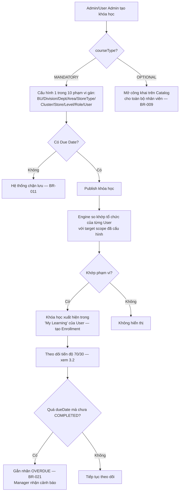

## 3.2. Quy trình hoàn thành bài học & tính tiến độ 70/30

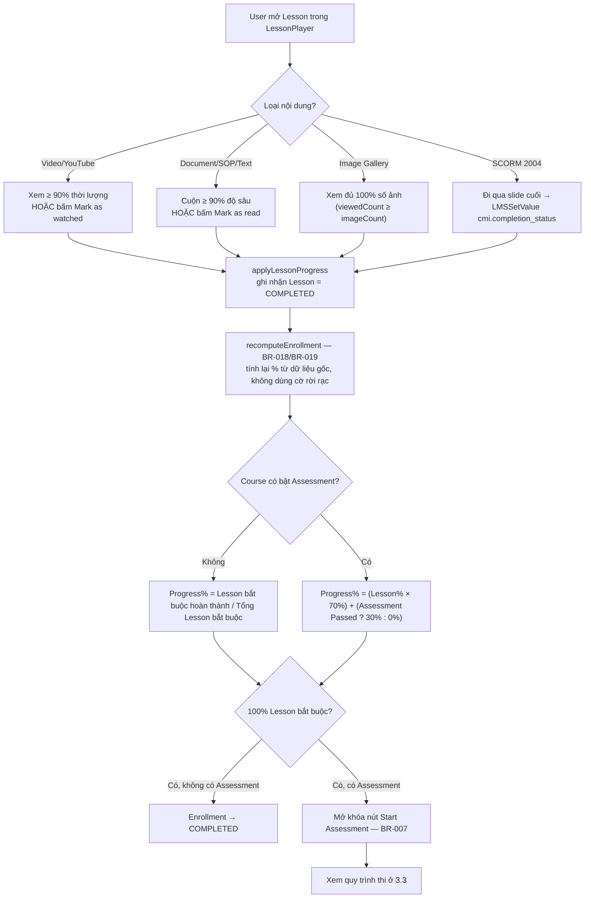

## 3.3. Quy trình khảo thí cuối khóa (Assessment Attempt)

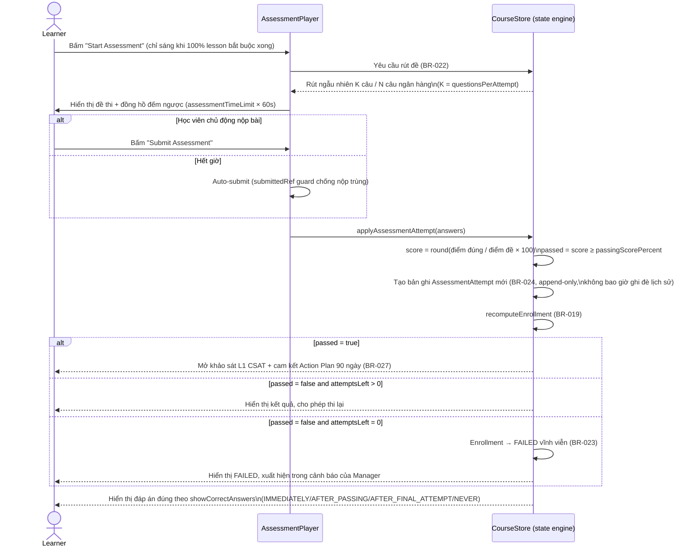

## 3.4. Quy trình đánh giá hiệu quả đào tạo Kirkpatrick L1 → L3 & Action Plan

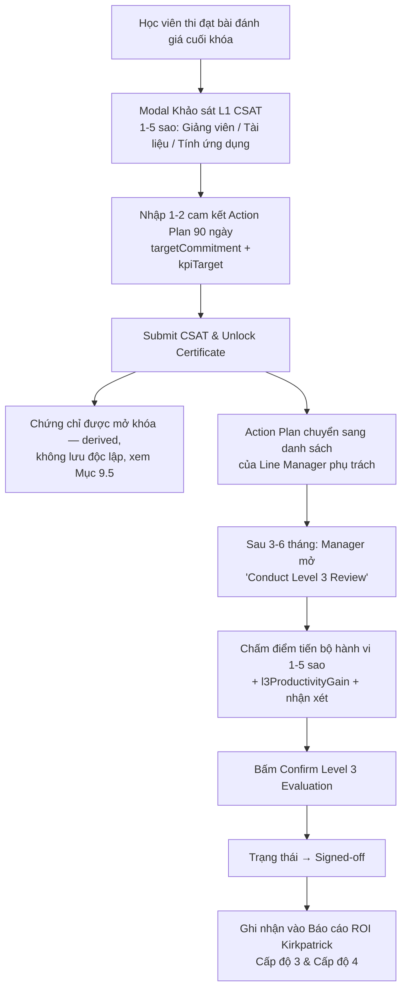

## 3.5. Quy trình phê duyệt khóa học & chi phí đào tạo (Approval + Cost Tracking)

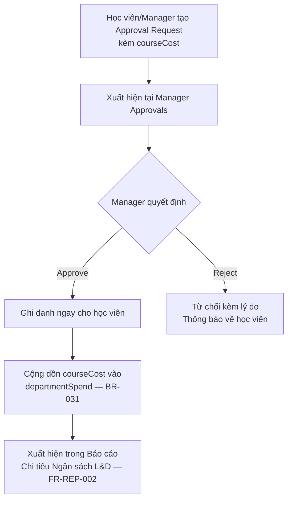

## 3.6. Quy trình đặt phòng thực hành / phòng họp (Room Booking Conflict Guard)

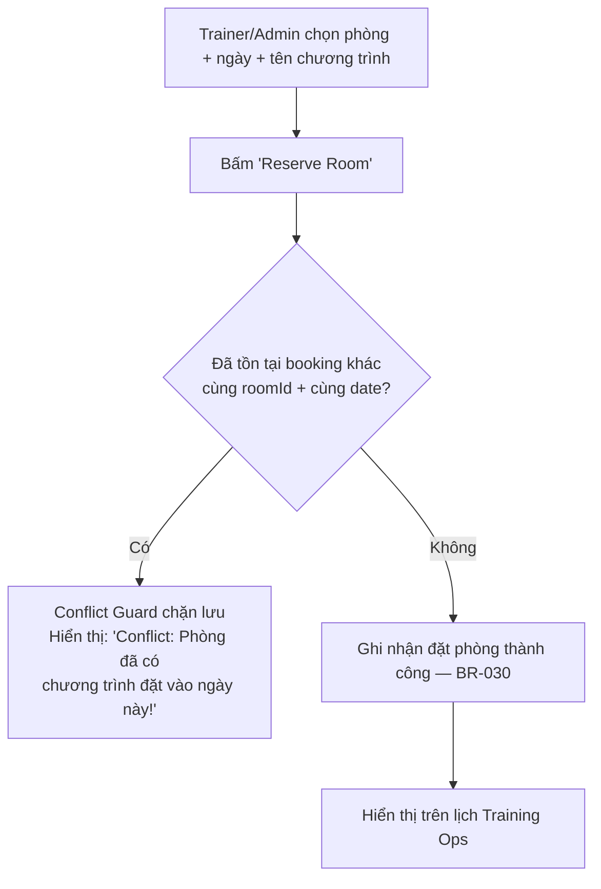

## 3.7. Quy trình tái chứng nhận (Recertification)

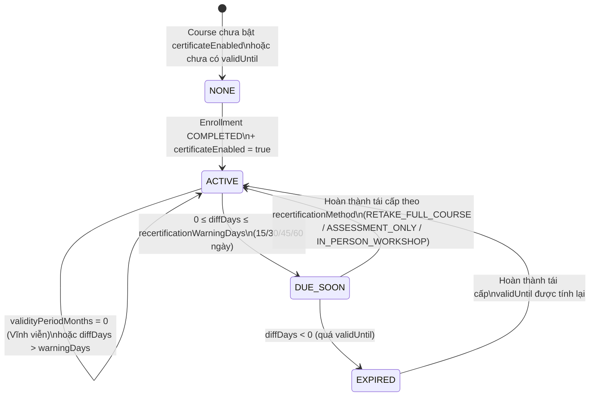

---
---

# 4. Software Requirements Specification (SRS)

## 4.1. Giới thiệu

### 4.1.1. Mục đích
Đặc tả đầy đủ yêu cầu chức năng (FR) và phi chức năng (NFR) của hệ thống MM MegaLearn, hợp nhất từ `lms-app/SRS.md` (bản dựng lại từ logic mã nguồn) và `lms-app/docs/MM_MEGALEARN_FUNCTIONAL_SPECIFICATION.md` (bản đặc tả V7.0), đã đối chiếu và hiệu chỉnh theo đúng mã nguồn hiện hành.

### 4.1.2. Phạm vi
Phạm vi là toàn bộ hành vi nghiệp vụ **đã hiện thực trong `lms-app/src`**. Các mục chưa nối hành động thật trong UI được liệt kê tường minh ở [4.3.10](#4310-các-phần-ui-có-sẵn-nhưng-chưa-nối-hành-động-thật).

### 4.1.3. Đối tượng đọc
Business Analyst, Solution Architect, Backend/Full-stack Developer, QA Engineer, đội L&OD.

## 4.2. Mô hình vai trò & phân quyền (RBAC)

6 vai trò, rank 1 (thấp nhất) → 6 (cao nhất), mỗi vai trò quản lý được mọi vai trò có rank thấp hơn (cascading hierarchy). Nguồn: `src/data/roles.js`.

| Rank | roleId | Tên vai trò | Route gốc | Level mặc định | Năng lực chính (capabilities) |
|:---:|:---|:---|:---|:---:|:---|
| 1 | `learner` | User Learner (Nhân Viên/Học Viên) | `/learner` | 7 | `canLearn`, `canRequestLevelSkip`, `canViewCsat` |
| 2 | `manager` | Line Manager (Quản Lý Trực Tiếp) | `/manager` | 4 | + `canViewTeam` (không duyệt học vượt cấp) |
| 3 | `trainer` | Trainer / L&D (Giảng Viên) | `/trainer` | 3 | + `canAuthorOfflineCourses`, `canTeach`, `canManageAttendance` |
| 4 | `hrbp` | HR Business Partner | `/hrbp` | 2 | + `canViewOrgProgress`, `canManageSkillMatrix`, `canManageSuccession`, `canProposeCurriculum` (chỉ đề xuất, không tự duyệt) |
| 5 | `useradmin` | User Administrator | `/user-admin` | 2 | + `canApproveLevelSkip`, `canManageUsers`, `canAllocateCourses`, `canAssignTrainers`, `canConfigureOrg`, `canAuthorOnlineCourses`, `canManageLevelRoadmaps`, `canManageCurriculum`, `canCreateVirtualClass` |
| 6 | `sysadmin` | System Administrator (IT) | `/sysadmin` | 1 | + `canConfigureSystem`, `canViewAuditLogs`, `canManageAllRoles`, `canDevelopPlatform` |

**Quy tắc quan trọng đã được sửa trong bản tái cấu trúc vai trò** (ghi rõ trong code, `roles.js` dòng 35–36, 74, 96–98): **duyệt đơn xin học vượt cấp (`canApproveLevelSkip`) KHÔNG thuộc về Manager** — chỉ `useradmin` và `sysadmin` có quyền này. Manager chỉ có thể **xin** vượt cấp (`canRequestLevelSkip`) như mọi vai trò khác.

Legacy role alias (chuẩn hóa dữ liệu cũ về đúng 6 role): `admin→trainer`, `lnd/l&d→trainer`, `instructor→trainer`, `employee/student→learner`, `it→sysadmin`.

### 4.2.1. Ma trận quyền truy cập chức năng chính

| Chức năng | learner | manager | trainer | hrbp | useradmin | sysadmin |
|:---|:---:|:---:|:---:|:---:|:---:|:---:|
| Học e-Learning & thi cá nhân | ✅ | ✅ | ✅ | ✅ | ✅ | ✅ |
| Khảo sát L1 & Action Plan (tạo) | ✅ | ✅ | ✅ | ✅ | ✅ | ✅ |
| Đánh giá hành vi L3 (team) | ❌ | ✅ | ❌ | R (vùng) | ❌ | ❌ |
| Đề cử/Chỉ định khóa học | ❌ | ✅ | ❌ | ❌ | ❌ | ❌ |
| Điểm danh Live QR (mở phiên) | ❌ | ❌ | ✅ | ❌ | R | R |
| Giám sát tiến độ & Nudge | ❌ | ✅ (team) | ❌ | R (vùng) | R (toàn quốc) | ❌ |
| Phê duyệt khóa học & chi phí | ❌ | ✅ | ❌ | ❌ | ❌ | ❌ |
| Quản lý Giảng viên & đặt phòng | ❌ | ❌ | ✅ | ❌ | ✅ | ✅ |
| Course Builder (soạn khóa) | ❌ | ❌ | Offline only | ❌ | Online + Offline | Online + Offline |
| Ngân hàng đề thi & import CSV | ❌ | ❌ | ❌ | ❌ | ✅ | ✅ |
| Duyệt đơn học vượt cấp | ❌ | ❌ | ❌ | ❌ | ✅ | ✅ |
| Cấu hình hệ thống/bảo mật | ❌ | ❌ | ❌ | ❌ | ❌ | ✅ |
| Xem Audit Log | ❌ | ❌ | ❌ | ❌ | ❌ | ✅ |

## 4.3. Yêu cầu chức năng (Functional Requirements)

### 4.3.1. FR-AUTH / FR-HRIS — Xác thực & Nhân sự
- **FR-AUTH-001**: Màn hình đăng nhập (`LoginPage.jsx`) + Role Switcher demo tại Topbar để đổi nhanh giữa 6 role. *(Ghi chú: đây là công cụ demo UI, không phải xác thực thật — xem NFR-SEC-003.)*
- **FR-HRIS-001**: Quản lý 4 trạng thái nhân sự: `ACTIVE`, `INACTIVE`, `TRANSFER`, `NEW_JOINER`. Màn hình admin hiển thị trạng thái đồng bộ HRIS, nút Manual Sync Trigger, nhật ký đồng bộ (`hrisSyncLogs`).

### 4.3.2. FR-ORG / FR-PRF — Cây tổ chức & Hồ sơ năng lực
- **FR-ORG-001**: Trình duyệt cây tổ chức nhánh đôi — đóng/mở từng cấp, form thêm nhanh Department/Store.
- **FR-PRF-001**: Talent Profile Modal 4 tab: (1) Talent & Succession Roadmap (`successorFor`, `readiness`, `mentor`, phân bổ 70-20-10, skill badge), (2) Career History, (3) Strategic Projects, (4) Training Curriculum & Scores.

### 4.3.3. FR-CRS — Soạn thảo & quản lý khóa học
- **FR-CRS-001**: Course Builder kéo-thả, cấu trúc `Course > Module > Lesson`, quản lý version (`version: 'v1.0'`), 10 định dạng nội dung bài học (SCORM 2004, Video, Interactive PPT, External embed, YouTube, PDF, Script, Image Gallery, Text/HTML, ILT).
- **FR-CRS-002**: Auto-Rules gán tự động theo 10 phạm vi + SLA hoàn thành (vd. 14 ngày).

### 4.3.4. FR-ASSESS — Khảo thí
- **FR-ASSESS-001**: Ngân hàng câu hỏi 3 loại (`SINGLE_CHOICE`, `MULTIPLE_CHOICE`, `TRUE_FALSE`), import CSV có tiền kiểm duyệt (bỏ qua dòng lỗi nhưng đếm & báo cáo, không mất dữ liệu âm thầm).
- **FR-ASSESS-002 → 010**: Điều kiện bắt đầu thi, rút đề ngẫu nhiên, đếm giờ, tự nộp bài (idempotent qua `submittedRef`), chấm điểm, ghi `AssessmentAttempt` bất biến, hiển thị đáp án theo 4 chế độ.

### 4.3.5. FR-TRN — Lớp thực hành ILT & phòng
- **FR-TRN-001**: Danh sách lớp ILT/webinar, Live QR Check-in (+150 XP).
- **FR-TRN-002**: Quản lý giảng viên, phòng thực hành/phòng họp, đặt phòng có kiểm tra xung đột `(roomId, date)`.

### 4.3.6. FR-LRN — Cổng học tập & Gamification
- **FR-LRN-001**: Dashboard cá nhân — thẻ "Continue Learning", KPI, 4 tab lọc (All/Mandatory/Optional/Completed).
- **FR-LRN-002**: Lộ trình nghề nghiệp khung 70-20-10 (10% Formal, 20% Social Coaching, 70% Experiential OJT).
- **FR-LRN-003**: XP, streak, huy hiệu, bảng xếp hạng Department/Company.

### 4.3.7. FR-MGR — Giám sát quản lý
- **FR-MGR-001**: Giám sát đội (giới hạn theo cơ cấu tổ chức), danh sách "Needs Attention" (OVERDUE / không hoạt động > 3 ngày / FAILED_EXAM), nút Nudge.
- **FR-MGR-002**: Course Nomination Modal (chọn nhân viên + khóa học + dueDate + justification).
- **FR-MGR-003**: Phê duyệt/từ chối đơn học kèm cost tracking.
- **FR-MGR-004**: L1 CSAT (học viên), quản lý Action Plans, đánh giá L3 (Manager, có sign-off).

### 4.3.8. FR-REP — Báo cáo
- **FR-REP-001**: ROI Kirkpatrick 4 cấp độ.
- **FR-REP-002**: Heatmap tuân thủ theo màu chuẩn (Xanh ≥90%, Vàng 70–89%, Đỏ <70%), báo cáo `departmentSpend`.
- **FR-REP-003**: Export CSV UTF-8 BOM, export PDF qua `window.print()`.

### 4.3.9. FR-AI — Trợ lý AI
- **FR-AI-001**: Tra cứu SOP theo ngữ nghĩa với bộ lọc chủ đề (#Bakery, #Food Safety, #Fire Safety, #Security).
- **FR-AI-002**: Chatbot AI Hub + Floating Drawer toàn hệ thống.
- **FR-AI-003**: Gợi ý khóa học cá nhân hóa theo chức danh & lịch sử học.

### 4.3.10. Các phần UI có sẵn nhưng chưa nối hành động thật
Ghi nhận trung thực từ `SRS.md` §10.4 — cần hoàn thiện khi làm backend:
- Nút "Send reminder" trong "Needs attention" của Manager Dashboard.
- Nút "View" trên bảng Manager Team.
- Nút "Save configuration" trong Admin Configuration.
- Bộ lọc BU/Division/Department/Role/Employee/Course/Status/Date trong Admin Reports (hiện chỉ có bảng/biểu đồ tĩnh).

## 4.4. Yêu cầu phi chức năng (Non-Functional Requirements)

| Mã | Hạng mục | Mô tả | Trạng thái |
|:---|:---|:---|:---|
| NFR-PERF-001 | Hiệu năng | 95% truy vấn API < 200ms | **[TARGET]** chưa có API để đo |
| NFR-PERF-002 | Khả năng chịu tải | Tối thiểu 2.000 CCU trong đợt thi toàn quốc | **[TARGET]** |
| NFR-SEC-001 | Bảo mật truyền tải | HTTPS/TLS 1.3, dữ liệu nhạy cảm mã hóa AES-256 | **[TARGET]** |
| NFR-SEC-002 | RBAC backend | Kiểm soát phân quyền ở cả Router và Backend Interceptor | **[TARGET]** — hiện chỉ có RBAC phía client (`roles.js`) |
| NFR-SEC-003 | Xác thực thật | Thay Role Switcher demo bằng session xác thực (SSO/LDAP đề xuất) | **[TARGET]**, xem README: *"a real build should derive the role from an authenticated session"* |
| NFR-AVAIL-001 | Tính sẵn sàng | Uptime tối thiểu 99.9%, sao lưu định kỳ | **[TARGET]** |
| NFR-DATA-001 | Toàn vẹn lịch sử | `AssessmentAttempt` là bản ghi append-only, backend không cho update/xóa | **[TARGET]** — đã mô phỏng đúng hành vi ở front-end |
| NFR-DATA-002 | Idempotency | Auto-submit khi hết giờ không tạo trùng attempt | Đã có guard `submittedRef` ở front-end; **[TARGET]** cần ràng buộc tương đương ở API/DB |
| NFR-UX-001 | Giao diện | Theme sáng duy nhất, nền `--paper:#FBF9F4`, không dark mode, màu luôn kèm badge/label (không dùng màu làm kênh thông tin duy nhất) | Đã triển khai |
| NFR-STORE-001 | Lưu trữ file | Cần object storage (S3-compatible) cho nội dung bài học | **[TARGET]** — hiện dùng object URL tạm, mất khi reload trình duyệt |

## 4.5. Giả định & Ngoài phạm vi (Out of Scope)

- Không có luồng "Manager duyệt hoàn thành khóa học" — quyết định thiết kế có chủ đích.
- Không có forum thảo luận/hỏi đáp trong khóa học.
- Không có custom report builder (chỉ báo cáo dựng sẵn).
- Đăng ký/tạo user mới, đổi cơ cấu Business Unit/Division/Department chưa có màn hình quản trị — dữ liệu tổ chức hiện là seed tĩnh.

---
---

# 5. Use Case Model

## 5.1. Danh sách Actor

| Actor | Tương ứng roleId | Ghi chú |
|:---|:---|:---|
| **User Learner** | `learner` | Mọi actor khác đều kế thừa toàn bộ use case của Learner (`canLearn`) |
| **Line Manager** | `manager` | |
| **Trainer / L&D** | `trainer` | |
| **HR Business Partner** | `hrbp` | |
| **User Administrator** | `useradmin` | |
| **System Administrator (IT)** | `sysadmin` | |
| **System (engine tự động)** | — | Actor phụ trợ: recompute progress, recertification checker, notification scheduler, auto-assignment matcher — chạy ngầm không cần tương tác người dùng |

## 5.2. Sơ đồ Use Case (theo nhóm chức năng)

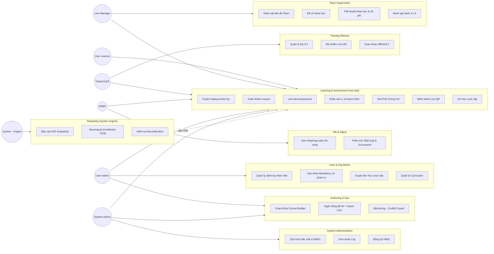

## 5.3. Bảng đầy đủ danh mục Use Case

| Mã | Tên Use Case | Actor chính | Gói |
|:---|:---|:---|:---|
| UC-01 | Duyệt danh mục khóa học (Catalog) | Learner (mọi role) | Learning |
| UC-02 | Truy cập khóa học đã được gán | Learner | Learning |
| UC-03 | Hoàn thành một Lesson (đa định dạng) | Learner | Learning |
| UC-04 | Làm bài đánh giá cuối khóa | Learner | Learning |
| UC-05 | Gửi khảo sát L1 CSAT & cam kết Action Plan | Learner | Learning |
| UC-06 | Xem / tải Chứng chỉ | Learner | Learning |
| UC-07 | Điểm danh Live QR tại lớp ILT | Learner | Learning |
| UC-08 | Xem lịch sử học tập (Transcript) | Learner | Learning |
| UC-09 | Xem lịch học cá nhân (Learning Calendar) | Learner | Learning |
| UC-10 | Xin học vượt cấp (Level-skip Request) | Learner | Learning |
| UC-11 | Xem bảng xếp hạng & huy hiệu (Gamification) | Learner | Learning |
| UC-12 | Hỏi trợ lý AI / tra cứu SOP | Learner | Learning |
| UC-13 | Giám sát tiến độ học tập của đội ngũ | Manager | Supervision |
| UC-14 | Gửi nhắc nhở 1-chạm (Nudge) | Manager | Supervision |
| UC-15 | Đề cử / Chỉ định khóa học cho nhân viên | Manager | Supervision |
| UC-16 | Phê duyệt / Từ chối khóa học & chi phí | Manager | Supervision |
| UC-17 | Đánh giá hành vi Kirkpatrick L3 (sau 3–6 tháng) | Manager | Supervision |
| UC-18 | Xem phân tích Skill Gap của đội ngũ | Manager | Supervision |
| UC-19 | Quản lý danh sách lớp thực hành ILT | Trainer | Delivery |
| UC-20 | Mở phiên điểm danh Live QR | Trainer | Delivery |
| UC-21 | Soạn khóa học Offline/ILT (tự dạy) | Trainer | Delivery |
| UC-22 | Xem phản hồi CSAT từ học viên | Trainer | Delivery |
| UC-23 | Xem bản đồ nhiệt tuân thủ theo vùng | HRBP | HR & Talent |
| UC-24 | Phân tích Skill Gap & Succession Pipeline | HRBP | HR & Talent |
| UC-25 | Đề xuất ứng viên vào Curriculum | HRBP | HR & Talent |
| UC-26 | Quản lý danh bạ nhân viên (100+) | User Admin | Org Admin |
| UC-27 | Quản lý cây tổ chức nhánh đôi | User Admin | Org Admin |
| UC-28 | Gán khóa Mandatory theo 10 phạm vi | User Admin | Org Admin |
| UC-29 | Phân công Giảng viên đứng lớp | User Admin | Org Admin |
| UC-30 | Duyệt đơn học vượt cấp | User Admin / SysAdmin | Org Admin |
| UC-31 | Quản lý Lộ trình Cấp bậc (Level Roadmap) | User Admin / SysAdmin | Org Admin |
| UC-32 | Quản lý Curriculum (nhóm khóa học) | User Admin / SysAdmin | Org Admin |
| UC-33 | Soạn khóa học (Course Builder đầy đủ) | User Admin / SysAdmin / Trainer | Authoring |
| UC-34 | Cấu hình ngân hàng đề thi (thủ công/CSV) | User Admin / SysAdmin | Authoring |
| UC-35 | Đặt phòng thực hành/phòng họp (Conflict Guard) | Trainer / User Admin / SysAdmin | Authoring |
| UC-36 | Cấu hình luật tự động gán (Auto-Rules) | User Admin / SysAdmin | Authoring |
| UC-37 | Cấu hình bảo mật & chính sách RBAC | SysAdmin | System Admin |
| UC-38 | Xem Audit Log (ISO 27001) | SysAdmin | System Admin |
| UC-39 | Kích hoạt/giám sát đồng bộ HRIS | SysAdmin | System Admin |
| UC-40 | Quản trị phân quyền toàn bộ vai trò | SysAdmin | System Admin |
| UC-41 | Xem báo cáo ROI Kirkpatrick 4 cấp độ | Manager/HRBP/UserAdmin/SysAdmin | Reporting |
| UC-42 | Xuất báo cáo CSV (UTF-8 BOM) | UserAdmin/SysAdmin | Reporting |
| UC-43 | Xuất hồ sơ kiểm toán PDF | UserAdmin/SysAdmin | Reporting |
| UC-44 | Xem báo cáo chi tiêu ngân sách đào tạo | Manager/UserAdmin/SysAdmin | Reporting |

---
---

# 6. Use Case Specification

Đặc tả chi tiết 8 use case cốt lõi (đại diện cho engine nghiệp vụ quan trọng nhất). Các use case còn lại tuân theo cùng khuôn mẫu và có thể được đặc tả chi tiết theo yêu cầu tương tự.

## UC-03 — Hoàn thành một Lesson

| | |
|:---|:---|
| **Actor chính** | User Learner (và mọi role qua `canLearn`) |
| **Mô tả** | Học viên tương tác với nội dung một bài học để hệ thống ghi nhận hoàn thành. |
| **Tiền điều kiện** | Course chưa bị khóa bởi Prerequisite chưa hoàn thành; Enrollment tồn tại. |
| **Trigger** | Học viên mở Lesson trong `LessonPlayer`. |
| **Luồng chính** | 1. Hệ thống xác định `lessonType`.<br>2. Học viên tương tác theo đúng rule của loại nội dung (xem bảng BR-004/005/006 ở Mục 4).<br>3. Khi đạt ngưỡng, hệ thống gọi `applyLessonProgress()` đánh dấu Lesson = COMPLETED.<br>4. Hệ thống gọi `recomputeEnrollment()` tính lại % tiến độ tổng thể (BR-018/019).<br>5. Nếu đây là lesson bắt buộc cuối cùng và course có Assessment, nút "Start Assessment" được mở khóa (BR-007). |
| **Luồng phụ** | 3a. Lesson không thuộc diện `isRequired` → vẫn ghi COMPLETED nhưng không tính vào mẫu số % (BR-003). |
| **Ngoại lệ** | Course bị khóa do Prerequisite → chỉ hiển thị thông báo khóa, không cho vào Lesson. |
| **Hậu điều kiện** | Trạng thái Lesson và % Enrollment được cập nhật tức thời, nhất quán (single source of truth). |
| **Business Rules liên quan** | BR-002, BR-003, BR-004, BR-005, BR-006, BR-018, BR-019 |

## UC-04 — Làm bài đánh giá cuối khóa

| | |
|:---|:---|
| **Actor chính** | User Learner |
| **Tiền điều kiện** | 100% lesson bắt buộc (không tính ASSESSMENT) đã COMPLETED; `attemptsLeft = maxAttempts − số attempt đã làm > 0`; chưa từng đạt (pass) bài này. |
| **Trigger** | Bấm "Start Assessment". |
| **Luồng chính** | 1. Hệ thống rút ngẫu nhiên `questionsPerAttempt` câu từ ngân hàng (BR-022).<br>2. Hiển thị đề thi + đồng hồ đếm ngược `assessmentTimeLimit × 60` giây.<br>3. Học viên chọn đáp án; bấm "Submit Assessment".<br>4. Hệ thống chấm điểm `score = round(điểm đúng/điểm đề × 100)`.<br>5. So sánh với `passingScorePercent` → `passed`.<br>6. Tạo bản ghi `AssessmentAttempt` mới (append-only, BR-024).<br>7. `recomputeEnrollment()`.<br>8. Hiển thị đáp án đúng theo `showCorrectAnswers` (BR-025). |
| **Luồng phụ** | 3a. Hết giờ trước khi học viên bấm Submit → hệ thống tự động nộp bài, có `submittedRef` guard chống nộp trùng (BR-026). |
| **Ngoại lệ** | Hết `attemptsLeft` mà chưa đạt → Enrollment chuyển `FAILED` vĩnh viễn, không tự mở thêm lượt (BR-023), xuất hiện trong danh sách cảnh báo của Manager. |
| **Hậu điều kiện** | Nếu `passed = true` → mở khảo sát L1 CSAT & Action Plan (UC-05). |
| **Business Rules liên quan** | BR-007, BR-022 → BR-026 |

## UC-05 — Gửi khảo sát L1 CSAT & cam kết Action Plan

| | |
|:---|:---|
| **Actor chính** | User Learner |
| **Tiền điều kiện** | Vừa thi đạt bài đánh giá cuối khóa (hoặc course không có assessment nhưng đã hoàn thành 100% lesson bắt buộc). |
| **Luồng chính** | 1. Modal khảo sát hiển thị 3 tiêu chí đánh giá 1–5 sao (Giảng viên, Tài liệu, Tính ứng dụng).<br>2. Học viên nhập 1–2 cam kết Action Plan (`targetCommitment`, `kpiTarget`) trong 90 ngày.<br>3. Bấm "Submit CSAT & Unlock Certificate".<br>4. Hệ thống mở khóa Chứng chỉ (nếu `certificateEnabled = true`).<br>5. Action Plan được chuyển sang danh sách theo dõi của Line Manager phụ trách. |
| **Hậu điều kiện** | Certificate available (derived); Action Plan chờ đánh giá L3 sau 3–6 tháng (UC-17). |
| **Business Rules liên quan** | BR-027 |

## UC-15 — Đề cử / Chỉ định khóa học cho nhân viên

| | |
|:---|:---|
| **Actor chính** | Line Manager |
| **Tiền điều kiện** | Manager đã đăng nhập và có nhân viên trực thuộc trong phạm vi tổ chức của mình. |
| **Luồng chính** | 1. Manager chọn nhân viên từ Team tab, bấm "Assign".<br>2. Mở `ManagerNominateModal`: chọn khóa học từ Catalog, đặt `dueDate`, nhập `justification`.<br>3. Bấm "Confirm Nomination".<br>4. Hệ thống ghi danh (tạo Enrollment) ngay cho nhân viên và gửi thông báo `COURSE_ASSIGNED` vào inbox. |
| **Ngoại lệ** | Manager không có quyền gán khóa Mandatory theo phạm vi tổ chức (đó là quyền của User Admin/SysAdmin, UC-28) — đây là gán trực tiếp 1:1 mang tính đề xuất phát triển cá nhân. |
| **Business Rules liên quan** | FR-MGR-002 |

## UC-16 — Phê duyệt / Từ chối khóa học & chi phí

| | |
|:---|:---|
| **Actor chính** | Line Manager |
| **Tiền điều kiện** | Tồn tại một `ApprovalRequest` đang chờ (nhân viên xin học khóa nâng cao/chứng chỉ ngoài kèm `courseCost`). |
| **Luồng chính** | 1. Manager mở `/manager/approvals`, xem danh sách đơn chờ duyệt kèm chi phí (vd. 4.500.000 VND).<br>2a. **Approve**: ghi danh ngay cho học viên, cộng `courseCost` vào `departmentSpend` (BR-031).<br>2b. **Reject**: hủy yêu cầu, gửi thông báo kèm lý do về học viên. |
| **Business Rules liên quan** | BR-031, FR-MGR-003 |

## UC-17 — Đánh giá hành vi Kirkpatrick L3 (sau 3–6 tháng)

| | |
|:---|:---|
| **Actor chính** | Line Manager |
| **Tiền điều kiện** | Nhân viên có Action Plan đã thiết lập ở UC-05, đã đến `evaluationDate` (sau 3–6 tháng). |
| **Luồng chính** | 1. Manager mở tab "Action Plans & L3 Review", bấm "Conduct Level 3 Review (3–6 Mos)".<br>2. Chấm điểm tiến bộ hành vi 1–5 sao (`l3BehaviorRating`).<br>3. Nhập chỉ số tăng năng suất / giảm hao hụt thực tế (`l3ProductivityGain`).<br>4. Nhập nhận xét.<br>5. Bấm "Confirm Level 3 Evaluation" → trạng thái chuyển **Signed-off**. |
| **Hậu điều kiện** | Dữ liệu được ghi nhận vào Báo cáo ROI Kirkpatrick Cấp độ 3/4 (UC-41). |
| **Business Rules liên quan** | BR-028 |

## UC-28 — Gán khóa học Mandatory theo 10 phạm vi

| | |
|:---|:---|
| **Actor chính** | User Administrator (và SysAdmin) |
| **Tiền điều kiện** | Course đã được tạo với `courseType = MANDATORY`. |
| **Luồng chính** | 1. Chọn 1 trong 10 phạm vi gán mục tiêu: `BUSINESS_UNIT`, `DIVISION`, `DEPARTMENT`, `AREA`, `STORE_TYPE`, `CLUSTER`, `STORE`, `LEVEL`, `ROLE`, `USER` (BR-010).<br>2. Bắt buộc nhập `dueDate` — hệ thống chặn lưu nếu để trống (BR-011).<br>3. Publish khóa học.<br>4. Hệ thống tự động so khớp tổ chức của từng User với target đã cấu hình, tạo Enrollment cho các User khớp phạm vi (BR-009). |
| **Luồng phụ** | Khi đổi `courseType` từ Mandatory → Optional: assignment bị hủy (`null`), khóa mở rộng cho toàn công ty (BR-012). |
| **Business Rules liên quan** | BR-009, BR-010, BR-011, BR-012 |

## UC-33 — Soạn khóa học (Course Builder)

| | |
|:---|:---|
| **Actor chính** | User Administrator / SysAdmin (đầy đủ Online + Offline); Trainer (chỉ Offline/ILT tự dạy) |
| **Tiền điều kiện** | Actor có capability `canAuthorOnlineCourses` và/hoặc `canAuthorOfflineCourses`. |
| **Luồng chính** | 1. Chọn hình thức: Online E-learning hoặc In-Person/ILT.<br>2. Nếu ILT: cấu hình Giảng viên đứng lớp, phòng/xưởng thực hành, ngày giờ, sức chứa.<br>3. Xây cấu trúc `Course > Module > Lesson`, cấu hình từng loại nội dung.<br>4. Cấu hình `courseCost`, Prerequisites, đối tượng gán (nếu Mandatory).<br>5. Cấu hình Assessment + ngân hàng đề thi (UC-34) nếu bật.<br>6. Bấm "Publish Course" → khóa học kích hoạt, xuất hiện ở Learner Portal/Trainer Hub. |
| **Ngoại lệ** | Xóa course chỉ được phép khi chưa có Enrollment nào (`courseHasParticipants = false`); nếu đã có người học → chuyển `ARCHIVED` thay vì xóa (BR-008). |
| **Business Rules liên quan** | BR-001, BR-008, FR-CRS-001 |

## UC-35 — Đặt phòng thực hành / phòng họp (Conflict Guard)

| | |
|:---|:---|
| **Actor chính** | Trainer / User Administrator / SysAdmin |
| **Luồng chính** | 1. Chọn phòng (xưởng thực hành siêu thị hoặc phòng họp Head Office), chọn ngày, nhập tên chương trình.<br>2. Bấm "Reserve Room".<br>3. Hệ thống kiểm tra xung đột theo cặp `(roomId, date)`.<br>4a. Nếu trùng → chặn lưu, hiển thị cảnh báo đỏ "Conflict: Phòng đã có chương trình đặt vào ngày này!".<br>4b. Nếu trống → ghi nhận thành công, hiển thị trên lịch Training Ops. |
| **Business Rules liên quan** | BR-030 |

---
---

# 7. Glossary

Hợp nhất từ `SRS.md` §1.4, `MM_MEGALEARN_FUNCTIONAL_SPECIFICATION.md` §1.2, và thuật ngữ phát hiện trong mã nguồn.

| Thuật ngữ / Mã | Tên đầy đủ | Định nghĩa |
|:---|:---|:---|
| **BU** | Business Unit | Đơn vị kinh doanh cấp cao nhất (`bu-mmvn`: MM Mega Market Vietnam). |
| **Supporting Functions** | Supporting Office Branch | Nhánh Trụ sở chính: Division → Department. |
| **Operations Branch** | Store Operations Branch | Nhánh Chuỗi Siêu thị: Area → Cluster → Retail Store. |
| **Division** | Khối nghiệp vụ | 16 khối tại Trụ sở chính (OMD, FAD, GM, OPT, SCM, HRD, MKT, LGD, CDD, PRC, ECOM, LP, IA, CAP, PROP, TU). |
| **Department** | Phòng ban | 56 phòng ban trực thuộc các Division. |
| **Store Type** | Loại hình siêu thị | 4 loại: Cash & Carry (C&C), Super Center, Food Service, Depot. |
| **Job Level** | Cấp bậc nghề nghiệp | Thang 7 cấp **đảo ngược**: Level 1 = Board of Management (cao nhất), Level 7 = Junior Associate (thấp nhất). |
| **Role** | Vai trò hệ thống | 6 vai trò phân cấp: `learner`, `manager`, `trainer`, `hrbp`, `useradmin`, `sysadmin`. |
| **Mandatory Course** | Khóa học bắt buộc | Có `dueDate`, gán theo 1 trong 10 phạm vi tổ chức. |
| **Optional Course** | Khóa học tự chọn | Mở công khai trên Catalog cho 100% nhân viên. |
| **Enrollment** | Learning Enrollment Record | Bản ghi quan hệ duy nhất giữa 1 User và 1 Course, lưu tiến độ 70/30 và trạng thái. |
| **Attempt** | Assessment Attempt | Bản ghi bất biến (append-only) của 1 lượt làm bài đánh giá. |
| **Action Plan** | Post-Training Action Plan | Cam kết áp dụng kiến thức vào công việc trong 90 ngày, kèm chỉ tiêu KPI. |
| **Kirkpatrick L1/L2/L3/L4** | 4 cấp đánh giá hiệu quả đào tạo | L1: Hài lòng (CSAT). L2: Điểm số/Pass thi. L3: Thay đổi hành vi (Manager đánh giá sau 3–6 tháng). L4: Hiệu quả tài chính/ROI. |
| **Cost Tracking** | Training/Program Cost | Theo dõi `courseCost` từng khóa và `departmentSpend` theo phòng ban. |
| **Recertification** | Tái chứng nhận | Chu kỳ gia hạn chứng chỉ có thời hạn: `validityPeriodMonths`, `recertificationWarningDays`, `recertificationMethod`. |
| **ILT** | In-Person / Instructor-Led Training | Lớp đào tạo trực tiếp có giảng viên đứng lớp, điểm danh Live QR. |
| **SCORM 2004** | Sharable Content Object Reference Model | Chuẩn đóng gói nội dung e-learning, mô phỏng qua sự kiện `LMSSetValue(cmi.completion_status)`. |
| **XP / Streak** | Experience Points / Chuỗi ngày học | Cơ chế Gamification: +20 XP/lesson, +100 XP thi đạt 100%, +150 XP điểm danh Live QR. |
| **Level Gate** | Cổng cấp bậc tuần tự | Cơ chế chặn học vượt ≥ 2 cấp; cho phép xin duyệt vượt đúng 1 cấp liền kề. |
| **HRIS** | Human Resource Information System | Hệ thống nhân sự nguồn — *[TARGET]* SAP SuccessFactors. |
| **RBAC** | Role-Based Access Control | Cơ chế phân quyền theo vai trò. |
| **CCU** | Concurrent Users | Người dùng đồng thời. |
| **CSAT** | Customer/Learner Satisfaction | Điểm hài lòng học viên (khảo sát L1). |

---
---

# 8. GUI Specification

## 8.1. Nguyên tắc thiết kế chung

- **Theme**: sáng duy nhất (light-only), nền giấy ấm `--paper: #FBF9F4`, **không có dark mode**.
- **Bảng màu mang ý nghĩa cố định trên toàn hệ thống** (không dùng màu làm kênh thông tin duy nhất — luôn kèm badge/label):
  | Màu | Token | Ý nghĩa |
  |:---|:---|:---|
  | Pine green | `--rail` | Thương hiệu / hành động chính |
  | Amber | — | Đang xử lý / chờ (`IN_PROGRESS`, `DUE_SOON`) |
  | Sage | — | Đạt / hoàn thành (`COMPLETED`, `ACTIVE`) |
  | Rust | — | Quá hạn / chặn / lỗi (`OVERDUE`, `FAILED`, `EXPIRED`) |
  | Slate | — | Trung tính / chưa bắt đầu (`NOT_STARTED`, `NONE`) |
- Design tokens định nghĩa tại `src/styles/tokens.css`; style thành phần tại `src/styles/app.css`. Không dùng thư viện UI ngoài (không MUI/Chakra/Tailwind) — CSS thuần theo custom properties.

## 8.2. Bố cục khung chung (Global Layout)

| Thành phần | Vị trí | Hành vi |
|:---|:---|:---|
| **Sidebar** (`Sidebar.jsx`) | Cột trái | Menu điều hướng tự đổi theo vai trò đang chọn (role-aware navigation). |
| **Topbar** (`Topbar.jsx`) | Trên cùng | Tiêu đề trang + **Role Switcher** (badge góc phải, đổi tức thì 6 vai trò) + chuông thông báo. |
| **AI Assistant Drawer** (`AiAssistantDrawer.jsx`) | Nút tròn nổi góc dưới phải | Mở ngăn kéo nổi hỏi đáp SOP mà không rời trang hiện tại. |
| **ErrorBoundary** | Toàn ứng dụng | Bọc nội dung route; cung cấp nút "Reset Session Cache & Reload" xóa `localStorage` khi lỗi runtime. |
| **ModuleList / LessonRow** (`components/ui.jsx`) | Trang chi tiết khóa học | Thành phần "chữ ký" của sản phẩm — hiển thị trực quan cấu trúc Course > Module > Lesson, mỗi lesson tự hoàn thành theo rule riêng, không có bước duyệt của Manager. |
| **Badge / ProgressBar / StatCard / Button / CourseTypeBadge** | Dùng lại toàn hệ thống | Bộ thành phần UI cơ bản trong `components/ui.jsx`. |

## 8.3. Bản đồ màn hình theo vai trò (Route Inventory)

Nguồn: `src/App.jsx`, `src/pages/**`.

| Nhóm | Route tiêu biểu | Trang |
|:---|:---|:---|
| **Learner** | `/learner` | `LearnerDashboard` |
| | `/learner/courses/:courseId` | `LearnerCourseDetail` |
| | `/learner/courses/:courseId/lessons/:lessonId` | `LessonPlayer` |
| | `/learner/courses/:courseId/assessment` | `AssessmentPlayer` |
| | `/learner/calendar` | `LearnerCalendar` |
| | `/learner/certificates` | `LearnerCertificates` |
| | `/learner/classrooms` | `LearnerClassrooms` |
| | `/learner/learning-paths` | `LearnerLearningPaths` |
| | `/learner/leaderboard` | `LearnerLeaderboard` |
| **Chia sẻ mọi role** | `/my-learning`, `/my-learning-calendar`, `/my-certificates` | `MyLearning`, `LearnerCalendar` (dùng chung), `MyCertificates` |
| **Manager** | `/manager`, `/manager/team`, `/manager/approvals`, `/manager/reports` | `ManagerDashboard`, `ManagerTeam`, `ManagerApprovals`, `ManagerReports` |
| **Trainer** | `/trainer`, `/trainer/attendance`, `/trainer/training-ops` | `TrainerHub` (tabs: CLASSES/ATTENDANCE/FEEDBACK/LABS) |
| **HRBP** | `/hrbp`, `/hrbp/succession`, `/hrbp/compliance`, `/hrbp/curriculum` | `HrbpDashboard` (tabs: SKILL_GAP/SUCCESSION/COMPLIANCE/CURRICULUM), `HrbpCurriculumTab` |
| **User Admin** | `/user-admin/hierarchy`, `/user-admin/job-levels`, `/user-admin/allocation`, `/user-admin/roadmaps` | `UserAdminPortal` (tabs: DIRECTORY/HIERARCHY/JOB_LEVELS/ALLOCATION/TRAINER_ASSIGNMENT) |
| **SysAdmin** | `/sysadmin/audit`, `/sysadmin/policies`, `/sysadmin/roles` | `SysAdminPortal` (tabs: HRIS/AUDIT_LOGS/POLICIES/ROLE_GOVERNANCE) |
| **Admin (Course Ops)** | `/admin/courses/new`, `/admin/reports`, `/admin/roadmaps` | `AdminCourseBuilder`, `AdminReports`, `AdminLevelRoadmaps` |
| **Auth** | `/login` | `LoginPage` |

Route không xác định → tự động điều hướng về trang chủ của vai trò hiện tại (`ROLE_HOME`).

## 8.4. Đặc tả tương tác màn hình then chốt

### Learner Dashboard
- Thẻ **"Continue Learning"**: khóa `IN_PROGRESS` gần nhất + % tiến độ + `dueDate` + nút **Resume Course** → mở thẳng lesson kế tiếp trong `LessonPlayer`.
- 4 Tab lọc: All / Mandatory / Optional / Completed.

### Lesson Player (đa định dạng)
| Định dạng | Thao tác | Điều kiện hoàn thành |
|:---|:---|:---|
| Video/Stream | Xem trực tuyến | ≥90% thời lượng hoặc "Mark as watched" |
| YouTube | Xem khung nhúng chuẩn đỏ | Bấm "Confirm Video Watched" |
| SCORM 2004 | Previous/Next Slide | Qua slide cuối |
| SOP/Text | Cuộn đọc | ≥90% độ sâu hoặc "Mark as Read" |
| Image Gallery | Xem lần lượt | Đủ 100% số ảnh |

### Assessment Player
1. Nút "Start Assessment" chỉ sáng khi đủ điều kiện.
2. Đồng hồ đếm ngược, đổi đỏ khi < 60s.
3. Submit chủ động hoặc tự động khi hết giờ.
4. Hiển thị điểm số, đạt/không đạt, `attemptsLeft`.

### Manager — Team Supervision
3 tab: **Team Members** (Assign → `ManagerNominateModal`; View Profile → `TalentProfileModal`), **Skill Gap Analysis** (nút "Assign Developmental Course"), **Action Plans & L3 Review** (nút "Conduct Level 3 Review (3-6 Mos)").

### Course Builder (Admin/User Admin/SysAdmin)
1. Chọn hình thức: 🌐 Online E-learning hoặc 🏢 In-Person/ILT.
2. Nếu ILT: chọn Giảng viên, phòng/xưởng, ngày giờ (Sáng 08:30–11:30 / Chiều 13:30–16:30), sức chứa; gán nhanh nhóm (All Managers, New Joiners, Toàn công ty...).
3. Cấu hình Module/Lesson, ngân hàng đề thi.
4. Publish.

### Training Ops (Đặt phòng)
Reserve Room → Conflict Guard kiểm tra `(roomId, date)` → chặn đỏ nếu trùng, ghi nhận thành công nếu trống. Nút "Schedule New Cohort" điều hướng sang Course Builder. Batch Student Upload: dán danh sách mã nhân viên → ghi danh đồng loạt.

### Admin Reports
Nút **"Export Excel Report (CSV)"** (UTF-8 BOM) và **"Export Audit Dossier"** (`window.print()` chuẩn A4).

---
---

# 9. Technical Design

## 9.1. Kiến trúc hiện tại (As-Built) — Front-end thuần

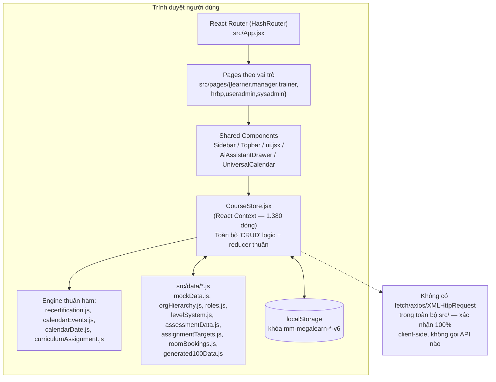

## 9.2. Kiến trúc mục tiêu Production **[TARGET — chưa triển khai]**

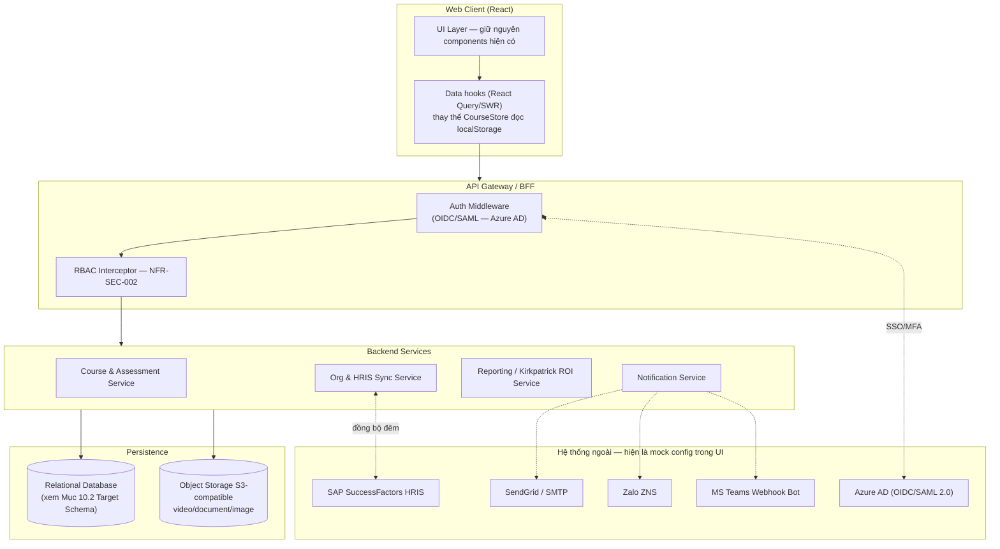

## 9.3. Sơ đồ thành phần Front-end (Component Diagram — as-built)

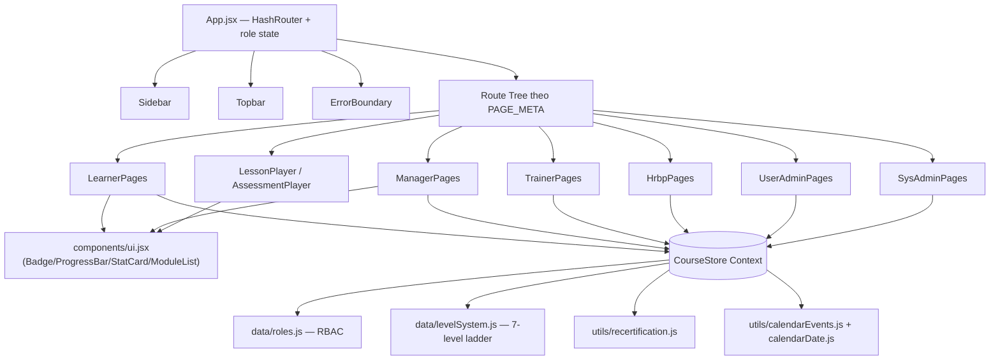

## 9.4. Sơ đồ trạng thái Enrollment (State Machine)

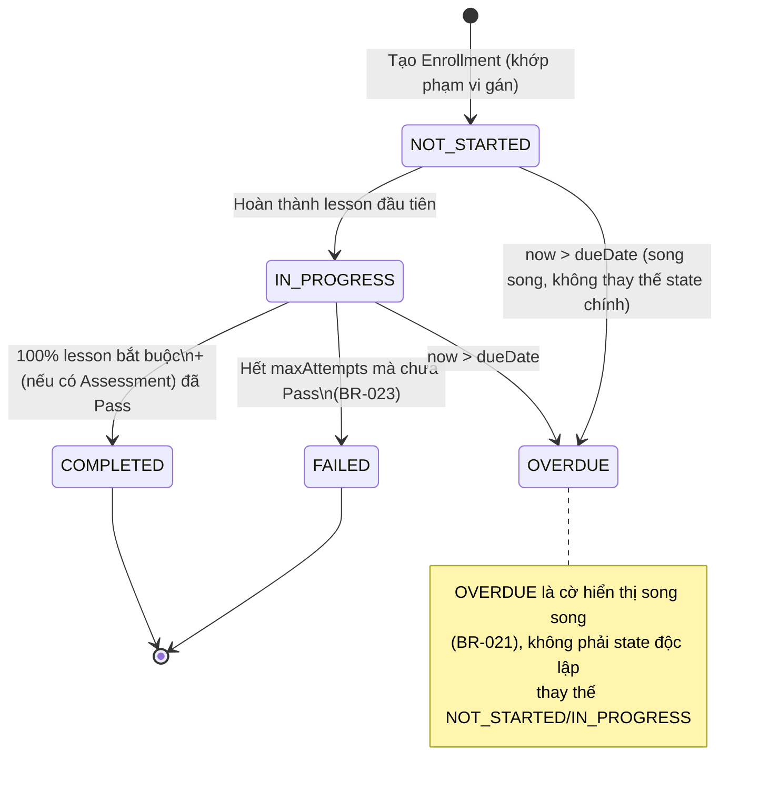

## 9.5. Sơ đồ trạng thái Duyệt học vượt cấp (Level-Skip Approval)

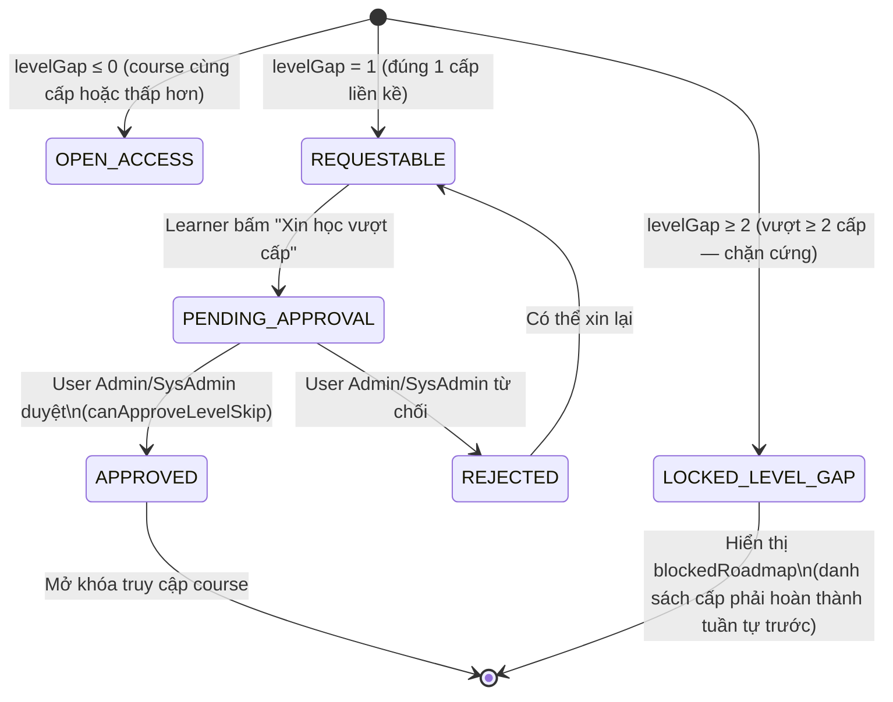

## 9.6. Sơ đồ đồng bộ dữ liệu HRIS **[TARGET]**

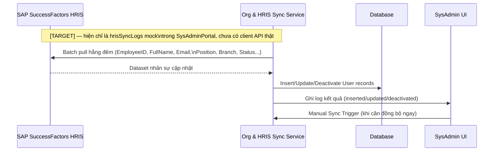

## 9.7. Nguyên tắc kỹ thuật cốt lõi cần giữ khi lên production

1. **Single Source of Truth**: Enrollment/Attempt luôn *recompute* từ dữ liệu lesson & attempt gốc — backend **không được** lưu cờ `progress`/`status` độc lập có thể lệch pha (BR-018/019).
2. **Append-only history**: `AssessmentAttempt` không bao giờ bị `UPDATE`/`DELETE` ở tầng DB.
3. **Idempotency**: auto-submit khi hết giờ thi phải có ràng buộc duy nhất (unique constraint) tương đương `submittedRef` để chống ghi trùng dưới tải đồng thời.
4. **RBAC hai lớp**: kiểm tra quyền cả ở Router (client) lẫn Backend Interceptor (server) — không tin tưởng client.
5. **Derived certificates**: chứng chỉ không lưu độc lập — luôn suy ra từ `Enrollment.status = COMPLETED AND Course.configuration.certificateEnabled = true`.

---
---

# 10. Data Schema Specification

## 10.1. Cấu trúc dữ liệu hiện tại (As-Built — JS mock-data shapes)

> Đây là cấu trúc *thực tế đang chạy* trong `src/data/*.js`, dùng làm hợp đồng dữ liệu (data contract) tối thiểu mà backend thật phải tái tạo để không phá vỡ UI hiện có.

### 10.1.1. User
| Trường | Kiểu | Mô tả |
|:---|:---|:---|
| `userId` | string | Định danh, vd. `USR-1042` |
| `employeeCode` | string | Mã nhân viên |
| `fullName`, `email` | string | |
| `role` | enum | 1 trong 6 `roleId` (§4.2) |
| `position`, `level`, `levelTitle` | string | Level = `'1'..'7'` (đảo ngược) |
| `branch`, `branchName` | enum | `SUPPORTING_FUNCTIONS` \| `OPERATIONS` |
| `businessUnitId/Code`, `divisionId/Code/Name`, `departmentId/Code/Name`, `subDepartmentId/Code/Name` | string | Nhánh Trụ sở chính |
| `areaId/Name`, `storeId/Name` | string | Nhánh Chuỗi siêu thị |
| `managerId` | string | FK tới User quản lý trực tiếp |
| `status` | enum | `ACTIVE` \| `INACTIVE` \| `TRANSFER` \| `NEW_JOINER` |
| `yearsOfService`, `avatar`, `badgeTone`, `description` | mixed | |

### 10.1.2. Org Hierarchy Entities (`orgHierarchy.js`)
`businessUnits`, `orgBranches` (2), `operationsAreas` (3: North/Central/South), `storeTypes` (4: C&C/Super Center/Food Service/Depot), `clusters`, `retailStores`, `storeDepartments`, `storeSections`, `divisions` (16), `departments` (56), `subDepartments`, `jobLevels`, `competencyFramework`, `meetingRoomsAndLabs`, `trainersDirectory`.

### 10.1.3. Course
| Trường | Kiểu | Mô tả |
|:---|:---|:---|
| `id`, `code`, `title`, `description` | string | |
| `category` / `categories` | string/array | |
| `startDate`/`endDate` | date | |
| `thumbnail`/`imageUrl` | string | |
| `targetLevel`/`targetLevels` | string/array | Cấp bậc mục tiêu |
| `deliveryType` | enum | `ONLINE_ELEARNING` \| `IN_PERSON_CLASSROOM` |
| `onlineClassType` | enum | `E_LEARNING` \| `VIRTUAL_CLASS` |
| `currentVersion` / `versions{}` | string/object | Snapshot đa phiên bản |
| `courseType` | enum | `MANDATORY` \| `OPTIONAL` |
| `status` | enum | `DRAFT` \| `PUBLISHED` \| `ARCHIVED` |
| `trainerId`/`trainerName`, `venueId`/`venue` | string | (ILT) |
| `scheduleDate`/`scheduleTime`, `maxCapacity`, `enrolledStudents` | mixed | (ILT) |
| `prerequisites` | array\<courseId\> | DAG, chặn nếu chưa COMPLETED |
| `courseCost` | number | Dùng cho Cost Tracking (BR-031) |
| `configuration` | object | Xem 10.1.4 |
| `modules[]` | array | Xem 10.1.5 |
| `virtualMeeting{}` | object | `platform` (TEAMS/ZOOM/MEET/WEBEX/CUSTOM), `meetingUrl`, `meetingId` |

### 10.1.4. Course.configuration (embedded)
| Trường | Kiểu | Mô tả |
|:---|:---|:---|
| `assessmentEnabled` | boolean | |
| `questionBankSize`, `questionsPerAttempt` | number | BR-022 |
| `passingScorePercent`, `maxAttempts` | number | BR-023 |
| `assessmentTimeLimit` | number (phút) | BR-026 |
| `randomizeQuestions`, `randomizeAnswers` | boolean | Chỉ ảnh hưởng thứ tự hiển thị |
| `showCorrectAnswers` | enum | `IMMEDIATELY` \| `AFTER_PASSING` \| `AFTER_FINAL_ATTEMPT` \| `NEVER` (BR-025) |
| `certificateEnabled` | boolean | |
| `validityPeriodMonths` | number | 6/12/24/36, `0` = vĩnh viễn |
| `recertificationWarningDays` | number | 15/30/45/60 |
| `recertificationMethod` | enum | `RETAKE_FULL_COURSE` \| `ASSESSMENT_ONLY` \| `IN_PERSON_WORKSHOP` |
| `completionRule` | mixed | |

### 10.1.5. CourseModule / CourseLesson
| Trường | Kiểu | Mô tả |
|:---|:---|:---|
| `moduleId`, `title`, `order` | mixed | |
| `lessonId`, `lessonType` | enum | `VIDEO` \| `YOUTUBE` \| `SCORM` \| `PPT` \| `DOCUMENT` \| `SCRIPT` \| `TEXT` \| `IMAGE` \| `ASSESSMENT` \| `ILT` |
| `isRequired` | boolean | Chỉ lesson bắt buộc tính vào mẫu số (BR-003) |
| `content`, `status` | mixed | |
| `requiredWatchPercent`/`requiredReadPercent` | number | Mặc định 90% |
| `imageCount` | number | (IMAGE) |

### 10.1.6. CourseAssignment (chỉ khi `courseType = MANDATORY`)
| Trường | Kiểu | Mô tả |
|:---|:---|:---|
| `assignmentType` | enum | 10 phạm vi: `BUSINESS_UNIT`, `DIVISION`, `DEPARTMENT`, `AREA`, `STORE_TYPE`, `CLUSTER`, `STORE`, `LEVEL`, `ROLE`, `USER` (BR-010) |
| `targetValue(s)` | mixed | Giá trị đối tượng mục tiêu tương ứng |
| `dueDate` | date | Bắt buộc (BR-011) |

### 10.1.7. Question Bank
| Trường | Kiểu | Mô tả |
|:---|:---|:---|
| `questionId`, `text` | string | |
| `type` | enum | `SINGLE_CHOICE` \| `MULTIPLE_CHOICE` \| `TRUE_FALSE` |
| `options[]` (tối đa 4) | array | Mỗi option: `text`, `isCorrect` |
| `category`, `difficulty` | enum | `EASY` \| `MEDIUM` \| `HARD` |
| `score` | number | |
| `explanation` | string (optional) | Hiển thị theo `showCorrectAnswers` |

### 10.1.8. Enrollment (derived/computed — không lưu cờ độc lập)
| Trường | Kiểu | Mô tả |
|:---|:---|:---|
| `userId`, `courseId` | FK | Khóa hợp thành (1 user ⇄ 1 course) |
| `status` | enum | `NOT_STARTED` \| `IN_PROGRESS` \| `COMPLETED` \| `FAILED` (+cờ `OVERDUE` song song) |
| `progressPercent` | number | Tính qua `recomputeEnrollment()` — công thức 70/30 (BR-019) |
| `dueDate`, `completedAt`, `validUntil` | date | |
| `lessonProgress[]` | array | Trạng thái từng lesson |

### 10.1.9. AssessmentAttempt (append-only)
| Trường | Kiểu | Mô tả |
|:---|:---|:---|
| `attemptId`, `attemptNumber` | mixed | |
| `userId`, `courseId` | FK | |
| `answers[]`, `score`, `passed` | mixed | |
| `submittedAt` | datetime | |
| `submittedRef` | string | Guard chống nộp trùng khi auto-submit |

### 10.1.10. Certificate (derived — không lưu độc lập, §39 SRS gốc)
Tồn tại **khi và chỉ khi** `Enrollment.status = COMPLETED` **và** `Course.configuration.certificateEnabled = true`. Trường hiển thị: `courseName`, `certificateCode` (`CERT-{courseId}`), `completedAt`, `courseVersion`, `firstPassingScore`, cộng với trạng thái tái chứng nhận tính từ `recertification.js` (`state`, `validUntil`, `diffDays`).

### 10.1.11. ActionPlan & L3 Evaluation
| Trường | Kiểu | Mô tả |
|:---|:---|:---|
| `userId`, `courseId`, `managerId` | FK | |
| `targetCommitment`, `kpiTarget` | string/number | Cam kết 90 ngày (BR-027) |
| `evaluationDate` | date | Mốc 3–6 tháng |
| `l3BehaviorRating` (1–5), `l3ProductivityGain` | number | (BR-028) |
| `signedOff` | boolean | |

### 10.1.12. ApprovalRequest (Program Cost)
| Trường | Kiểu | Mô tả |
|:---|:---|:---|
| `requestId`, `userId`, `courseId`, `managerId` | FK | |
| `courseCost` | number (VND) | |
| `status` | enum | `PENDING` \| `APPROVED` \| `REJECTED` |
| `justification` | string | |

### 10.1.13. RoomBooking / MeetingRoom
| Trường | Kiểu | Mô tả |
|:---|:---|:---|
| `roomId`, `date` | mixed | Cặp khóa kiểm tra xung đột (BR-030) |
| `programName`, `bookedBy` | string | |

### 10.1.14. Curriculum
Nhóm nhiều `Course` thành 1 chương trình học đa khóa, gán/phân bổ tới đối tượng học qua `curriculumAssignment.js`; chỉ `useradmin`/`sysadmin` được tạo/sửa/xóa (`canManageCurriculum`), `hrbp` chỉ đề xuất (`canProposeCurriculum`).

### 10.1.15. Notification
Hai luồng: **Learner inbox** (`COURSE_ASSIGNED`, `DEADLINE_REMINDER`, `COURSE_UNFINISHED`) và **Manager alerts** (`EMPLOYEE_OVERDUE`, `EMPLOYEE_INACTIVE`, `ASSESSMENT_FAILED`).

### 10.1.16. Cấu hình toàn hệ thống (Admin Config)
| Tham số | Ý nghĩa |
|:---|:---|
| `inactiveThresholdDays` | Ngưỡng ngày không hoạt động → đánh dấu inactive |
| `reminderFrequencyDays` | Mốc ngày gửi nhắc, vd. `[3, 6, 9]` |
| `maxReminderCount` | Số lần nhắc tối đa |
| `managerAlertAfterDays` | Ngày inactive trước khi cảnh báo Manager |
| `defaultVideoWatchPercent`, `defaultDocumentReadPercent`, `defaultPassingScorePercent` | Giá trị mặc định khi tạo course mới (course vẫn override được riêng) |

## 10.2. Sơ đồ ERD tổng quan (đối chiếu tài liệu đặc tả gốc)

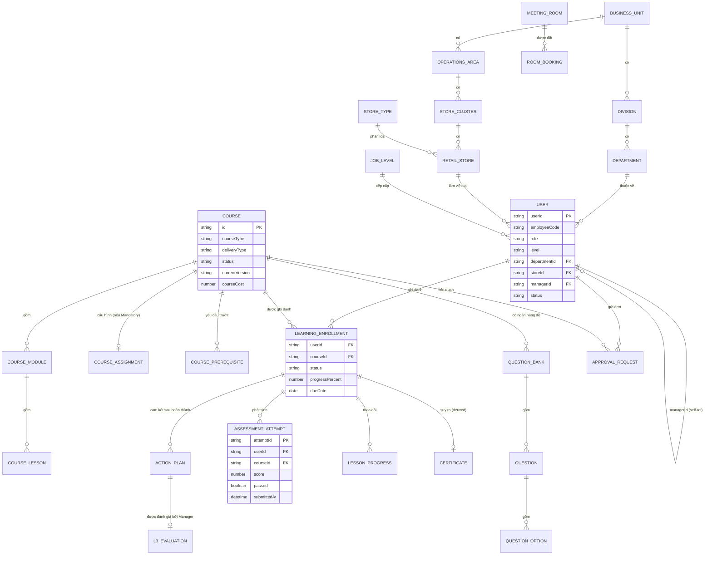

## 10.3. Đề xuất Schema quan hệ cho Production **[TARGET — chưa triển khai]**

> Ánh xạ trực tiếp từ ERD ở 10.2 sang các bảng quan hệ (PostgreSQL đề xuất, do cần hỗ trợ tốt JSON columns cho `configuration`/`versions` và ràng buộc toàn vẹn nghiêm ngặt cho `assessment_attempts`).

```sql
-- Tổ chức
CREATE TABLE business_units (id UUID PRIMARY KEY, code TEXT, name TEXT);
CREATE TABLE divisions (id UUID PRIMARY KEY, business_unit_id UUID REFERENCES business_units(id), code TEXT, name TEXT);
CREATE TABLE departments (id UUID PRIMARY KEY, division_id UUID REFERENCES divisions(id), code TEXT, name TEXT);
CREATE TABLE operations_areas (id UUID PRIMARY KEY, business_unit_id UUID REFERENCES business_units(id), name TEXT);
CREATE TABLE store_clusters (id UUID PRIMARY KEY, area_id UUID REFERENCES operations_areas(id), name TEXT);
CREATE TABLE store_types (id UUID PRIMARY KEY, code TEXT, name TEXT);
CREATE TABLE retail_stores (id UUID PRIMARY KEY, cluster_id UUID REFERENCES store_clusters(id), store_type_id UUID REFERENCES store_types(id), name TEXT);
CREATE TABLE job_levels (level SMALLINT PRIMARY KEY CHECK (level BETWEEN 1 AND 7), title_vi TEXT, title_en TEXT, band TEXT);

-- Nhân sự
CREATE TABLE users (
    id UUID PRIMARY KEY,
    employee_code TEXT UNIQUE NOT NULL,
    full_name TEXT NOT NULL,
    email TEXT UNIQUE NOT NULL,
    role TEXT NOT NULL CHECK (role IN ('learner','manager','trainer','hrbp','useradmin','sysadmin')),
    level SMALLINT REFERENCES job_levels(level),
    department_id UUID REFERENCES departments(id),
    store_id UUID REFERENCES retail_stores(id),
    manager_id UUID REFERENCES users(id),
    status TEXT NOT NULL CHECK (status IN ('ACTIVE','INACTIVE','TRANSFER','NEW_JOINER')),
    created_at TIMESTAMPTZ DEFAULT now()
);

-- Khóa học
CREATE TABLE courses (
    id UUID PRIMARY KEY,
    code TEXT UNIQUE,
    title TEXT NOT NULL,
    course_type TEXT NOT NULL CHECK (course_type IN ('MANDATORY','OPTIONAL')),
    delivery_type TEXT NOT NULL CHECK (delivery_type IN ('ONLINE_ELEARNING','IN_PERSON_CLASSROOM')),
    status TEXT NOT NULL CHECK (status IN ('DRAFT','PUBLISHED','ARCHIVED')),
    current_version TEXT,
    course_cost NUMERIC(14,2) DEFAULT 0,
    configuration JSONB NOT NULL DEFAULT '{}',   -- assessment + certificate + recert rules
    created_by UUID REFERENCES users(id),
    created_at TIMESTAMPTZ DEFAULT now()
);
CREATE TABLE course_modules (id UUID PRIMARY KEY, course_id UUID REFERENCES courses(id), title TEXT, sort_order INT);
CREATE TABLE course_lessons (
    id UUID PRIMARY KEY,
    module_id UUID REFERENCES course_modules(id),
    lesson_type TEXT NOT NULL,
    is_required BOOLEAN DEFAULT true,
    content JSONB,
    sort_order INT
);
CREATE TABLE course_assignments (
    id UUID PRIMARY KEY,
    course_id UUID REFERENCES courses(id) UNIQUE,   -- 1 assignment config / course (chỉ khi MANDATORY)
    assignment_type TEXT NOT NULL CHECK (assignment_type IN
        ('BUSINESS_UNIT','DIVISION','DEPARTMENT','AREA','STORE_TYPE','CLUSTER','STORE','LEVEL','ROLE','USER')),
    target_values TEXT[] NOT NULL,
    due_date DATE NOT NULL
);
CREATE TABLE course_prerequisites (course_id UUID REFERENCES courses(id), prerequisite_course_id UUID REFERENCES courses(id), PRIMARY KEY (course_id, prerequisite_course_id));

-- Khảo thí
CREATE TABLE questions (
    id UUID PRIMARY KEY,
    course_id UUID REFERENCES courses(id),
    text TEXT NOT NULL,
    type TEXT NOT NULL CHECK (type IN ('SINGLE_CHOICE','MULTIPLE_CHOICE','TRUE_FALSE')),
    difficulty TEXT CHECK (difficulty IN ('EASY','MEDIUM','HARD')),
    score NUMERIC DEFAULT 1,
    explanation TEXT
);
CREATE TABLE question_options (id UUID PRIMARY KEY, question_id UUID REFERENCES questions(id), text TEXT, is_correct BOOLEAN DEFAULT false);

-- Tiến trình học (derived, recompute từ nguồn dưới đây — KHÔNG lưu progress_percent tĩnh không kiểm chứng được)
CREATE TABLE enrollments (
    user_id UUID REFERENCES users(id),
    course_id UUID REFERENCES courses(id),
    status TEXT NOT NULL CHECK (status IN ('NOT_STARTED','IN_PROGRESS','COMPLETED','FAILED')),
    due_date DATE,
    completed_at TIMESTAMPTZ,
    valid_until DATE,
    PRIMARY KEY (user_id, course_id)
);
CREATE TABLE lesson_progress (user_id UUID, lesson_id UUID REFERENCES course_lessons(id), completed_at TIMESTAMPTZ, PRIMARY KEY (user_id, lesson_id));

-- Bất biến — append-only, KHÔNG cấp quyền UPDATE/DELETE ở tầng ứng dụng
CREATE TABLE assessment_attempts (
    id UUID PRIMARY KEY,
    user_id UUID REFERENCES users(id),
    course_id UUID REFERENCES courses(id),
    attempt_number INT NOT NULL,
    score NUMERIC NOT NULL,
    passed BOOLEAN NOT NULL,
    submitted_ref TEXT UNIQUE NOT NULL,   -- Idempotency guard — chống ghi trùng khi auto-submit
    submitted_at TIMESTAMPTZ NOT NULL DEFAULT now(),
    UNIQUE (user_id, course_id, attempt_number)
);

-- Đánh giá hiệu quả đào tạo
CREATE TABLE action_plans (
    id UUID PRIMARY KEY,
    user_id UUID REFERENCES users(id),
    course_id UUID REFERENCES courses(id),
    manager_id UUID REFERENCES users(id),
    target_commitment TEXT,
    kpi_target TEXT,
    evaluation_date DATE,
    l3_behavior_rating SMALLINT CHECK (l3_behavior_rating BETWEEN 1 AND 5),
    l3_productivity_gain NUMERIC,
    signed_off BOOLEAN DEFAULT false
);

-- Chi phí & phòng
CREATE TABLE approval_requests (id UUID PRIMARY KEY, user_id UUID REFERENCES users(id), course_id UUID REFERENCES courses(id), manager_id UUID REFERENCES users(id), course_cost NUMERIC(14,2), status TEXT CHECK (status IN ('PENDING','APPROVED','REJECTED')), justification TEXT);
CREATE TABLE meeting_rooms (id UUID PRIMARY KEY, name TEXT, location TEXT, capacity INT);
CREATE TABLE room_bookings (id UUID PRIMARY KEY, room_id UUID REFERENCES meeting_rooms(id), booking_date DATE, program_name TEXT, booked_by UUID REFERENCES users(id), UNIQUE (room_id, booking_date));
```

**Ràng buộc thiết kế bắt buộc giữ nguyên khi hiện thực bảng trên:**
- `assessment_attempts.submitted_ref UNIQUE` implement đúng NFR-DATA-002 (idempotency).
- `room_bookings UNIQUE (room_id, booking_date)` implement đúng BR-030 ở tầng DB (không chỉ ở tầng UI).
- Không có cột `progress_percent` lưu tĩnh trên `enrollments` — phải tính runtime hoặc qua materialized view/trigger để tránh lệch pha (BR-018/019).
- Chứng chỉ **không có bảng riêng** — expose qua view: `CREATE VIEW certificates AS SELECT * FROM enrollments e JOIN courses c ON c.id=e.course_id WHERE e.status='COMPLETED' AND (c.configuration->>'certificateEnabled')::boolean = true;`

---
---

# 11. Executive Summary & Integration Guide

## 11.1. Tóm tắt cho lãnh đạo (Executive Summary)

MM MegaLearn hiện là **một bản mockup front-end đầy đủ tính năng** (React + Vite), đóng vai trò vừa là **bằng chứng khái niệm (proof of concept)** vừa là **đặc tả sống (living specification)** cho toàn bộ nghiệp vụ đào tạo nội bộ của MMVN — bao gồm cơ chế RBAC 6 vai trò, gán khóa học bắt buộc theo 10 phạm vi tổ chức, engine khảo thí có rút đề ngẫu nhiên, đo lường hiệu quả đào tạo theo Kirkpatrick 4 cấp độ, và tái chứng nhận định kỳ.

**Giá trị đã đạt được ngay bây giờ**: đội ngũ nghiệp vụ (L&OD, HRBP) có thể dùng bản mockup để duyệt UAT nghiệp vụ, đào tạo nội bộ đội triển khai, và làm tài liệu nghiệm thu chấp nhận (acceptance criteria) không mơ hồ cho đội backend — vì mọi rule đã được code hóa tường minh (BR-001…BR-031) thay vì mô tả bằng lời.

**Việc còn lại để go-live thật**: xây dựng backend + database (Mục 10.3), thay Role Switcher demo bằng xác thực thật, kết nối các tích hợp bên ngoài hiện đang là mock UI (SAP HRIS, Azure AD SSO, kênh thông báo), và bổ sung object storage cho nội dung học liệu.

## 11.2. Ma trận tích hợp bên ngoài

| Hệ thống | Trạng thái hiện tại | Mục tiêu tích hợp |
|:---|:---|:---|
| **SAP SuccessFactors HRIS** | Mock: `hrisSyncLogs` mô phỏng batch sync đêm, hiển thị số bản ghi inserted/updated/deactivated trong SysAdmin Portal | **[TARGET]** Batch/streaming API pull nhân sự thật (EmployeeID, FullName, Email, Position, Branch, Status) → ghi vào bảng `users`/`departments`/`retail_stores` |
| **Azure Active Directory (OIDC/SAML 2.0)** | Mock config hiển thị trong SysAdmin Portal: tenant `mmvn-org.onmicrosoft.com`, MFA enforced, auto-provisioning | **[TARGET]** SSO thật thay Role Switcher; role/scope tổ chức phải suy ra từ token đã xác thực, không cho client tự chọn (NFR-SEC-003) |
| **Kênh thông báo** (Email, Zalo ZNS, MS Teams, in-app push) | Mock config trong `securityComplianceConfig.notificationChannels` (SendGrid/Internal SMTP, Zalo Business Solution, Microsoft Graph Webhook Bot) | **[TARGET]** Notification Service thật gửi `COURSE_ASSIGNED`, `DEADLINE_REMINDER`, `COURSE_UNFINISHED`, `EMPLOYEE_OVERDUE`, `EMPLOYEE_INACTIVE`, `ASSESSMENT_FAILED` |
| **Lưu trữ file (video/document/image)** | Local `<input type=file>` → object URL tạm, mất khi reload trình duyệt | **[TARGET]** Object storage S3-compatible, upload qua presigned URL |
| **Anti-cheat / Watermark / Proctoring** | Config UI-only trong `securityComplianceConfig` (watermark pattern, force-watch %, disable multi-tab, quiz blur-count limit) | **[TARGET]** Thực thi thật ở phía player + backend log sự kiện gian lận |

## 11.3. Lộ trình tích hợp đề xuất (Migration Path)

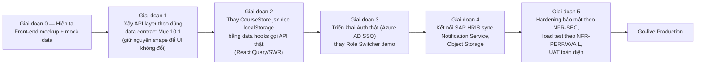

**Nguyên tắc trong suốt quá trình migrate**: giữ nguyên shape dữ liệu ở Mục 10.1 làm hợp đồng API — theo đúng khuyến nghị trong `README.md`: *"Replace the static exports with fetch calls... Keep the shape of each export the same — components don't know or care where the data comes from."* Điều này cho phép chuyển đổi backend mà **không cần viết lại UI**.

## 11.4. Checklist nghiệm thu trước go-live

- [ ] Toàn bộ 31 Business Rules (BR-001 → BR-031) có unit test ở tầng backend, không chỉ ở front-end.
- [ ] `assessment_attempts.submitted_ref` có ràng buộc UNIQUE thật ở DB (không chỉ `submittedRef` React ref).
- [ ] RBAC được enforce ở Backend Interceptor, không chỉ ở `roles.js` phía client.
- [ ] Role không còn lấy từ dropdown Topbar — lấy từ session đã xác thực qua Azure AD.
- [ ] Object storage thay thế toàn bộ object URL tạm cho nội dung bài học.
- [ ] `npm run verify` (86 assertions hiện có) được mở rộng và chạy trong CI, không chỉ chạy tay.

---
---

# 12. User Manual & Operational Guide

## 12.1. Bắt đầu nhanh — cho mọi người dùng

1. Truy cập ứng dụng, đăng nhập tại `/login`.
2. Ở môi trường demo/UAT hiện tại, dùng **Role Switcher** (badge góc trên phải Topbar) để trải nghiệm 6 vai trò khác nhau.
3. Trợ lý AI (nút tia sáng góc dưới phải) luôn sẵn sàng để hỏi nhanh về quy trình SOP mà không rời trang.

## 12.2. Hướng dẫn theo vai trò

### 12.2.1. User Learner — "Tôi muốn học và lấy chứng chỉ"
| Tôi muốn... | Làm thế nào |
|:---|:---|
| Xem khóa đang học dở | Vào Dashboard → thẻ "Continue Learning" → **Resume Course** |
| Học một bài (lesson) | Mở Course Detail → chọn lesson → tương tác theo loại nội dung (xem [8.4](#84-đặc-tả-tương-tác-màn-hình-then-chốt)) đến khi có tích xanh hoàn thành |
| Làm bài thi cuối khóa | Hoàn thành 100% lesson bắt buộc trước → nút "Start Assessment" sáng → làm bài trong thời gian quy định → Submit |
| Nhận chứng chỉ | Sau khi thi đạt → hoàn thành khảo sát L1 CSAT + cam kết Action Plan 90 ngày → chứng chỉ tự mở khóa tại `/learner/certificates` |
| Điểm danh lớp thực hành | Vào Classrooms → **Quick QR Check-in** → quét mã tại lớp → **Confirm Attendance** (+150 XP) |
| Xin học khóa vượt cấp | Chỉ được xin đúng 1 cấp liền kề; nếu vượt ≥ 2 cấp hệ thống chặn và chỉ ra lộ trình phải hoàn thành tuần tự trước |
| Xem lịch học của mình | `/learner/calendar` hoặc `/my-learning-calendar` |

### 12.2.2. Line Manager — "Tôi muốn giám sát và phát triển đội ngũ"
| Tôi muốn... | Làm thế nào |
|:---|:---|
| Xem ai đang trễ hạn/không hoạt động | `/manager/team` → danh sách "Needs Attention" |
| Nhắc nhở nhân viên | Bấm **Send Reminder (Nudge)** trên hàng nhân viên *(lưu ý: ở bản mockup hiện tại nút này chưa nối hành động gửi thật — xem [4.3.10](#4310-các-phần-ui-có-sẵn-nhưng-chưa-nối-hành-động-thật))* |
| Chỉ định khóa học cho nhân viên | Bấm **Assign** trên hàng nhân viên → chọn khóa, hạn chót, lý do → **Confirm Nomination** |
| Duyệt đơn xin học kèm chi phí | `/manager/approvals` → **Approve** (ghi danh + cộng ngân sách) hoặc **Reject** (kèm lý do) |
| Đánh giá hành vi sau đào tạo (L3) | Tab "Action Plans & L3 Review" → **Conduct Level 3 Review (3-6 Mos)** → chấm sao + nhập chỉ số năng suất → **Confirm Level 3 Evaluation** |

### 12.2.3. Trainer / L&D — "Tôi đứng lớp thực hành"
- Xem lớp mình phụ trách tại `/trainer`.
- Mở **Live QR Điểm danh** phóng to cho học viên quét.
- Xem bảng điểm danh, tìm kiếm nhanh, tích thủ công nếu cần.
- Theo dõi điểm CSAT trung bình và nhận xét từ học viên.

### 12.2.4. HRBP — "Tôi phân tích năng lực & kế nhiệm theo vùng"
- Xem Heatmap tuân thủ vùng tại `/hrbp/compliance`.
- Phân tích Skill Gap và Succession Pipeline tại `/hrbp/succession`.
- Đề xuất ứng viên vào Curriculum tại `/hrbp/curriculum` (chờ User Admin/SysAdmin duyệt).

### 12.2.5. User Administrator — "Tôi quản trị nhân sự & phân bổ khóa học"
- Quản lý danh bạ nhân viên & cây tổ chức tại `/user-admin/hierarchy`.
- Gán khóa Mandatory theo 10 phạm vi tại `/user-admin/allocation`.
- Duyệt đơn xin học vượt cấp (nút chỉ hiện với `useradmin`/`sysadmin`).
- Quản lý Lộ trình Cấp bậc tại `/user-admin/roadmaps`.

### 12.2.6. System Administrator (IT) — "Tôi vận hành hạ tầng & bảo mật"
- Giám sát đồng bộ HRIS, kích hoạt Manual Sync tại `/sysadmin` tab HRIS.
- Xem Audit Log tại `/sysadmin/audit`.
- Cấu hình chính sách bảo mật tại `/sysadmin/policies`.
- Quản trị phân quyền toàn bộ vai trò tại `/sysadmin/roles`.

## 12.3. Tác vụ vận hành cho L&OD (soạn thảo & vận hành đào tạo)

1. **Tạo khóa học mới**: `/admin/courses/new` → chọn Online/ILT → cấu hình module/lesson → (nếu Mandatory) cấu hình phạm vi gán + due date bắt buộc → cấu hình đánh giá + ngân hàng đề → **Publish Course**.
2. **Import ngân hàng câu hỏi hàng loạt**: tải template CSV → điền theo cột (question, type, tối đa 4 option, đáp án đúng, category, difficulty, score, explanation) → import → hệ thống báo số dòng lỗi bị bỏ qua (không mất dữ liệu âm thầm).
3. **Đặt phòng thực hành**: `/admin/training-ops` → chọn phòng + ngày + tên chương trình → **Reserve Room** (bị chặn nếu trùng lịch).
4. **Xuất báo cáo cho thanh tra/kiểm toán**: `/admin/reports` → **Export Excel Report (CSV)** (chuẩn UTF-8 BOM, hiển thị đúng tiếng Việt) hoặc **Export Audit Dossier** (in PDF chuẩn A4).

---
---

# 13. System Maintenance & Troubleshooting Guide

## 13.1. Thiết lập môi trường phát triển

```bash
cd lms-app
npm install
npm run dev        # chạy dev server (mặc định http://localhost:5173)
```

| Lệnh | Mục đích |
|:---|:---|
| `npm run dev` | Chạy Vite dev server |
| `npm run build` | Build production, xuất ra `dist/` |
| `npm run preview` / `npm run start` | Preview bản build (đọc `process.env.PORT` — phù hợp Render/Railway/Fly/Heroku) |
| `npm run verify` | Chạy `scripts/verify-role-level-model.jsx` qua esbuild+node — bộ 86 assertion kiểm tra tính nhất quán mô hình 6-role/7-level (bao gồm cả kiểm tra `LearnerCalendar` render đúng cho cả 6 vai trò tại route `/my-learning-calendar`) |
| `npm run check:tables` | Chạy `scripts/check-table-widths.jsx` — kiểm tra độ rộng bảng UI |

## 13.2. Triển khai (Deployment)

- `vite.config.js` đặt `base: './'` để hỗ trợ host ở sub-path bất kỳ; `host: true` và `preview.allowedHosts: true` để chạy được trên các nền tảng container hóa.
- Build ra thư mục tĩnh `dist/` → deploy trực tiếp lên Netlify, Vercel, S3/CloudFront, hoặc bất kỳ static hosting nào.
- **Không cần biến môi trường bí mật nào** ở trạng thái hiện tại (không có `.env`) vì không gọi API/service ngoài nào thật.

## 13.3. Xử lý sự cố thường gặp (bản mockup hiện tại)

| Sự cố | Nguyên nhân | Cách xử lý |
|:---|:---|:---|
| Dữ liệu demo "kỳ lạ"/không nhất quán sau khi thao tác nhiều | Toàn bộ state được ghi vào `localStorage` (khóa `mm-megalearn-*-v6`) và cộng dồn qua nhiều phiên thao tác thủ công | Dùng nút **"Reset Session Cache & Reload"** trong `ErrorBoundary`, hoặc xóa thủ công các khóa `mm-megalearn-*` trong DevTools → Application → Local Storage |
| Ứng dụng trắng trang / lỗi runtime | Lỗi JS không bắt được ở component con | `ErrorBoundary` sẽ tự hiển thị màn hình lỗi kèm nút reset cache; nếu vẫn lỗi, kiểm tra console trình duyệt |
| File vừa upload cho lesson biến mất sau khi tải lại trang | Upload cục bộ chỉ tạo `object URL` tồn tại trong phiên trình duyệt hiện tại, không có object storage thật | **[Hạn chế đã biết]** — chỉ dùng URL đã host sẵn (dán trực tiếp) để nội dung tồn tại lâu dài; xem giải pháp production ở [Mục 11.2](#112-ma-trận-tích-hợp-bên-ngoài) |
| Đổi vai trò nhưng vẫn thấy dữ liệu vai trò cũ | Đây là hành vi UI convenience, không phải phiên đăng nhập thật | Dùng đúng Role Switcher ở Topbar; không nên coi đây là kiểm thử bảo mật thật |
| Số liệu tiến độ (%) không khớp kỳ vọng | Theo thiết kế, % luôn được `recomputeEnrollment()` tính lại từ lesson/attempt gốc (BR-018/019) — không có cách "sửa tay" | Kiểm tra lại trạng thái từng lesson bắt buộc và attempt gần nhất thay vì tìm cờ trạng thái độc lập (không tồn tại) |
| Bảng dữ liệu tràn ngang trên màn hình nhỏ | Một số bảng thống kê có nhiều cột | Chạy `npm run check:tables` để rà soát độ rộng bảng |

## 13.4. Cách đọc & mở rộng bộ kiểm thử `npm run verify`

- File: `lms-app/scripts/verify-role-level-model.jsx`.
- Không dùng framework test chuẩn (không Jest/Vitest) — dùng script chạy qua esbuild + Node với các assertion kiểu `console.assert`, tổng cộng 86 assertion.
- Bao phủ: tính nhất quán của 6-role/7-level, alias hợp lệ, và ví dụ cụ thể — component "SharedLearningCalendar" (tên nội bộ của kịch bản kiểm thử `LearnerCalendar`) phải render đúng cho **cả 6 vai trò** tại route `/my-learning-calendar`, gồm cả kiểm tra lưới tháng 2/năm nhuận.
- Khi thêm role/level/permission mới: cập nhật `src/data/roles.js` hoặc `src/data/levelSystem.js` trước, sau đó bổ sung assertion tương ứng trong script rồi chạy lại `npm run verify` để xác nhận không phá vỡ giả định cũ (tham khảo lịch sử sửa lỗi trong `docs/ROLE_LEVEL_RESTRUCTURE_PLAN.md`, ghi nhận 16 lỗi P1–P16 đã được khắc phục theo cách này).

## 13.5. Vận hành & bảo trì hệ thống Production **[TARGET — áp dụng sau khi có backend thật]**

| Hạng mục | Khuyến nghị |
|:---|:---|
| **Giám sát (Monitoring)** | APM cho API layer (đo theo NFR-PERF-001: 95% request < 200ms), dashboard CCU theo thời gian thực (theo NFR-PERF-002: 2.000 CCU) |
| **Sao lưu (Backup)** | Backup định kỳ database + object storage, kiểm thử phục hồi (restore drill) định kỳ, đáp ứng NFR-AVAIL-001 (uptime ≥ 99.9%) |
| **Nhật ký & Audit** | Log mọi thao tác ghi (assign/approve/publish/delete) phục vụ ISO 27001 audit — mở rộng từ khái niệm Audit Logs đã có trong SysAdmin Portal (hiện là UI-only) |
| **Xử lý sự cố dữ liệu tuân thủ** | Nếu `AssessmentAttempt` hoặc `Certificate` bị nghi ngờ sai lệch, **không sửa tay bản ghi** — điều tra qua chuỗi `lesson_progress` + `assessment_attempts` gốc vì mọi giá trị hiển thị đều derived (BR-018/019, giữ nguyên nguyên tắc từ Mục 9.7) |
| **Khôi phục sau lỗi đồng bộ HRIS** | Giữ log chi tiết từng lần sync (inserted/updated/deactivated theo `employeeCode`) để có thể rollback chọn lọc nếu batch sync lỗi dữ liệu |
| **Quy trình tăng quyền (role escalation)** | Mọi thay đổi role/level của user phải qua `useradmin`/`sysadmin` (đúng RBAC hiện có), ghi log vào Audit Trail, không cho sửa trực tiếp trong DB production |

---

*Hết tài liệu — Master Documentation V1.0. Tài liệu này tổng hợp và hiệu chỉnh từ `lms-app/SRS.md`, `lms-app/docs/MM_MEGALEARN_FUNCTIONAL_SPECIFICATION.md`, `lms-app/README.md`, `lms-app/docs/ROLE_LEVEL_RESTRUCTURE_PLAN.md` và đối chiếu trực tiếp với mã nguồn `lms-app/src/**` tại thời điểm 28/08/2026.*
